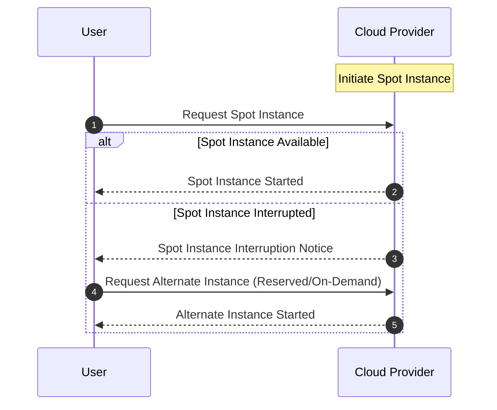

In the world of cloud computing, managing costs while maintaining performance and reliability can be a challenging task. Spot and reserved instances are essential techniques offered by cloud service providers to help organizations reduce their computational costs while aligning their capacity with workload demands.

## Design Pattern Overview

### Spot Instances

Spot instances allow you to bid on and purchase unused cloud compute capacity at significantly reduced rates compared to standard on-demand instances. These instances are well-suited for workloads that are:

- **Flexible and Interruptible**: Workloads that can tolerate interruptions without impacting the overall process, such as batch processing, data analysis, and big data jobs.

- **Stateless**: Processes that don’t require storing state locally on the instance so that they can be easily restarted elsewhere.

- **Non-Critical**: Applications or tasks where interruptions and restarts do not lead to major business disruptions.

### Reserved Instances

Reserved instances provide a reservation of compute capacity, typically at a discounted rate compared to on-demand pricing, suggesting a commitment to use the cloud provider's resources for a term of one or three years. They are ideal for:

- **Predictable Workloads**: Environments where the demand does not fluctuate significantly.

- **Long-Running Applications**: Processes that run continuously over a long period and require guaranteed computational resources.

- **Cost Savings**: Customers receive significant savings compared to on-demand pricing in exchange for making a longer-term commitment.

## Architectural Approaches

1. **Combination Strategy**:
   - Employ a blend of spot, reserved, and on-demand instances to align infrastructure costs with business budget and needs.
   - For instance, use reserved instances for base-level compute needs, and spot instances to handle fluctuating demand.

2. **Auto-Scaling Groups**:
   - Implement auto-scaling policies that prioritize using spot instances, falling back to reserved or on-demand instances during times of spot instance unavailability.

3. **Workload Segmentation**:
   - Divide workloads into separate pipelines that can run on spot vs. reserved instances based on their reliability and availability requirements.

## Best Practices

- **Pricing Models and Analysis**: Regularly analyze pricing models to ensure optimal use of spot and reserved instances.
  
- **Monitoring and Alerts**: Set up robust monitoring and alerts for instances, particularly spot instances, which can be interrupted.

- **Reserved Instances Planning**: Conduct thorough forecasting and planning to accurately determine the baseline of compute resources to reserve.

- **Interrupt Handling**: For spot instances, design systems with efficient checkpointing, task resubmission, or other forms of interruption handling.

## Example Code

Below is an example of using AWS SDK in Java to create a spot instance request:

```java
import software.amazon.awssdk.services.ec2.Ec2Client;
import software.amazon.awssdk.services.ec2.model.RequestSpotInstancesRequest;
import software.amazon.awssdk.services.ec2.model.SpotInstanceRequest;

public class SpotInstanceExample {
    public static void main(String[] args) {
        Ec2Client ec2 = Ec2Client.create();

        RequestSpotInstancesRequest request = RequestSpotInstancesRequest.builder()
                .spotPrice("0.05")
                .instanceCount(1)
                .type("persistent")
                .launchSpecification(/* your launch specification here */)
                .build();

        SpotInstanceRequest response = ec2.requestSpotInstances(request);

        System.out.println("Spot instance request ID: " + response.spotInstanceRequestId());
    }
}
```

## Diagrams

Below is UML Sequence Diagram illustrating a mixed instance strategy for handling spot interruptions:



## Related Patterns

- **Auto-Scaling**: Techniques to automatically adjust compute capacity.
- **Disaster Recovery**: Strategies for maintaining service continuity during failures.
- **Cost Optimization**: Holistic strategies for reducing cloud expenditure.

## Additional Resources

- [AWS Spot and Reserved Instances Pricing](https://aws.amazon.com/ec2/pricing/)
- [Google Cloud Preemptible VMs](https://cloud.google.com/compute/docs/instances/preemptible)
- [Azure Spot Virtual Machines](https://azure.microsoft.com/en-us/pricing/spot/)
- [Best Practices for Cloud Cost Management](https://cloud.google.com/docs/best-practices/cost-management-overview)

## Summary

Utilizing spot and reserved instances strategically in cloud environments can lead to significant cost savings without compromising performance and availability. By understanding when and how to deploy these instances, businesses can efficiently manage resources and align cloud costs with operational goals. This pattern is invaluable for organizations aiming to optimize their cloud infrastructure economically and sustainably.
