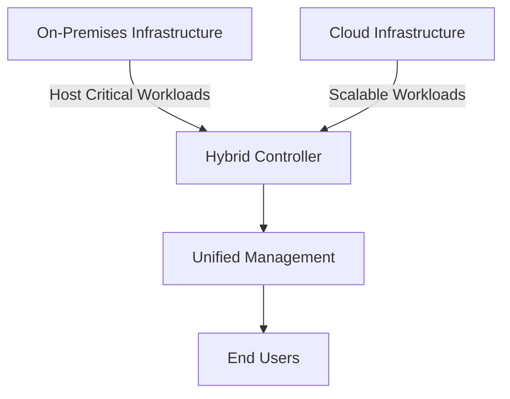

## Introduction to Hybrid Compute Models

Hybrid Compute Models represent a strategic approach to computing infrastructure that combines on-premises and cloud resources. This pattern allows organizations to maintain existing infrastructure while incrementally integrating cloud capabilities, offering flexibility, scalability, and potentially reduced costs. This model also facilitates enhanced disaster recovery solutions and better resource management.

## Key Components

1. **On-Premises Infrastructure**: Local servers and data centers which can host sensitive and critical workloads.
2. **Cloud Infrastructure**: Public or private cloud services that provide scalability, storage, and workload flexibility.
3. **Networking Solutions**: Secure networks that connect on-premises and cloud environments, frequently using VPNs or direct connections.
4. **Management Tools**: Cloud management platforms or hybrid cloud management systems to manage resources across environments.

## Architectural Approaches

### 1. **Workload Distribution**

Organizations can distribute workloads between on-premises and cloud resources based on specific requirements, such as compliance, latency, and cost.



### 2. **Cloud Bursting**

Utilizes cloud resources to handle excess demand. For instance, a retail website might burst into the cloud during peak shopping seasons.

### 3. **Disaster Recovery**

Implement comprehensive disaster recovery strategies by synchronizing data to the cloud while maintaining primary operations on-premises.

## Best Practices

- **Security and Compliance**: Ensure that data governance respects regulatory requirements across both environments.
- **Cost Management**: Regularly monitor resource utilization and optimize for cost-efficiency without compromising performance.
- **Seamless Integration**: Utilize APIs and hybrid integration platforms to ensure smooth interaction between on-premises and cloud systems.
- **Resilience and Redundancy**: Incorporate failover strategies to safeguard against downtime and ensure business continuity.

## Example Code

```java
// Example code demonstrating a simple hybrid cloud networking setup with AWS SDKs in Java

import com.amazonaws.services.ec2.AmazonEC2;
import com.amazonaws.services.ec2.AmazonEC2ClientBuilder;
import com.amazonaws.services.ec2.model.*;

public class HybridNetworkConfigurator {
    public static void main(String[] args) {
        AmazonEC2 ec2Client = AmazonEC2ClientBuilder.standard().build();
        
        CreateVpcRequest vpcRequest = new CreateVpcRequest().withCidrBlock("10.0.0.0/16");
        CreateVpcResult vpcResult = ec2Client.createVpc(vpcRequest);
        System.out.println("VPC ID: " + vpcResult.getVpc().getVpcId());

        CreateVpnGatewayRequest vpnGatewayRequest = new CreateVpnGatewayRequest().withType("ipsec.1");
        CreateVpnGatewayResult vpnGatewayResult = ec2Client.createVpnGateway(vpnGatewayRequest);
        System.out.println("VPN Gateway ID: " + vpnGatewayResult.getVpnGateway().getVpnGatewayId());
        
        // Additional configuration to link with on-premises infrastructure
    }
}
```

## Related Patterns

- **Service Delegator Pattern**: Directs specific service calls to the appropriate on-premise or cloud-based resource.
- **API Gateway**: Centralizes API management to ensure secure and efficient traffic routing between diverse environments.

## Additional Resources

- [AWS Hybrid Cloud Solutions](https://aws.amazon.com/hybrid/)
- [Azure Hybrid and Multicloud Solutions](https://azure.microsoft.com/en-us/overview/hybrid-cloud/)
- [Google Cloud Hybrid and Multicloud Solutions](https://cloud.google.com/solutions/hybrid-and-multi-cloud)

## Summary

Hybrid Compute Models provide a powerful framework for modernizing IT infrastructure while ensuring continuity and control over critical workloads. By combining on-premises and cloud resources, organizations can handle fluctuations in demand with agility, enhance their disaster recovery posture, and capitalize on the compute efficiency of cloud architectures.
