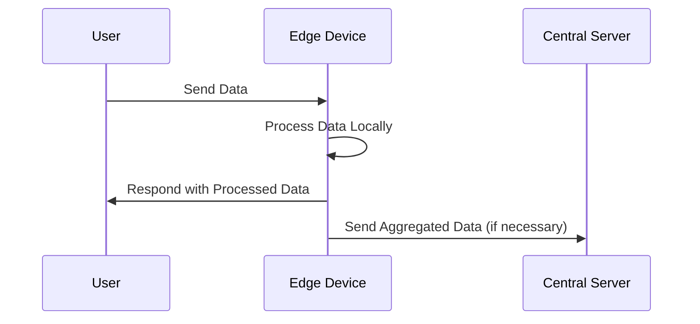

## Introduction

Edge Computing is a paradigm where compute resources and services are deployed closer to the location of data generation. This approach is increasingly essential in scenarios where processing needs to happen rapidly or when data cannot efficiently be sent to centralized locations due to latency, bandwidth, or privacy constraints. Edge Computing is particularly valuable for Internet of Things (IoT) applications, autonomous vehicles, remote locations, and real-time data processing tasks.

## Design Pattern Overview

The Edge Computing Resources pattern focuses on distributing computational processes across multiple edge nodes that are positioned physically closer to the data sources or consumers. By shifting computation and storage closer to the edge of the network, latency is minimized, bandwidth consumption is reduced, and real-time processing capabilities are enhanced.

### Key Considerations

- **Latency Reduction**: By processing data locally or on nearby edge nodes, applications can achieve significant reductions in response times.
  
- **Bandwidth Optimization**: Transmitting large amounts of raw data to a central cloud can be inefficient, so edge computing allows processing at the source and only sending meaningful data to centralized systems.

- **Privacy and Security**: Sensitive data can be processed at the edge, minimizing exposure risks and addressing data sovereignty concerns.

## Architectural Approaches

### 1. Distributed Data Processing

Edge Computing allows data to be processed across distributed nodes. Frameworks like Apache Kafka and Apache Flink can be utilized to orchestrate real-time data streaming and processing across edge devices.

### 2. Edge Device Virtualization

Use of containerization technologies, such as Docker and Kubernetes, enables the virtualization of edge resources. These technologies facilitate scalable and reliable application deployment on edge devices.

### 3. Application Partitioning

Applications can be partitioned into microservices where portions of the application logic are executed on edge devices while others reside on central cloud servers.

### 4. Real-Time Analytics

Deploy machine learning models and analytics engines on edge devices using frameworks like TensorFlow Lite or AWS IoT Greengrass to conduct real-time data analytics and decision-making.

## Example Code

Here's a simplified example of using AWS IoT Greengrass for deploying edge functions to handle device data locally:

```python
import greengrasssdk

iot_client = greengrasssdk.client('iot-data')

def function_handler(event, context):
    device_data = event['data']
    
    # Process data locally
    processed_data = handle_device_data(device_data)
    
    # Publish processed data to an IoT topic
    iot_client.publish(
        topic='edge/device/data',
        payload=processed_data
    )

def handle_device_data(data):
    # Implement data processing logic
    return data.upper()  # Example of processing data
```

## Diagrams

### UML Sequence Diagram



## Related Patterns

- **Cloud Computing**: Complements edge resources by providing scalable central resources.
- **Fog Computing**: Involves an additional layer between the cloud and edge to further optimize resource use.
- **Content Delivery Network (CDN)**: Similar strategy of deploying resources closer to end-users for optimized delivery.

## Additional Resources

- [AWS Greengrass Documentation](https://aws.amazon.com/greengrass/)
- [Azure IoT Edge Documentation](https://docs.microsoft.com/en-us/azure/iot-edge/)
- [Google Cloud IoT Edge Documentation](https://cloud.google.com/edge-tpu/)

## Summary

The Edge Computing Resources pattern is integral for modern distributed systems, particularly in scenarios requiring rapid data processing and minimized latency. It promotes efficient bandwidth usage and enhances privacy and security through localized data handling. Adopting Edge Computing in conjunction with centralized cloud systems and possibly Fog Computing enables robust, scalable, and responsive applications adept at handling the data processing needs of the future.
