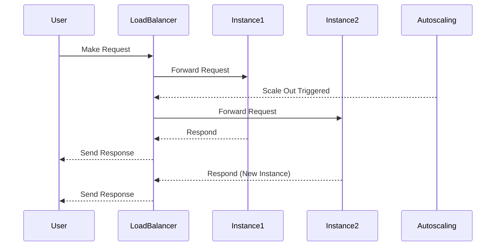

## Introduction

Horizontal scaling, also known as scaling out, is a key pattern in cloud architecture aimed at enhancing the capacity and performance of applications by adding more nodes or instances. This approach contrasts with vertical scaling (scaling up), where resources such as CPU or RAM are increased in existing machines. Horizontal scaling adds more machines to the pool of resources, distributing the workload effectively.

## Detailed Explanation

### Architectural Approach

In horizontal scaling, each new instance is an exact replica of the existing ones, and load balancing is often employed to manage how requests are directed across these instances. This pattern is beneficial in scenarios where demand increases temporarily or when there is a need for higher fault tolerance. Cloud providers like AWS, Azure, and Google Cloud offer auto-scaling services that automatically add or remove instances based on predefined rules, making it easier to implement horizontal scaling.

### Key Components

- **Load Balancer**: Essential for distributing incoming traffic across multiple instances to ensure no single instance is overwhelmed.
- **Stateless Services**: Horizontal scaling works best with stateless services where any instance can handle any request independently.
- **Shared Data Stores**: These are necessary for maintaining consistent data across all instances, often implemented using cloud-based databases or data warehouses.
- **Auto-scaling Groups**: Enable automatic scaling based on demand, using pre-configured triggers and thresholds.

### Best Practices

1. **Design for Statelessness**: Ensure that each service instance can handle requests independently. Persist state in external data stores when necessary.
2. **Implement Effective Load Balancing**: Use cloud-provided load balancers or integrate third-party solutions to optimize traffic distribution.
3. **Optimize Deployment Time**: Use containerization to achieve quicker deployment times, allowing new instances to come online swiftly under load spikes.
4. **Use Auto-scaling Features**: Take advantage of cloud-native auto-scaling features to dynamically adjust the number of instances based on demand.
5. **Monitor Performance**: Implement monitoring and logging to understand performance and trigger scaling operations effectively.

## Example Code and Diagrams

### Example Configuration with AWS Auto Scaling

```yaml
AutoScalingGroup:
  Type: AWS::AutoScaling::AutoScalingGroup
  Properties:
    MinSize: 1
    MaxSize: 10
    DesiredCapacity: 3
    LaunchTemplate:
      LaunchTemplateId: !Ref MyLaunchTemplate
    VPCZoneIdentifier:
      - subnet-abcde123
      - subnet-12345abc
```

### Sequence Diagram: Horizontal Scaling Process



## Related Patterns

- **Load Balancer Pattern**: Vital for distributing traffic across different instances in horizontal scaling.
- **Service Discovery Pattern**: Helps in detecting and connecting to available instances in a horizontally scaled environment.
- **Circuit Breaker Pattern**: Enhances fault tolerance by preventing requests from being sent to failing instances.

## Additional Resources

- [Amazon EC2 Auto Scaling](https://aws.amazon.com/ec2/autoscaling/)
- [Google Cloud Autoscaler](https://cloud.google.com/compute/docs/autoscaler)
- [Azure Scale Sets](https://azure.microsoft.com/en-us/services/virtual-machine-scale-sets/)

## Summary

Horizontal scaling is a powerful design pattern that allows cloud-based applications to handle increased load by adding more instances, thus enhancing performance and fault tolerance. By distributing requests across multiple instances with the aid of load balancers and ensuring statelessness in services, organizations can maintain service availability and responsiveness even during peak loads. Leveraging automatic scaling features provided by major cloud providers further simplifies the scaling process, making it a vital component in modern cloud architecture.
