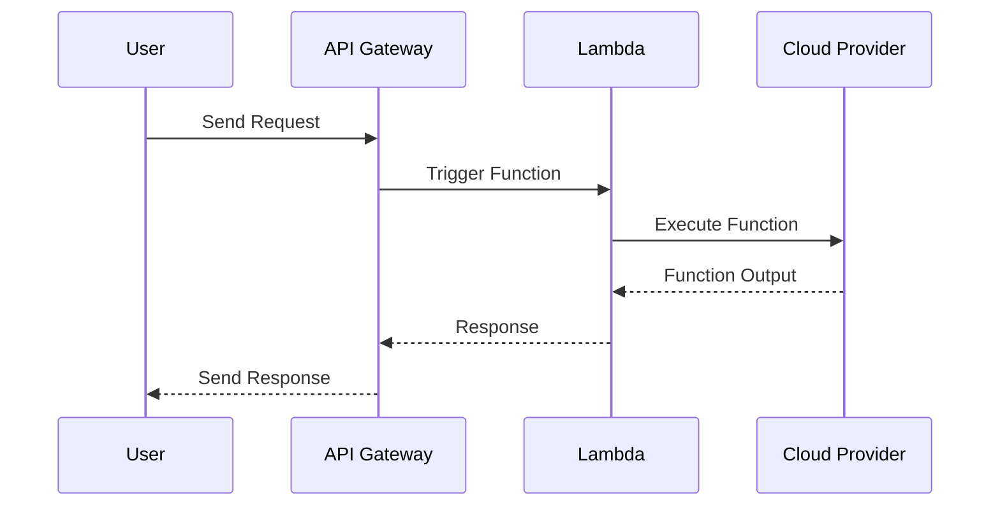

## Introduction to Serverless Computing

Serverless Computing is a model in which the cloud provider dynamically manages the allocation and provisioning of servers. With Serverless Computing, developers focus on writing code and defining events that trigger this code. The cloud provider takes care of running the functions and scaling them as needed, responding to varying loads while also optimizing for cost by only charging for execution time.

## Key Characteristics

- **Event-Driven Execution**: Functions are invoked in response to specific events, allowing for highly granular, event-driven architectures.
- **Automatic Scaling**: Functions scale automatically and independently of each other, responding to demand without manual intervention.
- **Stateless Functions**: Functions are typically stateless, simplifying concurrency aspects and improving performance.
- **Cost Efficiency**: Billing is based on actual usage, often calculated per function execution time, providing cost savings over pre-provisioned resources.

## Architectural Approach

Serverless architectures are centered around the concept of Functions as a Service (FaaS), where applications are broken down into individual functions that are triggered by events such as HTTP requests, database changes, or incoming messages from IoT sensors.

### Core Components

1. **Functions**: Stateless pieces of code that are executed in response to events.
2. **Events**: Triggers that initiate the execution of functions, which can come from various sources like web requests, file uploads, or database changes.
3. **Execution Environment**: Managed by the cloud provider, abstracting the underlying infrastructure.
4. **Monitoring and Logging**: Integrated tools for tracking application behavior and performance.

## Example Code

Below is a simple example of an AWS Lambda function, a typical serverless provider, written in JavaScript:

```javascript
exports.handler = async (event) => {
    console.log('Received event:', JSON.stringify(event, null, 2));
    const response = {
        statusCode: 200,
        body: JSON.stringify('Hello from Serverless!'),
    };
    return response;
};
```

This function logs the incoming event data and returns a simple "Hello from Serverless!" message when triggered.

## UML Diagram

Below is a sequence diagram illustrating the serverless function invocation process:



## Best Practices

- **Modular Function Design**: Keep functions small and focused on a single purpose, adhering to microservices principles.
- **Efficient Event Handling**: Tune event sources and functions to minimize latency and maximize throughput.
- **Security**: Employ least privilege principles and use role-based access to secure functions.
- **Monitoring**: Utilize integrated tools to monitor function performance and detect issues early.

## Related Patterns

- **Event-Driven Architecture**: A design paradigm centered around event production, detection, and consumption, providing real-time responsiveness.
- **Microservices Architecture**: A cloud-native architecture focusing on small, independently deployable services.

## Additional Resources

- [AWS Lambda Documentation](https://aws.amazon.com/lambda/)
- [Azure Functions Overview](https://docs.microsoft.com/azure/azure-functions/)
- [Google Cloud Functions](https://cloud.google.com/functions/)

## Summary

Serverless Computing represents a significant evolution in cloud computing models, focusing on functional programming in response to events without the complexities of infrastructure management. By leveraging this pattern, organizations can build scalable and efficient applications that only consume resources when needed, minimizing costs and operational complexity.
