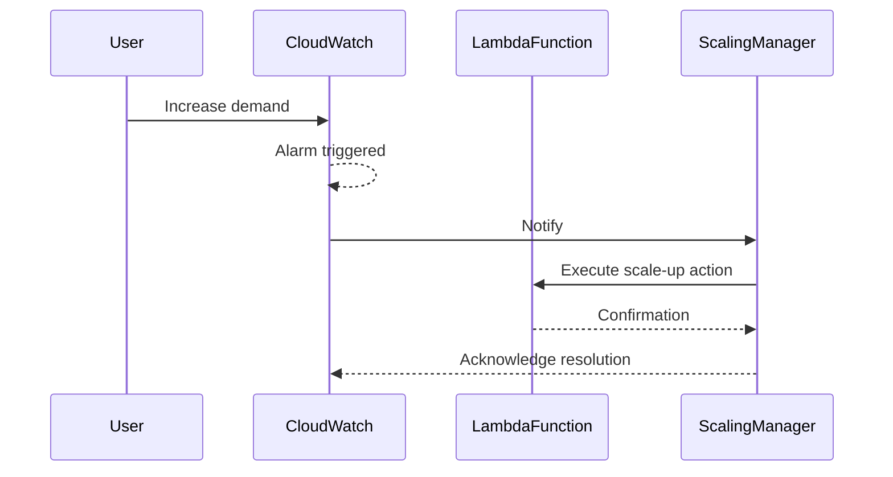

## Introduction

Event-Driven Scaling is a cloud computing design pattern that focuses on dynamically adjusting system resources in response to specific events or conditions. By leveraging event-driven mechanisms, this pattern ensures that applications automatically scale up or down based on demand, thereby maintaining optimal performance while efficiently managing costs.

## Detailed Explanation

Event-Driven Scaling primarily involves two key elements:

1. **Event Detection**: The system must be capable of identifying pertinent events that indicate a need for scaling. These events could be related to resource utilization, performance metrics, user demands, or specific triggers like promotional campaigns.

2. **Automated Scaling Actions**: Upon detection of relevant events, pre-defined scaling actions are executed. These actions involve allocating or deallocating cloud resources such as VMs, containers, or serverless functions.

This pattern is particularly beneficial in cloud environments where workloads can be unpredictable, and the ability to respond swiftly to changes is crucial. It eliminates the need for manual intervention, leading to more efficient operations and reduced human error.

### Example Code

Below is a pseudo-code example demonstrating an event-driven scaling setup using AWS Lambda and AWS CloudWatch:

```python
import boto3

cloudwatch = boto3.client('cloudwatch')
lambda_client = boto3.client('lambda')

def scale_up(event, context):
    # Example scaling action: increase the memory of a Lambda function
    response = lambda_client.update_function_configuration(
        FunctionName='myLambdaFunction',
        MemorySize=512
    )
    print("Scaled up myLambdaFunction:", response)

def event_handler(event, context):
    # Assume this function is triggered by a CloudWatch Alarm
    if event['detail-type'] == 'CloudWatch Alarm State Change':
        if event['detail']['state']['value'] == 'ALARM':
            scale_up(event, context)
```

In this scenario, a CloudWatch Alarm detects an increase in demand and triggers the `event_handler`, which then executes the `scale_up` function to adjust the Lambda configuration.

## Diagram



## Best Practices

- **Define Clear Triggers**: Ensure that the events that trigger scaling are well-defined and correspond to genuine scaling requirements to avoid unnecessary resource allocation.
- **Monitor and Adjust**: Continuously monitor the performance of your scaling actions and adjust your triggers and actions based on historical data and performance metrics.
- **Testing**: Thoroughly test your event-driven scaling configurations in a controlled environment to ensure reliability and correctness.
- **Leverage Auto-Scaling Services**: Utilize cloud provider services like AWS Auto Scaling, Azure Autoscale, or Google Cloud's Autoscaler to streamline scaling efforts.

## Related Patterns

- **Auto-Scaling Pattern**: While similar, auto-scaling generally uses predefined thresholds rather than specific events for scaling decisions.
- **Reactive Scaling**: Focuses on responding to previously observed historical data to manage scaling.
- **Predictive Scaling**: Uses machine learning techniques to forecast demand and adjust resources proactively.

## Additional Resources

- [AWS Documentation on Auto Scaling](https://aws.amazon.com/autoscaling/)
- [Azure Autoscale Overview](https://docs.microsoft.com/en-us/azure/azure-monitor/autoscale/autoscale-overview)
- [Google Cloud Autoscaler](https://cloud.google.com/compute/docs/autoscaler)

## Summary

Event-Driven Scaling embodies an adaptive approach to cloud resource management by reacting to real-time conditions. It is a strategic pattern that not only ensures optimal application performance but also aids in cost efficiency and resource utilization. By automating scaling processes, organizations can focus on delivering value while the system autonomously handles dynamic workload requirements. This pattern, when effectively implemented, can serve as a foundational strategy in resilient and scalable cloud architectures.
