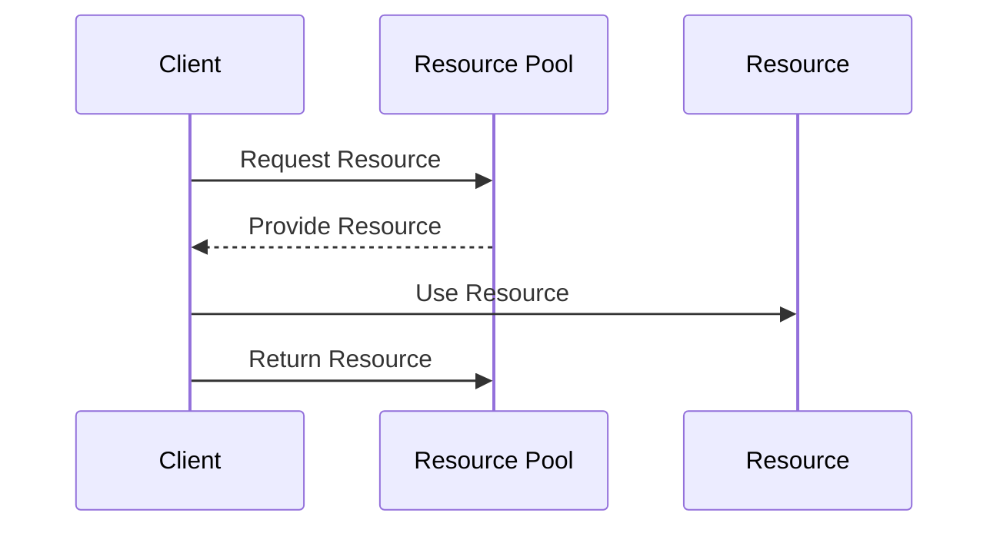

### Detailed Explanation

**Resource Pooling** is a design pattern used in cloud computing to maximize resource utilization and efficiency. The core idea of this pattern is to create a pool of reusable resources that can be dynamically shared among different clients or services. This approach optimizes the use of resources, reduces the overhead of resource management, and ensures that applications can scale efficiently.

Cloud resources, such as database connections, compute instances, or file handles, are valuable assets. By pooling these resources, applications can handle higher loads while minimizing the cost and complexity associated with managing individual resources.

### Architectural Approaches

1. **Connection Pooling**: Involves maintaining a pool of connections to a database. Instead of opening and closing a connection every time there's a request, the request can use an existing connection from the pool and return it back once done.

2. **Thread Pooling**: Threads are managed in a pool and may handle different tasks during their lifecycle, reducing the overhead of thread creation and still enabling high concurrency levels in applications.

3. **Object Pooling**: Objects are pre-created and managed in a pool to be reused across a system, particularly beneficial in environments where object creation is resource-intensive.

4. **Compute Resource Pooling**: Dynamically manage compute resources such as virtual machines or server instances, scaling up or down based on the demand.

### Best Practices

- **Pool Size Management**: Balancing the size of the pool is crucial. A pool that's too small can become a bottleneck, while one that's too large might waste resources.
  
- **Timeout and Exception Handling**: Implement timeouts and proper exception handling to release and manage resources efficiently, avoiding deadlocks and resource leaks.

- **Resource Monitoring**: Continuous monitoring of resources available in the pool helps in identifying patterns in resource consumption and predicting future requirements.

- **Dynamic Scaling**: Use auto-scaling policies in cloud environments to adjust the resource pool size based on workload changes.

### Example Code

Here’s a simple example in Java illustrating a connection pooling mechanism using HikariCP, a popular lightweight connection pool:

```java
import com.zaxxer.hikari.HikariConfig;
import com.zaxxer.hikari.HikariDataSource;

public class ConnectionPoolExample {
    public static void main(String[] args) {
        HikariConfig config = new HikariConfig();
        config.setJdbcUrl("jdbc:mysql://localhost:3306/mydatabase");
        config.setUsername("user");
        config.setPassword("password");
        config.setMaximumPoolSize(10); // Max pool size

        try (HikariDataSource dataSource = new HikariDataSource(config)) {
            // Acquire a connection from the pool
            try (Connection connection = dataSource.getConnection()) {
                // Use the connection ...
            } // Connection is automatically returned to the pool here
        }
    }
}
```

### Diagrams

#### UML Sequence Diagram



### Related Patterns

- **Circuit Breaker**: Works in tandem with resource pooling to ensure system stability by preventing an application from performing operations likely to fail.

- **Load Balancing**: Distributes workloads across multiple resources to optimize resource use, maximize throughput, and minimize response time.

- **Auto-Scaling**: Automatically adjusts the amount of resources based on the demand, ensuring efficient resource utilization.

### Additional Resources

- [HikariCP Documentation](https://github.com/brettwooldridge/HikariCP)
- [Oracle's Guide on Connection Pooling](https://www.oracle.com/java/technologies/javase/jdbc-10-4-2.html)
- [AWS Auto Scaling](https://aws.amazon.com/autoscaling/)

### Summary

Resource Pooling is an essential design pattern in cloud computing that facilitates efficient resource use by enabling sharing and reusing of resources among multiple clients or services. It reduces resource lifecycle management overhead, improves application performance, and aids in achieving scalability and elasticity in cloud environments. By adhering to best practices like proper pool size management and dynamic scaling, organizations can ensure that their systems remain robust and responsive under varying loads.
