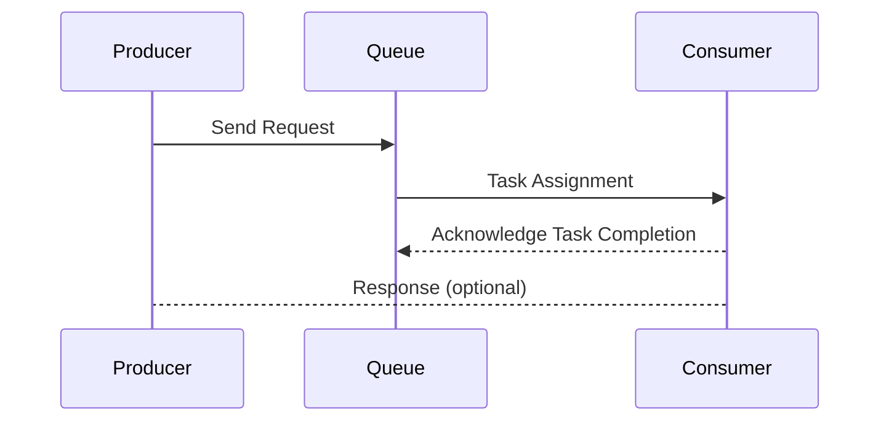

## Introduction

As cloud-based systems increasingly need to handle unpredictable workloads, maintaining service stability becomes crucial. Queue-Based Load Leveling is a design pattern that introduces a queue between producers and consumers, allowing systems to absorb sudden spikes in requests without overwhelming the resources or impacting service availability.

## Detailed Explanation

The Queue-Based Load Leveling pattern operates by decoupling the producer and consumer of a resource-intensive process. The producer sends work requests to a queue, and the consumer processes these requests at its own pace. By doing this, the system can gracefully handle fluctuations in load without the need for over-provisioning resources or compromising on performance.

### Key Concepts

1. **Message Queue**: Serves as a buffer between the producer and consumer, allowing requests to be queued during peak load times.
2. **Producer**: The component that generates tasks or requests.
3. **Consumer**: The component that processes tasks. It pulls requests off the queue when it’s able to process them, helping in balancing the load.
4. **Scalability**: The ability of the system to handle increased load by scaling out consumers that process the queue.

### Benefits

- **Decoupling**: Separation of producers and consumers allows each to evolve independently.
- **Resilience**: System can handle requests beyond the immediate capacity of consumers by queuing requests.
- **Scaling**: Offers flexible scaling of consumers as per the workload, supporting dynamic scaling in cloud environments.

### Challenges

- **Queue Management**: Requires careful management of queue size and processing delays.
- **Message Durability**: Handling message persistence and reliability in case of system failures.
- **Latency**: Potential increase in latency as requests wait in the queue to be processed.

## Architectural Approach

The architectural setup involves an intermediary message queue acting between request initiators and processors. When incoming traffic surges, requests are queued rather than directly processed, allowing the consumers to handle tasks at an optimal pace without overloading.

Here's a basic representation of the Queue-Based Load Leveling architecture using Mermaid syntax:



## Example Code

An example of implementing Queue-Based Load Leveling using AWS SQS (Simple Queue Service) and AWS Lambda:

```javascript
// Producer: Sending messages to AWS SQS
const AWS = require('aws-sdk');
const sqs = new AWS.SQS();

const params = {
  QueueUrl: 'Your-Queue-URL',
  MessageBody: JSON.stringify({ value: 'task data' }),
};

sqs.sendMessage(params, (err, data) => {
  if (err) {
    console.error('Error sending message:', err);
  } else {
    console.log('Message sent, ID:', data.MessageId);
  }
});

// Consumer: Processing messages from AWS SQS using AWS Lambda
exports.handler = async (event) => {
  try {
    for (const record of event.Records) {
      const taskData = JSON.parse(record.body);
      console.log('Processing task:', taskData);
      
      // Process the task
    }
  } catch (error) {
    console.error('Error processing message:', error);
    throw error;
  }
};
```

## Related Patterns

- **Throttling Pattern**: Limits the rate at which an operation is performed or accepted.
- **Circuit Breaker Pattern**: Used to detect failures and wrap calls to remote services in order to prevent cascading failures.
- **Competing Consumers Pattern**: Multiple consumers can concurrently process messages from a message queue.

## Additional Resources

- [AWS SQS Documentation](https://docs.aws.amazon.com/sqs)
- [Azure Queue Storage Documentation](https://docs.microsoft.com/en-us/azure/storage/queues/queues-overview)
- [Google Cloud Pub/Sub Overview](https://cloud.google.com/pubsub)

## Summary

The Queue-Based Load Leveling pattern is an essential tool for building scalable, resilient cloud architectures. By decoupling request producers from consumers, it allows systems to handle high load‐bursts effectively, improving overall system reliability and responsiveness. This pattern is particularly beneficial in environments with unpredictable workloads and is a fundamental practice for managing scalability and elasticity in cloud computing.
