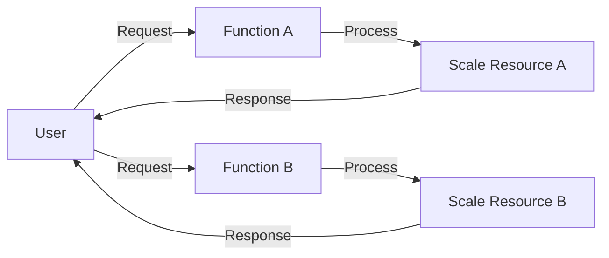

## Introduction

Function-Level Scaling is a cloud computing pattern that allows individual functions or services to scale independently. As modern applications become more complex and dynamic user demands vary, traditional scaling approaches, where the entire application is scaled as a whole, can lead to resource inefficiency and increased operational costs. This pattern introduces the flexibility to allocate resources solely to the functions that require them at any given time, enhancing performance and cost management.

## Architectural Approaches

### Serverless Computing

Serverless frameworks, such as AWS Lambda, Azure Functions, and Google Cloud Functions, exemplify Function-Level Scaling by natively supporting the independent scaling of functions. In this approach, developers deploy code as discrete functions, each scaling based on its specific demands.

### Microservices Architecture

Microservices architecture further enables function-level scaling. Here's how:

- **Decoupled Services**: Each microservice represents an independent business capability, allowing tailored resource allocation.
- **Containerization**: Utilizing container orchestration platforms like Kubernetes, individual containers encapsulating microservices can scale independently using Horizontal Pod Autoscalers.

## Best Practices

- **Statelessness**: Design functions to be stateless to enable seamless scaling without dependency on local memory.
- **Efficient Resource Utilization**: Monitor and define clear thresholds for scaling events to prevent unnecessary resource allocation.
- **Proper Logging and Monitoring**: Implement comprehensive monitoring to track function performance and adjust scaling configurations as needed.

## Example Code

Using AWS Lambda for Function-Level Scaling, consider the following simple example of a Node.js Lambda function:

```javascript
exports.handler = async (event) => {
    const response = {
        statusCode: 200,
        body: JSON.stringify('Hello from Function-Level Scaling!'),
    };
    return response;
};
```

This function will automatically scale based on incoming request demand.

## Diagrams



The diagram above illustrates how different functions (Function A and B) scale independently and respond to user requests.

## Related Patterns

- **Elastic Provisioning**: Automatically provisioning and de-provisioning resources as needed.
- **Load Balancer**: Distributing incoming network traffic across a group of backend resources or services to ensure availability.
- **Circuit Breaker**: Preventing system components from being overwhelmed by failures.

## Additional Resources

- [AWS Lambda – Event-driven Compute Service](https://aws.amazon.com/lambda/)
- [Serverless Computing on Azure](https://azure.microsoft.com/en-us/overview/serverless-computing/)
- [Google Cloud Functions Overview](https://cloud.google.com/functions)

## Summary

Function-Level Scaling provides a robust framework to address modern cloud application demands by enabling independent scaling of functions. This pattern leverages serverless computing and microservices architecture, allowing applications to dynamically adjust resource allocation in real-time, thus optimizing performance and reducing costs. By embracing this pattern, organizations can achieve a high level of elasticity and efficiency within their cloud environments.
