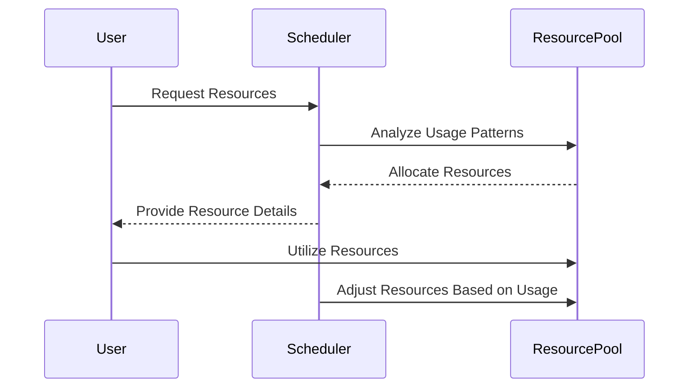

## Introduction

In cloud computing, **Resource Scheduling** refers to the strategic allocation of computational resources based on analyzed usage patterns. This design pattern aims to optimize both performance and cost-effectiveness by dynamically adjusting resource provisioning in response to varying workloads.

## Detailed Explanation

### Architectural Approach

Resource Scheduling incorporates advanced algorithms and strategic planning to ensure that the right amount of resources is available at the right time. This involves:

1. **Monitoring and Analysis**: Continuously collecting data on resource utilization across different services and applications.
2. **Predictive Analytics**: Using machine learning models to predict future resource needs based on historical data and trends.
3. **Dynamic Provisioning**: Automatically scaling resources up or down based on demand predictions to avoid resource wastage or shortages.
4. **Cost Management**: Employing spot instances, reserved instances, or autoscaling groups to minimize costs while meeting resource demands.

### Best Practices

- **Leverage Machine Learning**: Use predictive models to anticipate peaks and troughs in usage and adjust schedules accordingly.
- **Implement Autoscaling**: Utilize cloud provider features such as AWS Auto Scaling, Azure Autoscale, or GCP's autoscaling feature to automate the scaling of resources.
- **Optimize Resource Types**: Choose the most cost-effective and performance-appropriate resource types, such as instances or storage according to workload demands.
- **Regular Auditing and Adjustment**: Continually reassess and adjust resource schedules based on performance data and financial metrics.

## Example Code

```typescript
import { EC2 } from 'aws-sdk';
import * as Autoscaling from 'aws-sdk/clients/autoscaling';

const ec2 = new EC2();
const autoscaling = new Autoscaling();

// Configuring an EC2 instance
const params = {
  ImageId: 'ami-abcd',
  InstanceType: 't2.micro',
  MinCount: 1,
  MaxCount: 5,
};

// Launch instances
ec2.runInstances(params, (err, data) => {
  if (err) console.log("Error", err);
  else console.log("Success", data.Instances);
});

// Set up autoscaling
const autoScalingParams = {
  AutoScalingGroupName: 'myAutoScalingGroup',
  LaunchConfigurationName: 'myLaunchConfig',
  MinSize: 1,
  MaxSize: 5,
};

autoscaling.createAutoScalingGroup(autoScalingParams, (err, data) => {
  if (err) console.log("Error", err);
  else console.log("AutoScaling Group Created", data);
});
```

## Diagrams

### Sequence Diagram: Resource Scheduling



## Related Patterns

1. **Auto-Scaling Pattern**: This pattern automatically adjusts resources based on defined policies and thresholds.
2. **Load Balancing Pattern**: Distributes workloads evenly across available resources to optimize utilization.
3. **Dynamic Queue Pattern**: Manages work items in queues that automatically expand or contract based on demand.

## Additional Resources

- AWS Resource Scheduling Documentation
- Azure Autoscale Implementation Guide
- Google Cloud Resource Allocation Strategies

## Summary

Resource Scheduling optimizes cloud environments by dynamically allocating resources in response to observed and predicted workload patterns. By implementing this pattern, organizations can enhance their cloud utilization, improve service performance, and achieve significant cost savings. Utilizing tools like autoscaling and predictive analytics is essential in implementing effective resource scheduling strategies in modern cloud infrastructures.
