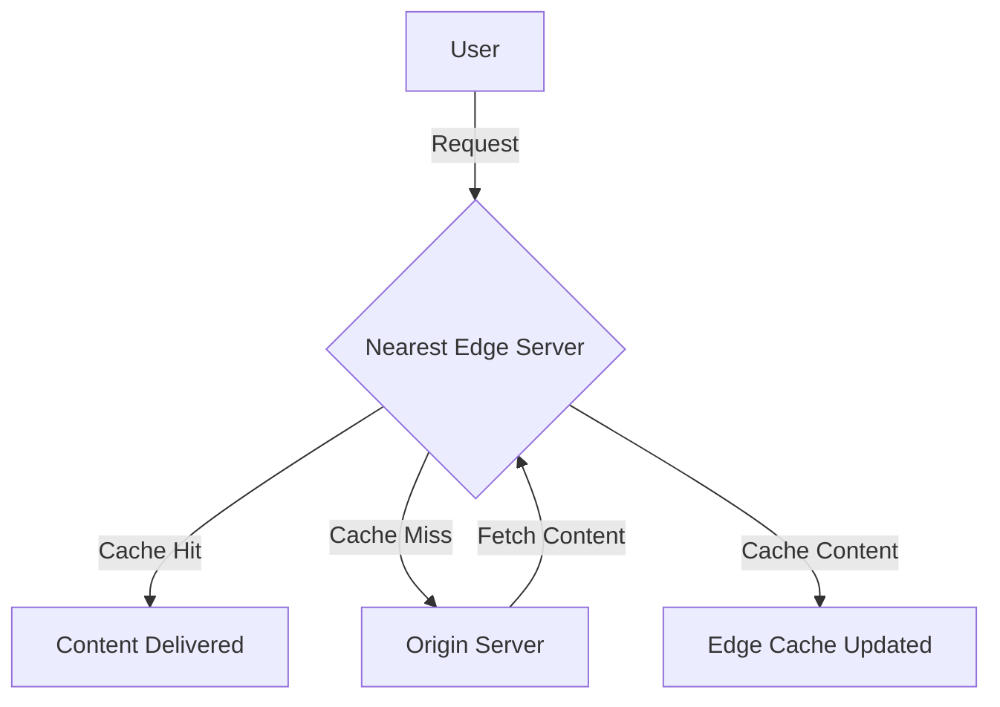

## Introduction

Content Delivery Networks (CDNs) are integral to modern cloud architectures, enabling applications to efficiently deliver digital content to users worldwide. By distributing content across a network of geographically dispersed servers, CDNs offer a scalable solution that enhances user experience by reducing latency and improving load times. This design pattern focuses on offloading content delivery from origin servers, which reduces load, optimizes bandwidth, and scales more efficiently under high traffic conditions.

## Detailed Explanation

### Architectural Approach

At the core, CDNs consist of a network of edge servers strategically placed in various global locations. These edge servers cache content originated from central servers (origin servers) and deliver it to end-users. Key components include:

1. **Origin Server**: The original source of content, such as web pages, images, videos, and code files.
2. **Edge Servers**: Servers located closer to end-users that cache and serve content.
3. **Caching Strategy**: Policies to determine what content to store, for how long, and when to refresh cached content.

### How CDNs Work

1. **Request Routing**: When a user requests content, the CDN ensures it is served by the nearest edge server, thereby minimizing the distance data travels and improving speed.
2. **Content Caching**: Static content such as HTML, CSS, JavaScript, images, and video files are cached on edge servers to fulfill user requests without having to query the origin server each time.
3. **Load Balancing**: Dynamic content that cannot be cached is efficiently routed to the least loaded edge or origin server.
4. **Content Invalidation and Purging**: Outdated or incorrect content must be removed quickly from the cache. CDNs provide efficient mechanisms to invalidate and refresh content as needed.

### Best Practices

- **Utilize Caching Policies**: Define effective caching strategies to improve content freshness and hit ratios.
- **Monitor CDN Performance**: Regularly monitor performance metrics such as cache hit rates, latency, and traffic distribution.
- **Security Measures**: Implement security measures such as HTTPS, DDoS protection, and secure tokenized links.
- **Optimize and Compress Content**: Use image optimization, minification, and compression techniques to reduce content size and improve delivery speed.

## Example Code

Assuming a website using a popular CDN service like Cloudflare or AWS CloudFront, here's how you might define basic CDN settings:

```javascript
// Example for initializing a CDN using AWS CloudFront
const AWS = require('aws-sdk');
const cloudFront = new AWS.CloudFront();

const params = {
  DistributionConfig: {
    CallerReference: 'unique-reference-string',
    Comment: 'CDN configuration for my website',
    Enabled: true,
    Origins: {
      Quantity: 1,
      Items: [
        {
          Id: 'myOrigin',
          DomainName: 'mywebsite.com',
          // Define more detailed parameters for origin
        }
      ]
    },
    DefaultCacheBehavior: {
      TargetOriginId: 'myOrigin',
      ViewerProtocolPolicy: 'redirect-to-https',
      // Caching and forwarding rules
    },
    // Further configuration...
  }
};

cloudFront.createDistribution({ DistributionConfig: params }).promise()
  .then(data => console.log('CDN Distribution Created:', data))
  .catch(err => console.error('Error creating CDN distribution:', err));
```

## Diagrams

### CDN Architecture Diagram



## Related Patterns

- **Edge Computing**: Extending computing to the edge of the network for real-time processing closer to the source of data generation.
- **Load Balancing**: Efficiently distributing incoming traffic across multiple servers to ensure no single server becomes overwhelmed.
- **Auto-scaling**: Automatically adjusting the number of compute resources in a system depending on the load.

## Additional Resources

- [AWS CloudFront Documentation](https://aws.amazon.com/documentation/cloudfront/)
- [Cloudflare CDN Overview](https://www.cloudflare.com/learning/cdn/what-is-a-cdn/)
- [Understanding CDN Caching Strategies](https://www.keycdn.com/support/caching-strategy)

## Summary

Content Delivery Networks (CDNs) are a powerful pattern for improving content delivery efficiency in cloud environments. By caching content at strategically placed edge servers worldwide, CDNs enhance application performance, reduce server loads, and optimize bandwidth usage, making them essential for modern web applications aiming for global reach and scalability. Implementing CDNs effectively requires careful selection of caching strategies, regular performance monitoring, and robust security practices to ensure continuous optimization and protection.
