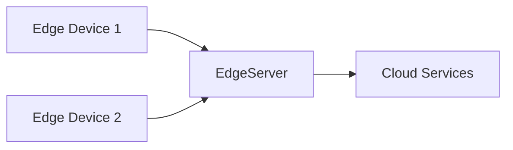

## Introduction

Edge Computing for Scalability is a design pattern that aims to address performance and responsiveness challenges by processing data closer to its source. This pattern reduces the load on central data centers, enhances real-time data processing capabilities, and decreases latency by using decentralized computing resources.

## Architectural Approach

The cornerstone of this pattern is to extend computing capabilities to the network's edge, positioning compute resources in proximity to the data source. This distributed approach ensures that data processing can occur quickly and efficiently, leveraging local computational resources to handle critical tasks before data is transmitted to centralized cloud services.

### Key Components:

1. **Edge Devices**: Equip these devices with sufficient processing power to handle data locally. Examples include IoT devices, smartphones, and embedded systems.

2. **Edge Servers**: Positioned as intermediaries between the cloud and edge devices, these servers aggregate data, process it as needed, and manage connections to the core infrastructure.

3. **Central Cloud Services**: These provide robust processing, analytics, and storage capabilities, receiving critical data that has been pre-processed at the edge.

### Best Practices

- **Data Prioritization**: Determine which data must be processed locally versus what should be sent to centralized services based on latency sensitivity and bandwidth costs.
  
- **Security**: Ensure data is securely transmitted and stored by implementing edge-specific security measures due to the potentially vulnerable nature of geographically dispersed devices.

- **Scalability Management**: Enable horizontal scalability by adding more edge nodes as demand increases.

## Example Code

Here's an example code snippet demonstrating edge computing using a cloud serverless function and an edge device.

```python
import random

def collect_and_process_data():
    sensor_data = random.randint(0, 100)
    processed_data = sensor_data * 2  # Simple processing
    return processed_data

def send_data_to_cloud(processed_data):
    # Placeholder code for sending data
    print(f"Sending processed data to cloud: {processed_data}")

data = collect_and_process_data()
send_data_to_cloud(data)
```

```javascript
// Example Serverless Function (Node.js)
exports.handler = async (event) => {
    const processedData = JSON.parse(event.body).data;
    console.log("Received data from edge:", processedData);
    // Perform further processing or storage in cloud
    return {
        statusCode: 200,
        body: JSON.stringify('Data processed successfully')
    };
};
```

## Diagrams

### Edge Computing Architecture

Here is diagram illustrating the interaction between Edge Devices, Edge Servers, and Cloud Services.



## Related Patterns

- **Gateway Offloading**: Similar to edge computing, this pattern focuses on offloading specific tasks to gateway devices to reduce the load on central servers.
  
- **Content Delivery Network (CDN)**: Deploying content caches closer to users enhances delivery speed and reduces latency, akin to edge computing's aims.

## Additional Resources

- [Edge Computing Basics](https://www.ibm.com/cloud/learn/edge-computing)
- [Cloud-Based Edge Computing Resources](https://aws.amazon.com/edge/)
- [The Role of Edge Computing in Modern IT](https://www.forbes.com/sites/forbestechcouncil/2023/edge-computing-in-modern-cloud-architecture)

## Summary

Edge Computing for Scalability offers a strategic advantage by dispersing computation closer to the data origin. This pattern significantly reduces latency, optimizes bandwidth usage, improves responsiveness, and ultimately enhances application scalability and resilience. By effectively leveraging computational resources at the edge, organizations can meet modern computing demands with greater efficiency and agility.
