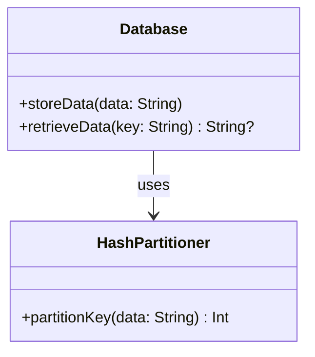
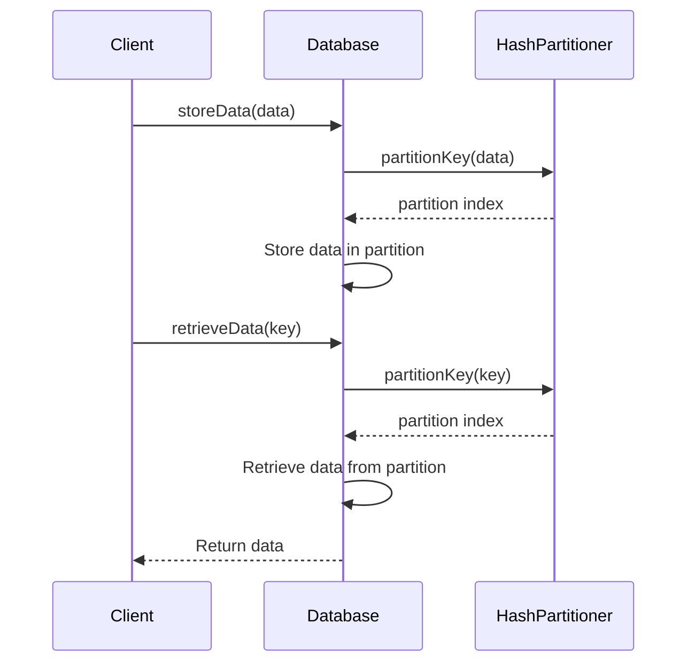

## Overview

Data Partitioning is a fundamental design pattern in cloud computing and distributed systems. It involves dividing a dataset into smaller, more manageable pieces or partitions to improve performance, enhance manageability, and support scalability. This pattern is particularly significant in the contexts of big data, distributed databases, and scalable web applications.

The primary aim of data partitioning is to distribute workloads evenly across system resources, thereby preventing bottlenecks and ensuring efficient data access. By enabling horizontal scaling, data partitioning facilitates the accommodation of growing datasets and user loads.

## Architectural Approaches

There are several approaches to implement data partitioning, each with its advantages and considerations:

1. **Horizontal Partitioning (Sharding)**: This method involves distributing rows of a database table across different nodes. Each partition (or shard) contains a subset of the total data. Horizontal partitioning is widely used for its ability to scale out by adding more nodes.

2. **Vertical Partitioning**: Here, columns of a table are divided into different physical tables, which can be stored on various nodes. Vertical partitioning can benefit applications with distinct access patterns to different data sets.

3. **Functional Partitioning**: In this approach, data is divided based on functional access patterns, such as separating user data from transactional data.

4. **Range Partitioning**: This involves partitioning data based on ranges of values, such as dates or numeric IDs. It helps in queries that operate over certain ranges.

5. **Hash Partitioning**: Here, data is distributed by applying a hash function to partition keys, ensuring even distribution and simplifying access patterns.

## Best Practices

- **Define Clear Partitioning Keys**: Choose partitioning keys that evenly distribute data and align with your access patterns.
- **Consider Future Growth**: Design your partitioning strategy with scalability in mind to accommodate future data growth.
- **Monitor and Adjust**: Continuously monitor performance and adjust partitioning as needed.
- **Balance Load**: Ensure that partitions are balanced in size and accessed equally to prevent hotspots.

## Example Code

Here's a simple example of a hash partitioning implementation in a distributed database using Kotlin and a hypothetical library:

```kotlin
fun partitionKey(data: String): Int {
    return data.hashCode() % numberOfPartitions
}

fun storeData(data: String) {
    val partition = partitionKey(data)
    databasePartitions[partition].insert(data)
}

fun retrieveData(key: String): String? {
    val partition = partitionKey(key)
    return databasePartitions[partition].find(key)
}
```

## Diagrams

### UML Class Diagram



### UML Sequence Diagram



## Related Patterns

- **CQRS (Command and Query Responsibility Segregation)**: This pattern often uses partitioning to manage queries and commands separately.
- **Event Sourcing**: Complementary to data partitioning in systems that rely on event logs.

## Additional Resources

- "Designing Data-Intensive Applications" by Martin Kleppmann
- Distributed Systems: Principles and Paradigms

## Summary

Data Partitioning is an essential pattern for achieving scalability, performance optimization, and manageability of large datasets in distributed systems. By leveraging different partitioning strategies such as horizontal, vertical, and hash partitioning, applications can efficiently handle diverse workloads and data access patterns. Implementing this pattern requires careful consideration of access patterns and future growth, along with continuous monitoring to ensure optimal performance.
