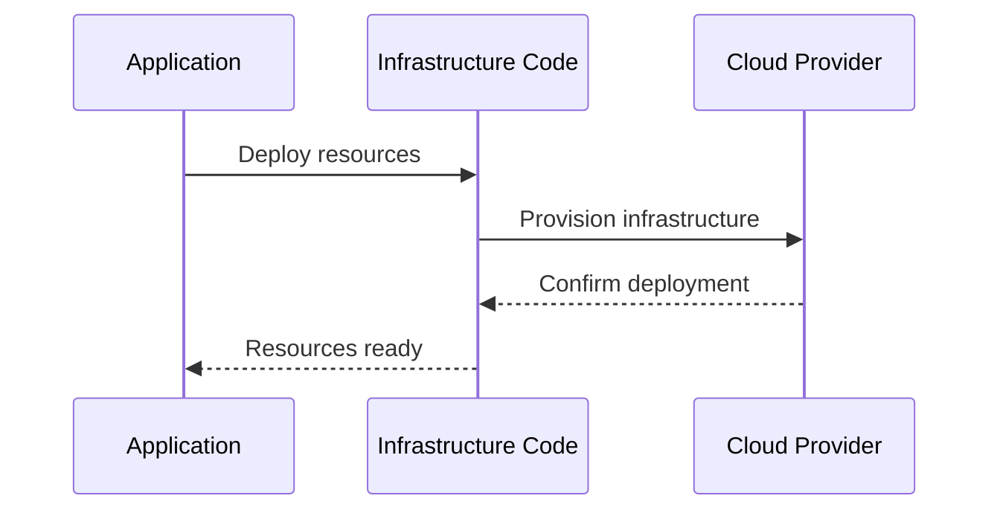

## Introduction

Software-Defined Infrastructure (SDI) refers to an architectural approach that leverages software-based management to automate the provisioning, configuration, and scaling of infrastructure resources. This approach abstracts physical infrastructure into software components and uses policy-driven operations to ensure that infrastructure adapts dynamically to the needs of applications and workloads. SDI is foundational for achieving scalability and elasticity in modern cloud environments.

## Core Concepts

### Infrastructure as Code (IaC)

Infrastructure as Code is an essential principle behind SDI that involves managing and provisioning computing infrastructure through machine-readable definition files, rather than physical hardware configuration or interactive configuration tools. This allows for reproducibility, version control, and collaboration in managing infrastructure.

### Automation and Orchestration

SDI employs automation and orchestration tools to streamline the deployment and management of infrastructure. Automation handles repetitive tasks, while orchestration manages the sequences and dependencies of complex processes, ensuring everything is integrated smoothly.

### Dynamic Resource Allocation

SDI enables dynamic resource allocation, allowing infrastructure components to be provisioned, scaled, and decommissioned automatically based on real-time requirements. This ensures optimal resource utilization and cost efficiency.

## Architectural Approaches

### Policy-Driven Resource Management

In a Software-Defined Infrastructure, policies define how resources are allocated, monitored, and scaled. These policies are used by orchestration tools to automate infrastructure adjustments without human intervention, adapting to the workload demands automatically.

### Service Abstraction

Service abstraction decouples application components from the underlying infrastructure, allowing them to interact through predefined service interfaces. This abstraction facilitates seamless resource management and scaling, as services can be redeployed or scaled independently of physical resources.

### Containerization and Virtualization

SDI often utilizes containerization and virtualization technologies to encapsulate and isolate applications, providing consistent runtime environments that are easy to deploy, manage, and scale across distributed infrastructure.

## Best Practices

1. **Implement Robust IaC Practices**: Use industry-standard tools like Terraform, Ansible, or AWS CloudFormation for defining infrastructure specifications, which ensures consistency and repeatability.
   
2. **Utilize CI/CD for Infrastructure**: Integrate infrastructure changes into CI/CD pipelines to ensure safe, automated deployment and rollback of infrastructure components along with application updates.
   
3. **Emphasize Security and Compliance**: Incorporate security policies and compliance checks into automated workflows to protect infrastructure and ensure adherence to standards.

4. **Regularly Monitor and Optimize**: Use monitoring tools to continuously observe infrastructure performance and make necessary adjustments to improve efficiency and cover unexpected loads.

## Example Code

Here's a simple example of Infrastructure as Code using Terraform for creating an EC2 instance on AWS:

```hcl
provider "aws" {
  region = "us-west-2"
}

resource "aws_instance" "example" {
  ami           = "ami-2757f631"
  instance_type = "t2.micro"

  tags = {
    Name = "SDI-Terraform-Example"
  }
}
```
This configuration file specifies a region and a resource (an EC2 instance) with its associated properties, automating the provisioning of infrastructure.

## Diagrams



## Related Patterns

- **Cloud Orchestration**: Focuses on the integration and coordination of disparate services and resources based on pre-defined workflows and policies.
- **Immutable Infrastructure**: Entails deploying only fresh instances whenever there are any updates or changes, instead of modifying existing instances.

## Additional Resources

- [Terraform Documentation](https://www.terraform.io/docs/index.html)
- [AWS CloudFormation](https://aws.amazon.com/cloudformation/)
- [Ansible for Automation](https://www.ansible.com/)

## Summary

Software-Defined Infrastructure transforms how infrastructure is managed by reducing manual intervention and enhancing agility through automation and policy-driven management. This pattern is crucial for achieving scalable, elastic, and efficient cloud environments, enabling organizations to respond quickly to changing requirements while optimizing resource utilization and reducing costs. SDI, with its underlying principles like Infrastructure as Code and orchestration, lays the groundwork for resilient and adaptive infrastructure.
