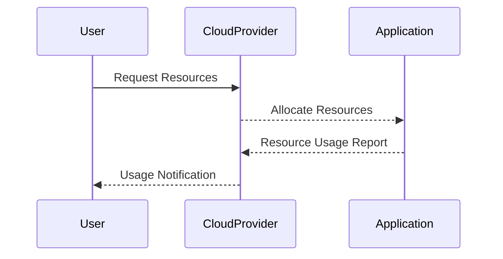

## Introduction

The **Resource Limits and Quotas** design pattern is a fundamental concept in cloud computing frameworks aimed at ensuring that no single application can monopolize or exhaust shared resources. This approach is crucial for maintaining application performance, achieving balanced resource consumption, and ensuring a fair playing field for multiple users or applications within a cloud environment.

## Objectives

1. **Prevent Resource Overconsumption**: Ensure that one application cannot consume all available resources, thereby impacting the performance of other applications.
2. **Promote Fair Usage**: Enable equitable distribution of resources among all applications and users.
3. **Enforce Service Level Agreements (SLAs)**: Use quotas to ensure SLAs are met and applications are not exceeding their allocated resources.
4. **Cost Control**: Prevent unexpected costs by limiting the usage of expensive resources.

## Architectural Approach

### Resource Limits

Resource limits define the maximum amount of a given resource that any single application or tenant is allowed to use. This ensures that even if an application attempts to consume more, its usage is throttled or terminated according to the predefined limits.

- **CPU and Memory Limits**: Set upper bounds on the amount of CPU or memory usage for applications.
- **Network Bandwidth**: Cap the amount of network bandwidth used by each application to prevent network saturation.
- **Storage Limits**: Control the maximum disk space an application can consume.

### Quotas

Quotas differ from limits in that they specify the total amount of resources a user or application can use within a certain timeframe or for a particular operation. They are often implemented as part of cloud provider environments or enterprise IT policies.

- **Daily or Monthly Quotas**: Restrict users or applications to a certain amount of resource usage over a specified timeframe.
- **Operation-based Quotas**: Limit the number of particular cloud API calls or operations (e.g., database writes).

## Best Practices

1. **Monitor Usage Regularly**: Implement monitoring to observe real-time application resource usage and detect when thresholds are nearing.
2. **Automate Alerts and Actions**: Set up automated alerts for when usage exceeds certain limits and automate scaling or throttling actions.
3. **Review and Adjust**: Regularly review and adjust limits and quotas based on observed application patterns and changes in resource demand.
4. **Resource Isolation**: Use containerization or virtualization to enforce limits at the process or virtual machine level.

## Example Code

For demonstration, let's consider Kubernetes as an example of implementing resource limits in a pod configuration:

```yaml
apiVersion: v1
kind: Pod
metadata:
  name: example-pod
spec:
  containers:
  - name: example-container
    image: example-image
    resources:
      limits:
        memory: "512Mi"
        cpu: "500m"
      requests:
        memory: "256Mi"
        cpu: "250m"
```

In this example, the container has a memory limit of 512MB and a CPU limit of 500 milliCPU units. These limits ensure that the container does not exceed the prescribed resource utilization.

## Diagrams

### Resource Allocation Sequence Diagram



This sequence diagram illustrates the interaction between users, cloud providers, and applications in managing quotas and limits.

## Related Patterns

- **Auto-Scaling**: Automatically increase or decrease resources allocated to an application based on their utilization.
- **Rate Limiting**: Control the number of sent or received requests over a specific period to prevent abuse or overconsumption.
- **Circuit Breaker**: Temporarily halt operations when a system is overloading or error rates exceed a threshold, hence limiting resource usage.

## Additional Resources

- [Kubernetes Resource Management](https://kubernetes.io/docs/concepts/configuration/manage-resources-containers/)
- [AWS Quotas and Limits](https://docs.aws.amazon.com/general/latest/gr/aws_service_limits.html)
- [GCP Resource Quotas](https://cloud.google.com/docs/quota)

## Summary

Resource Limits and Quotas are essential for maintaining balanced and fair resource utilization across cloud environments. By implementing these patterns, organizations can prevent single applications from monopolizing resources, improve overall system stability, and enforce usage-aware cost management frameworks. Following best practices in monitoring, setting alerts, and periodic review ensures these systems remain efficient and responsive to organizational changes in resource demand.
