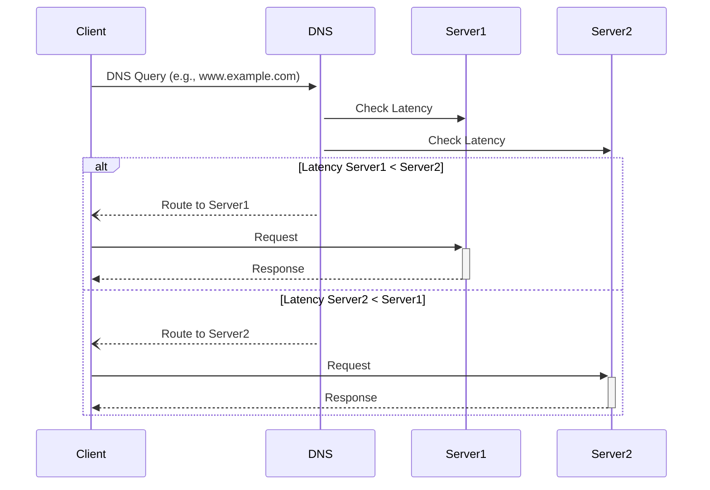

---

linkTitle: "Latency-Based Routing"
title: "Latency-Based Routing: Directing Traffic Based on Network Latency"
category: "Scalability and Elasticity in Cloud"
series: "Cloud Computing: Essential Patterns & Practices"
description: "Latency-Based Routing involves directing traffic to the server with the least network latency to enhance performance and user experience. It helps in dynamically adjusting the routing path for requests based on the current network conditions."
categories:
- Scalability
- Elasticity
- Networking
tags:
- Latency
- Cloud
- Network Performance
- Traffic Routing
- Load Balancing
date: 2024-07-07
type: docs

canonical: "https://softwarepatternslexicon.com/18/20/23"
license: "© 2024 Tokenizer Inc. CC BY-NC-SA 4.0"
---

## Overview

Latency-Based Routing is a design pattern used to route network traffic to the endpoint that offers the lowest latency among many. This pattern is crucial for applications and services spread over multiple geographic locations aiming to provide optimal response times by minimizing network delays.

## Detailed Explanation

Implementing Latency-Based Routing begins with measuring the latency between the sources of requests and available server locations. The system then dynamically routes each request to the server location that provides the least latency — ensuring faster response times, improving user satisfaction, and optimizing resource utilization.  

### Key Components

1. **Global Load Balancer**: Essential for managing the distribution of traffic across multiple server locations to enhance speed and reliability.
2. **Latency Measurement Mechanism**: Evaluates and measures network latency continuously or periodically between the client and server clusters.
3. **Routing Algorithm**: A policy or algorithm that makes real-time decisions based on latency measurements to direct traffic to the optimal server.
4. **Monitoring and Analytics**: Tools and systems to track performance metrics and user experience feedback to finetune routing rules.

## Architectural Approaches

1. **DNS-Based Routing**: Using DNS queries to route users to the least latent endpoint.
2. **Cloud Provider Services**: Leverage services like AWS Route 53 or Google Cloud's Cloud CDN which offer built-in latency-based routing features.
3. **Custom Implementations**: Develop custom solutions using load balancers with dynamic latency metrics for advanced control.

## Best Practices

- **Regular Latency Evaluation**: Continuously monitor network latency as it can fluctuate due to various factors like bandwidth availability or network congestion.
- **Redundancy**: Ensure redundancy by having multiple data centers or server locations to switch between if one becomes suboptimal.
- **Scalability**: Design the routing mechanism to scale with the number of clients and server locations.
- **Failover Strategies**: Implement failover strategies to handle downtimes or high latency scenarios efficiently.

## Example Code

Below is an example of using AWS Route 53 for Latency-Based Routing:

```bash
aws route53 create-traffic-policy-instance \
    --hosted-zone-id /hostedzone/Z1PA6795UKMFR9 \
    --name www.example.com \
    --traffic-policy-id "ExamplePolicy" \
    --traffic-policy-version 1 \
    --endpoint-type HTTP \
    --resource-record-set-count 2
```

## Diagrams



## Related Patterns

- **Geolocation Routing**: Routes traffic based on the geographical location of the request origin.
- **Weighted Routing**: Uses predefined weights to distribute traffic among endpoints.
- **Failover Routing**: Automatically redirects traffic to an available server during failure or high latency instances.

## Additional Resources

- Amazon Route 53 Documentation: [AWS Route 53](https://aws.amazon.com/route53/)
- Google Cloud CDN Documentation: [Google Cloud CDN](https://cloud.google.com/cdn/docs)
- Cloudflare Latency-Based Routing: [Cloudflare Load Balancing](https://www.cloudflare.com/load-balancing/)

## Summary

Latency-Based Routing enhances user experience and application efficiency by directing traffic to the server cluster with the minimal latency. Employing this pattern ensures that applications deliver content as swiftly as possible, ultimately leading to improved satisfaction and reduced latency-related user drop-offs.

---
