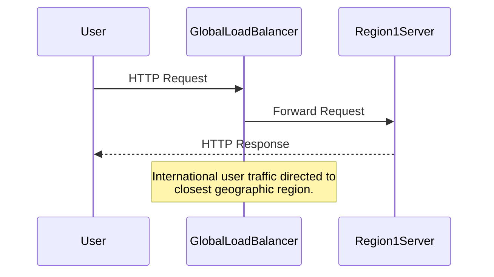

## Introduction

Geo-Distributed Deployments is a pattern aimed at enhancing the performance, reliability, and availability of cloud applications by deploying them across multiple geographic locations. By placing application components closer to end-users, this pattern helps to reduce latency and improve user experience, while also allowing for regionalized scaling and fault tolerance.

## Design Pattern Description

### Core Concepts

- **Latency Reduction**: Distribute service endpoints globally to minimize the distance data must travel, which reduces latency and enhances performance.
- **Regional Scaling**: Dynamically scale resources in response to local demand, enabling more efficient traffic handling during peak loads or within different time zones.
- **High Availability**: Maintain application availability even if a regional failure occurs, via built-in redundancy and failover mechanisms.
- **Compliance and Data Residency**: Facilitate data handling by complying with regional data residency laws and regulations.

## Architectural Approaches

### System Architecture

When designing geo-distributed systems, several architectural elements are vital:

- **Load Balancers**: Act as the entry point, directing traffic to the nearest or least-loaded deployment instance.
- **Data Replication**: Use distributed databases or storage solutions that ensure data consistency and availability across regions.
- **Content Delivery Networks (CDN)**: Utilize CDNs to cache static content closer to user locations, minimizing load times.
- **Global Load Balancing**: Implement DNS-based global load balancing policies to dynamically route requests.

### Design Considerations

- **Network Latency**: Account for increased latency when accessing remote data centers.
- **Consistency Models**: Implement data consistency models that balance data consistency with availability and partition tolerance.
- **Failover Strategy**: Define failover and redundancy strategies, such as active-active or active-passive, to handle region-specific outages.

## Example Code

Here, we demonstrate an example of setting up geo-distributed deployments using AWS CloudFormation for multi-region support:

```yaml
AWSTemplateFormatVersion: "2010-09-09"
Resources:
  GlobalLoadBalancer:
    Type: AWS::ElasticLoadBalancingV2::LoadBalancer
    Properties:
      LoadBalancerAttributes:
        - Key: "load_balancing.cross_zone.enabled"
          Value: "true"
      Name: "GlobalLoadBalancer"
      Scheme: internet-facing

  GeoRegion1:
    Type: AWS::EC2::Instance
    Properties:
      InstanceType: t2.micro
      ImageId: ami-0ff8a91507f77f867
      AvailabilityZone: us-east-1a

  GeoRegion2:
    Type: AWS::EC2::Instance
    Properties:
      InstanceType: t2.micro
      ImageId: ami-0ff8a91507f77f867
      AvailabilityZone: eu-west-1a
```

## Diagrams

### Sequence Diagram: Geo-Distributed Request Handling



## Related Patterns

- **Edge Computing**: Focus on reducing latency and network costs by processing data closer to the source.
- **Content Delivery Network (CDN) Pattern**: Expands on reducing latency by caching content at strategically located data centers.

## Additional Resources

- [AWS Global Accelerator](https://aws.amazon.com/global-accelerator/)
- [Google Cloud Global VPC](https://cloud.google.com/vpc/)
- [Azure Traffic Manager](https://azure.microsoft.com/en-us/services/traffic-manager/)

## Summary

Geo-Distributed Deployments provide a strategic cloud architecture pattern that balances performance, availability, and fault tolerance by leveraging multiple geographic locations. It facilitates global reach while maintaining high standards for latency and user experience, thereby driving scalability and reliability for cloud-based applications. By embracing this pattern, enterprises can deliver superior service quality, align with geographically-bound compliance requirements, and construct resilient systems capable of thriving amidst regional disruptions.
