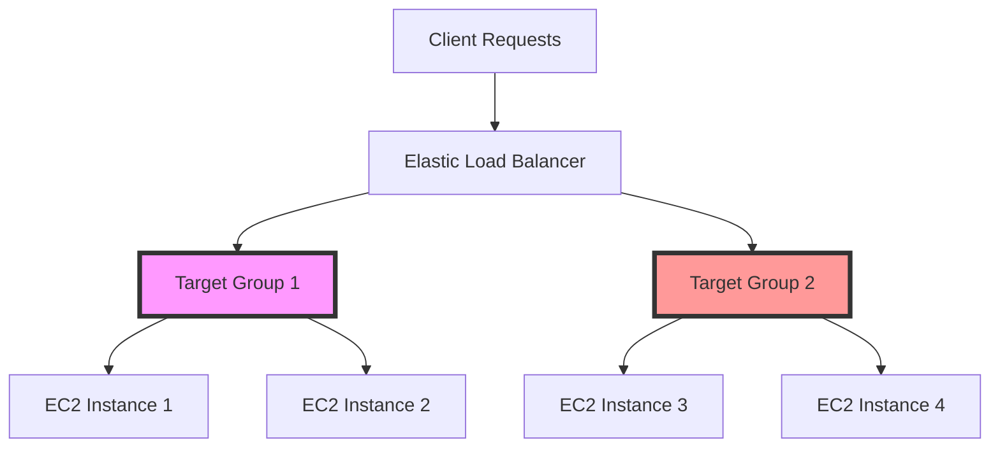

## Introduction

Elastic Load Balancing (ELB) is a quintessential design pattern in cloud architecture, offering automated distribution of incoming application or network traffic across multiple targets in different availability zones. This pattern supports scaling out by balancing traffic loads and ensures high availability and fault tolerance by routing traffic away from unhealthy targets.

## Detailed Explanation

### Core Concepts

1. **Traffic Distribution**: ELB distributes incoming traffic across multiple targets such as EC2 instances, containers, or IP addresses, thus preventing any single instance from becoming a bottleneck.
   
2. **Health Checks**: ELB performs continuous health checks on registered targets and only routes traffic to the healthy ones, ensuring optimal performance and uptime.

3. **Automatic Scaling**: The load balancer grows and adapts automatically to accommodate changing traffic patterns, supporting scalability without manual intervention.

4. **Zoning and Fault Tolerance**: By spreading traffic across availability zones, ELB provides resilience and fault tolerance against zone failures or outages.

### Components

- **Load Balancers**: Types include Application Load Balancer (ALB), Network Load Balancer (NLB), and Classic Load Balancer. Each serves different use cases — ALBs for HTTP/HTTPS, NLBs for ultra-high performance and static IP addresses, and CLBs for legacy compatibility.
  
- **Load Balancer Listeners**: Listeners check for connection requests from clients using the protocol and port configuration. They route requests to the appropriate targets based on defined rules.
  
- **Target Groups**: Targets are grouped for routing purposes. Each group can contain EC2 instances, ECS containers, Lambda functions, or IP addresses.

### Diagram



## Example Code

Elastic Load Balancing can be set up using AWS SDK for Java:

```java
import com.amazonaws.services.elasticloadbalancingv2.*;
import com.amazonaws.services.elasticloadbalancingv2.model.*;

public class ElasticLoadBalancerSetup {
    public static void main(String[] args) {
        AmazonElasticLoadBalancing client = AmazonElasticLoadBalancingClientBuilder.defaultClient();

        CreateLoadBalancerRequest request = new CreateLoadBalancerRequest()
                .withName("my-load-balancer")
                .withSubnets("subnet-01234567")
                .withSecurityGroups("sg-01234567")
                .withScheme("internet-facing")
                .withType(LoadBalancerTypeEnum.Application);

        CreateLoadBalancerResult response = client.createLoadBalancer(request);
        System.out.println("Load balancer ARN: " + response.getLoadBalancers().get(0).getLoadBalancerArn());
    }
}
```

## Related Patterns

- **Auto Scaling**: Dynamically adjusts the number of EC2 instances to handle changes in demand.
- **Circuit Breaker**: Prevents a service from making requests to an unhealthy resource.
- **Retry Pattern**: Implements retries for transient failures in distributed environments.

## Best Practices

- Regularly update and maintain security policies associated with the load balancers.
- Use cross-zone load balancing to ensure equal distribution across all registered targets in different zones.
- Monitor load balancer performance using CloudWatch metrics.

## Additional Resources

- AWS Elastic Load Balancing Documentation: [AWS ELB](https://aws.amazon.com/elasticloadbalancing/)
- Google Cloud Load Balancing: [GCP Load Balancing](https://cloud.google.com/load-balancing/)
- Microsoft Azure Load Balancer: [Azure Load Balancer](https://azure.microsoft.com/en-us/services/load-balancer/)

## Summary

Elastic Load Balancing is a pivotal component in cloud architectures that ensures scalable, high-performance, and fault-tolerant distributed systems. By automatically distributing incoming application traffic across multiple targets, scaling in response to load, and rerouting around unhealthy instances, ELB helps maintain high availability and optimal resource utilization. Implementing ELB in conjunction with other cloud patterns like Auto Scaling and Circuit Breaker enhances the overall robustness and responsiveness of cloud-native applications.
