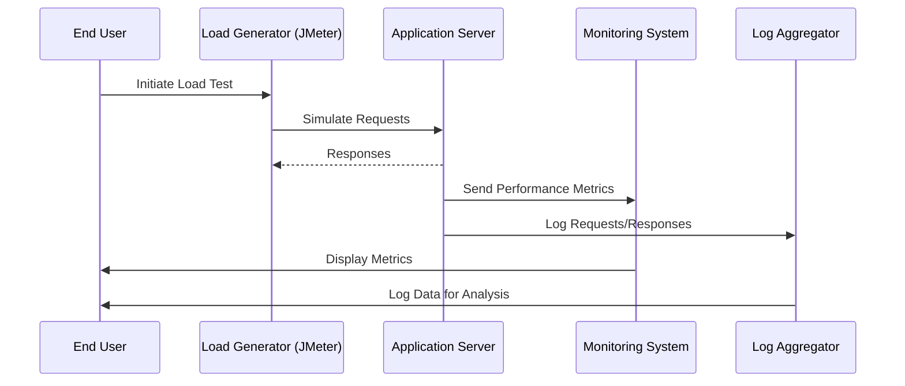

## Introduction

In the realm of cloud computing, the ability of a system to handle varying levels of load is paramount. **Testing for Scalability** ensures that your application can efficiently scale up or down to meet demand by simulating high-load scenarios. This pattern is vital for maintaining service reliability, performance, and user satisfaction, especially during peak usage times.

## Design Pattern Explanation

Testing for Scalability involves creating a controlled environment where applications are subjected to simulated traffic of varying intensities. This testing encompasses both horizontal and vertical scaling strategies and evaluates system behavior under stress to detect performance degradation and identify architectural bottlenecks.

### Key Objectives:
- **Performance Benchmarking**: Assess system response times, throughput, and resource utilization under load.
- **Bottleneck Identification**: Pinpoint system components or services that impede scalability.
- **Resource Utilization Optimization**: Ensure effective use of cloud resources to minimize costs.
- **Elasticity Verification**: Confirm system's ability to scale automatically with demand variations.

## Architectural Approaches

1. **Automated Load Testing Tools**: Use tools like Apache JMeter, Gatling, or AWS CloudFormation to simulate high traffic. These tools allow for scripting and configuring complex test scenarios.
   
2. **Infrastructure as Code (IaC)**: Utilize IaC to quickly deploy test environments and tear them down post-testing. Tools such as Terraform or Ansible facilitate environment consistency.

3. **Monitoring and Alerting**: Integrate monitoring tools like Prometheus, Grafana, or AWS CloudWatch to visualize performance metrics in real-time and set up alerts for critical thresholds.

4. **Data Collection and Analysis**: Collect detailed logs and metrics during tests. Analyze them with big data tools like Elasticsearch or Splunk to gain insights into system behavior.

## Example Code

Here is a basic example using Apache JMeter to perform a load test on a web application:

```xml
<?xml version="1.0" encoding="UTF-8"?>
<jmeterTestPlan version="1.2" properties="5.0" jmeter="5.4.1">
  <hashTree>
    <TestPlan guiclass="TestPlanGui" testclass="TestPlan" testname="Sample Test Plan" enabled="true">
      <stringProp name="TestPlan.comments"></stringProp>
      <boolProp name="TestPlan.functional_mode">false</boolProp>
      <boolProp name="TestPlan.tearDown_on_shutdown">true</boolProp>
      <elementProp name="TestPlan.user_defined_variables" elementType="Arguments" guiclass="ArgumentsPanel" testclass="Arguments" testname="User Defined Variables" enabled="true"/>
      <stringProp name="TestPlan.serialize_threadgroups">false</stringProp>
    </TestPlan>
    <hashTree>
      <ThreadGroup guiclass="ThreadGroupGui" testclass="ThreadGroup" testname="Thread Group" enabled="true">
        <stringProp name="ThreadGroup.on_sample_error">continue</stringProp>
        <elementProp name="ThreadGroup.main_controller" elementType="LoopController" guiclass="LoopControlPanel" testclass="LoopController" testname="Loop Controller" enabled="true">
          <boolProp name="LoopController.continue_forever">false</boolProp>
          <intProp name="LoopController.loops">1</intProp>
        </elementProp>
        <stringProp name="ThreadGroup.num_threads">100</stringProp>
        <stringProp name="ThreadGroup.ramp_time">10</stringProp>
        <longProp name="ThreadGroup.duration">60</longProp>
      </ThreadGroup>
      <hashTree/>
    </hashTree>
  </hashTree>
</jmeterTestPlan>
```

### Description
- **Thread Group**: Simulates 100 concurrent users ramping up over 10 seconds, running a test for 60 seconds total.
- **Loop Controller**: Configures each thread to execute the load test scenario once.

## Diagrams



## Related Patterns

- **Elastic Load Balancing**: Dynamically distribute incoming application traffic across multiple targets.
- **Auto-scaling**: Automate the scaling of resources upwards or downwards based on demand.
- **Circuit Breaker**: Prevent a cascade of failures in distributed systems by managing failed components.

## Additional Resources

- [Amazon Web Services - Load Testing with EC2](https://aws.amazon.com/ec2)
- [Azure - Performance Testing with Visual Studio](https://azure.microsoft.com/en-us/services/devops/test-plans/)
- [GCP - Cloud Load Balancing](https://cloud.google.com/load-balancing)

## Summary

Testing for Scalability is a crucial pattern for ensuring systems can withstand high loads while maintaining performance and reliability. By simulating different load scenarios, organizations can identify bottlenecks, optimize resource utilization, and ensure their applications scale efficiently. Automated tools, monitoring solutions, and cloud services play vital roles in effectively implementing this pattern, leading to improved elasticity and cost-effective cloud operations.
