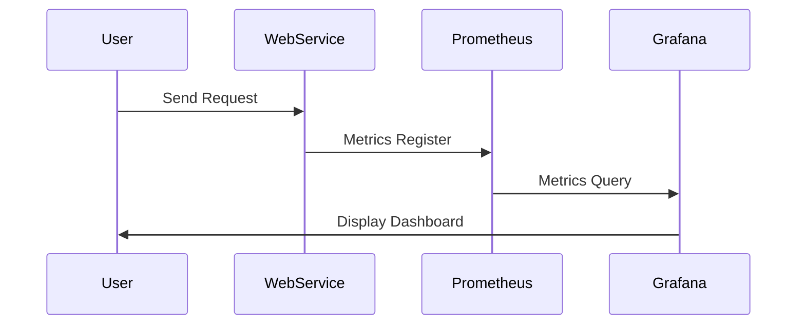

## Introduction

The **Monitoring and Metrics Collection** pattern is foundational for ensuring the optimal performance and scalability of cloud-based systems. By systematically collecting and analyzing data about system performance, you can make informed decisions about when and how to scale resources, ensuring that services remain responsive under varying loads.

## Detailed Explanation

### Importance of Monitoring and Metrics

In a cloud environment, resources often need to dynamically scale to meet fluctuating demand. Monitoring provides visibility into how resources are being utilized, flagging potential bottlenecks or inefficiencies. Metrics are quantitative measures collected over time, offering insights into trends and patterns that can inform scaling strategies. Together, these tools form the backbone of an effective elasticity strategy.

### Key Components

1. **Data Collection Agents**: Installed on cloud resources to gather data such as CPU usage, memory consumption, and network bandwidth.
2. **Centralized Data Repository**: Stores the collected metrics for analysis and reference.
3. **Analysis Tools**: Software to process and interpret metrics, providing actionable insights.
4. **Alerting Systems**: Notifies operators or automated systems when metrics indicate performance issues or threshold breaches.
5. **Visualization Dashboards**: Present data in an understandable format, aiding in quick assessments and decision-making.

### Architectural Approach

1. **Distributed Monitoring Infrastructure**: Implement agents across various system nodes to ensure comprehensive data collection.
2. **Scalable Storage for Metrics**: Use solutions like Amazon S3, Google Cloud Storage, or a NoSQL database such as Apache Cassandra to handle large volumes of time-series data.
3. **Real-time Analysis and Alerts**: Use tools like Prometheus, Grafana, or AWS CloudWatch to facilitate real-time analysis and alerting.

### Example Code

Here's a simple example using Prometheus and Grafana for monitoring a web service:

```yaml
global:
  scrape_interval: 15s

scrape_configs:
  - job_name: 'web_service'
    static_configs:
    - targets: ['localhost:9090']
```

Grafana can be configured to connect to Prometheus for visualizing the collected metrics.

### Diagrams

#### Sequence Diagram



## Related Patterns

- **Auto-Scaling Pattern**: Automatically scale resources based on predefined rules that use metrics as input.
- **Circuit Breaker Pattern**: Include monitoring endpoints to prevent requests to services that are likely to fail.

## Best Practices

- **Define Key Metrics**: Identify which metrics most accurately reflect your system’s performance and capacity thresholds.
- **Establish Baselines**: Understand normal performance metrics to better identify anomalies.
- **Automated Responses**: Incorporate automation to adjust resource allocation in response to real-time metrics.

## Additional Resources

- [Prometheus Official Documentation](https://prometheus.io/docs/introduction/overview/)
- [Grafana Official Documentation](https://grafana.com/docs/grafana/latest/)
- [AWS CloudWatch](https://docs.aws.amazon.com/cloudwatch/index.html)

## Summary

The **Monitoring and Metrics Collection** design pattern ensures your cloud infrastructure remains efficient and responsive. By harnessing the power of real-time data and analytical tools, you can drive informed scaling decisions, keep operational costs aligned with usage, and maintain high service availability. Implementing effective monitoring and metrics collection allows you to anticipate and respond proactively to system demands and issues.
