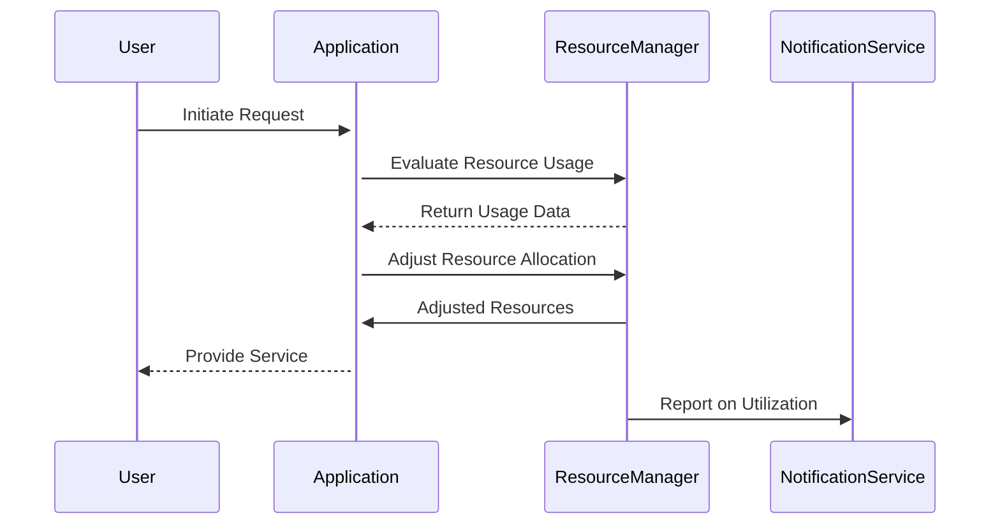

## Introduction

Efficient Resource Utilization is a cloud computing pattern aimed at optimizing the existing resources' usage in a cloud environment to ensure they are fully utilized before considering horizontal or vertical scaling. This approach not only enhances cost efficiency and performance but also aids in better resource management and environmental impact.

## Key Concepts

- **Resource Monitoring**: Continuously monitor resource usage across applications and services to identify under-utilized resources.
- **Load Balancing**: Distribute workloads evenly across computing resources to ensure optimal utilization and prevent resource bottlenecks.
- **Autoscaling Policies**: Implement intelligent autoscaling policies that factor in real-time metrics to adjust resources dynamically.
- **Resource Allocation**: Use tools and techniques to allocate resources efficiently based on current demands and workloads.
- **Resource Scheduling**: Efficiently schedule tasks and processes to make the best use of available resources.

## Architectural Approaches

- **Microservices**: Breaking down applications into smaller, manageable services allows granular control over resource allocation and utilization.
- **Serverless Computing**: Utilize serverless architectures to manage dynamic workloads more effectively, thereby optimizing cost.
- **Containerization**: Use container orchestration platforms like Kubernetes to manage resource allocation efficiently and automate resource management tasks.
- **Batch Processing**: Group tasks for processing at non-peak times, capitalizing on low-cost computational power.

## Best Practices

1. **Implement Resource Monitoring**: Regularly inspect metrics related to CPU, memory, disk usage, and network bandwidth.
2. **Optimize Workloads**: Regularly review and optimize application workloads to ensure they are well-suited for their current environments.
3. **Leverage Spot Instances**: Utilize spot instances for workloads that are flexible in terms of execution time to reduce costs.
4. **Fine-tune Autoscaling**: Customize autoscaling policies tailored to your specific application needs, considering latency, throughput, and performance.
5. **Use Caching Strategies**: Implement caching mechanisms at various levels (e.g., CDN, in-memory caches) to reduce redundant processing.

## Example Code

Here's a hypothetical example showcasing autoscaling configurations using AWS CLI for efficient resource utilization:

```bash
aws autoscaling create-auto-scaling-group \
    --auto-scaling-group-name my-auto-scaling-group \
    --launch-configuration-name my-launch-config \
    --min-size 2 \
    --max-size 10 \
    --desired-capacity 5 \
    --vpc-zone-identifier subnet-12345678 \
    --scalable-dimension ecs:service:DesiredCount \
    --target-tracking-scaling-policy-configuration file://policy-config.json
```

Where `policy-config.json` might contain:

```json
{
    "PredefinedMetricSpecification": {
        "PredefinedMetricType": "ASGAverageCPUUtilization"
    },
    "TargetValue": 50.0
}
```

## Diagrams

### Efficient Resource Utilization Sequence Diagram



## Related Patterns

- **Autoscaling**: Dynamic allocation of resources based on load.
- **Load Balancer**: Distributes network or application traffic across resources.
- **Serverless Function**: Executes code in response to events without managing servers.

## Additional Resources

- [AWS CloudWatch Monitoring](https://aws.amazon.com/cloudwatch/)
- [Azure Cost Management + Billing](https://azure.microsoft.com/en-us/services/cost-management/)
- [Kubernetes Resource Management](https://kubernetes.io/docs/concepts/configuration/manage-resources-containers/)

## Summary

Efficient Resource Utilization is critical for managing cloud environments effectively. By optimizing the use of existing resources and implementing strategic architectural and operational practices, organizations can achieve high levels of performance while benefiting from lower operational costs. Leveraging technologies such as microservices, serverless computing, and container orchestration can significantly contribute to this goal.
