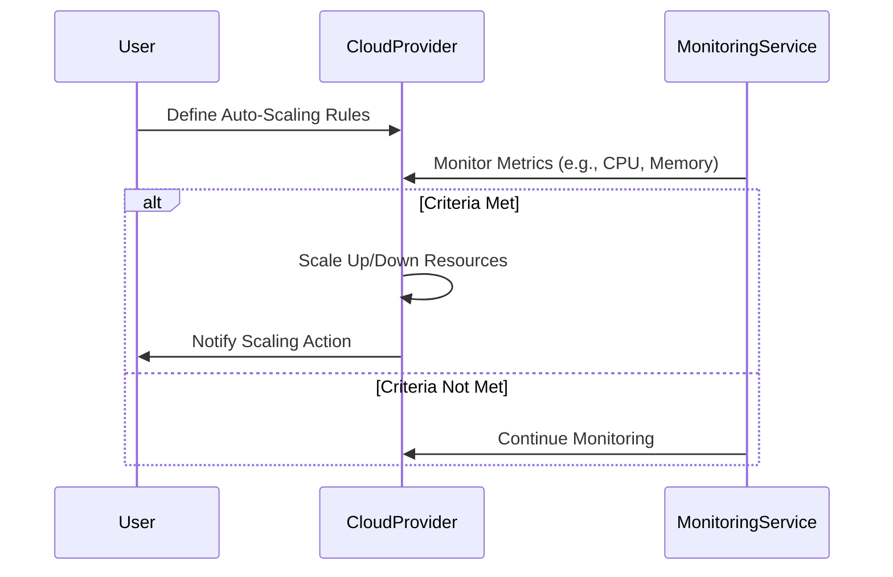

Auto-Scaling Groups (ASGs) are a fundamental pattern in cloud computing architectures that automatically adjust the number of computational resources in use. This pattern is particularly useful in managing load variations without manual intervention, ensuring applications remain responsive and highly available.

## Design Pattern Explanation

Auto-Scaling Groups automate the process of adding or removing resources (such as VM instances or containers) from a group to optimize performance while minimizing costs. This mechanism uses metrics such as CPU usage, memory utilization, network traffic, or custom monitoring parameters to trigger scaling operations. Resources can be scaled up (added) or scaled down (removed) based on these metrics.

### Key Characteristics
- **Reactive Scalability**: Responds to dynamic changes in workload demands.
- **Efficiency**: Optimally uses resources, reducing waste and cost.
- **High Availability**: Ensures resource availability aligns with demand, preventing overloading.
- **Cost-effectiveness**: Minimizes the costs by running only necessary resources.

## Architectural Approaches

1. **Threshold-Based Rules**: Define conditions under which resources should be added or removed. For instance, scaling out when CPU usage exceeds 70% for more than 5 minutes.
   
2. **Predictive Scaling**: Uses historical data and machine learning models to anticipate and adjust resources in advance of predicted load.

3. **Scheduled Scaling**: Pre-defines scaling actions to occur at specific times, helping prepare for known demand spikes like sales events.

## Example Code

Here is an example using AWS SDK in Java to create an Auto-Scaling Group:

```java
import software.amazon.awssdk.services.autoscaling.AutoScalingClient;
import software.amazon.awssdk.services.autoscaling.model.*;

public class AutoScalingExample {

    public static void main(String[] args) {
        AutoScalingClient autoScalingClient = AutoScalingClient.builder().build();

        CreateAutoScalingGroupRequest request = CreateAutoScalingGroupRequest.builder()
                .autoScalingGroupName("my-asg")
                .instanceId("i-1234567890abcdef0")
                .minSize(1)
                .maxSize(10)
                .desiredCapacity(2)
                .build();

        autoScalingClient.createAutoScalingGroup(request);

        System.out.println("Auto Scaling Group created successfully!");
    }
}
```

## Diagrams

### UML Sequence Diagram



## Best Practices

- **Define Accurate Metrics**: Use reliable and comprehensive metrics to trigger scalings, such as aggregate CPU utilization or response time.
- **Test Scaling Policies**: Ensure scaling policies do not cause resource thrashing—rapid and repeated scaling due to narrow thresholds.
- **Utilize Monitoring Tools**: Implement robust monitoring and alerting to preemptively tackle issues before they affect end-users.
- **Cost Optimization**: Choose instances with pricing that aligns with your scaling needs, such as spot instances for non-critical workloads.

## Related Patterns

- **Load Balancer**: Distributes incoming application traffic across multiple targets, such as Auto-Scaling Groups, to maximize throughput and ensure no single resource is overwhelmed.
- **Service Discovery**: Automatically detects the presence of service instances and updates routing/configuration accordingly.

## Additional Resources

- [AWS Auto Scaling Documentation](https://docs.aws.amazon.com/autoscaling/)
- [Google Cloud AutoScaler](https://cloud.google.com/compute/docs/autoscaler/)
- [Azure Virtual Machine Scale Sets](https://docs.microsoft.com/en-us/azure/virtual-machine-scale-sets/)

## Summary

Auto-Scaling Groups are essential for achieving elasticity in cloud environments, orchestrating resource allocation dynamically based on real-time demand. By implementing ASGs effectively, organizations can enhance performance, reduce costs, and maintain seamless user experiences across a wide range of applications.
