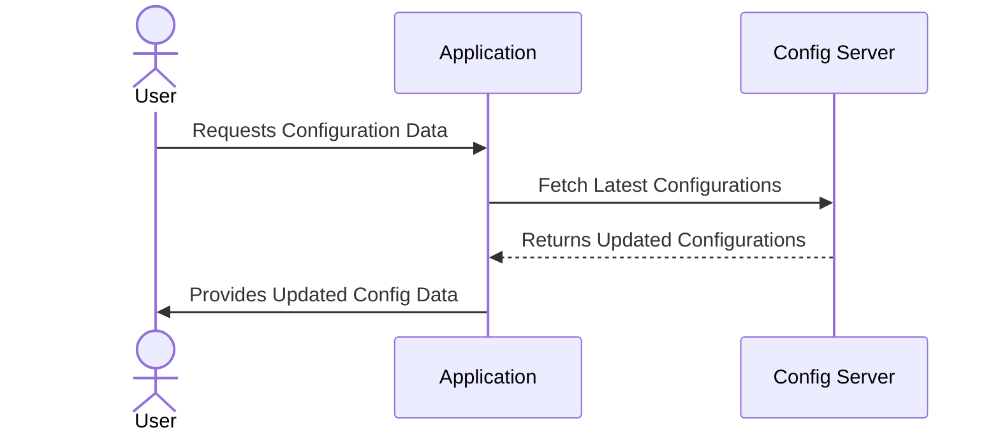

## Introduction

The **Dynamic Configuration Updates** pattern is essential for modern cloud-native applications that need to adapt and scale in real-time without downtime or service interruption. This pattern focuses on modifying application or system settings on the fly to respond to changing conditions, ensuring efficiency and optimal resource usage in dynamic cloud environments.

## Problem

In traditional applications, changes to configuration settings often require a full application restart, causing downtime. In cloud-based environments, where scalability and availability are paramount, this downtime can lead to significant performance issues and a poor user experience. There's a need for a system that allows real-time adjustments to configurations in response to fluctuating workloads or other operational metrics.

## Solution

The solution is to decouple configuration settings from application logic and store them in a central location such as a configuration server or a database. The application should be designed to periodically check for configuration updates or respond to events indicating a change. Libraries and frameworks can be used to facilitate this dynamic check and apply new configurations without restarting the application.

### Example Code

Here's an example using Spring Cloud Config for dynamic configuration updates:

```java
@RestController
@RefreshScope
public class ConfigController {

    @Value("${config.property}")
    private String configProperty;

    @GetMapping("/config")
    public String getConfigProperty() {
        return "Config Property: " + configProperty;
    }
}
```

In this example, the `@RefreshScope` annotation ensures that the bean will update its configuration when the `/refresh` endpoint is triggered.

### Diagram



## Architectural Approaches

- **Configuration Servers**: Use centralized configuration management systems like Spring Cloud Config, HashiCorp Consul, or AWS Systems Manager Parameter Store.
- **Feature Toggles**: Implement feature flags to enable or disable features dynamically without a full deployment cycle.
- **Sidecar Pattern**: Use a sidecar to manage configuration data and inject updates to the main application process.

## Best Practices

- **Immutable Infrastructure**: Separate configuration from code to manage environments consistently using tooling like Docker and Kubernetes.
- **Secured Access**: Secure configuration data to protect sensitive information using encryption and access control.

## Related Patterns

- **12-Factor App Methodology**: Outlines best practices for building applications that can scale and change independently.
- **Circuit Breaker Pattern**: Provides a fail-safe mechanism when a configuration change might affect system functionality.

## Additional Resources

- [Spring Cloud Config Documentation](https://spring.io/projects/spring-cloud-config)
- [HashiCorp Consul Documentation](https://www.consul.io/docs)
- [AWS Systems Manager Parameter Store](https://docs.aws.amazon.com/systems-manager/latest/userguide/systems-manager-paramstore.html)

## Summary

Dynamic Configuration Updates enable applications to adapt seamlessly to changing requirements without downtime, enhancing scalability and user experience in cloud environments. By implementing this pattern, cloud-based applications can maintain high availability and operational efficiency, even under varying load and conditions.
