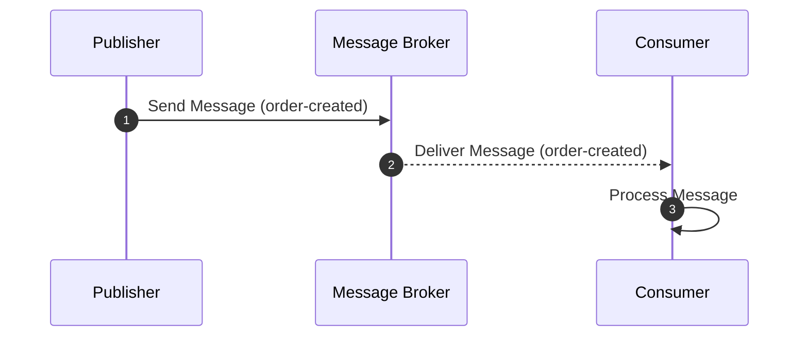

## Introduction

In cloud computing, scalability and elasticity are crucial for designing systems that can handle the dynamics of growing or fluctuating workloads. The **Decoupling Components** design pattern is pivotal in enabling these capabilities, allowing individual system components to be scaled independently. This pattern enhances system flexibility, improves resource utilization, and ensures cost-effectiveness in cloud environments.

## Detailed Explanation

### Design Pattern Overview

Decoupling components involves abstracting or isolating different parts of a system so they can evolve, scale, and operate independently. This autonomy allows services to be deployed and updated without affecting other components, catering to specific demand changes without unnecessary resource allocation across the entire system.

### Architectural Approaches

- **Microservices Architecture**: This approach inherently supports decoupling by designing small, independent services that can be deployed separately. Each microservice is designed to perform a specific business function, interacting over network protocols such as HTTP/REST or messaging queues.

- **Message-Driven Communication**: Asynchronous messaging enables decoupling by allowing services to communicate indirectly. Message brokers like Apache Kafka, RabbitMQ, or AWS SQS facilitate this, ensuring that services can continue operating independently of each other's load conditions.

- **Event-Driven Architecture**: Systems respond to and process events, decoupling event producers from consumers. By leveraging cloud services like Amazon EventBridge or Google Cloud Pub/Sub, events can be processed as needed, independently scaling different parts of the system.

### Best Practices

- **Implement Loose Coupling**: Use interfaces and abstraction layers to minimize the direct dependencies between components. This makes systems more resilient to changes and easier to maintain.

- **Design for Failure**: Ensure that components handle failures gracefully and can operate even when some parts of the system fail. This includes implementing retries, fallbacks, and graceful degradation strategies.

- **Utilize Cloud Services**: Leverage managed services for databases, caching, load balancing, etc., to abstract and decouple infrastructure management, focusing on business logic scalability.

## Example Code

Below is a simplified example in JavaScript using Node.js and Kafka to illustrate decoupled communication between services:

```javascript
// Publisher Service
const { Kafka } = require('kafkajs');

const kafka = new Kafka({ clientId: 'my-app', brokers: ['kafka1:9092', 'kafka2:9092'] });
const producer = kafka.producer();

const sendMessage = async () => {
  await producer.connect();
  await producer.send({
    topic: 'order-created',
    messages: [{ key: 'orderId', value: '12345' }],
  });
  await producer.disconnect();
};

sendMessage().catch(console.error);

// Consumer Service
const consumer = kafka.consumer({ groupId: 'order-group' });

const runConsumer = async () => {
  await consumer.connect();
  await consumer.subscribe({ topic: 'order-created', fromBeginning: true });

  await consumer.run({
    eachMessage: async ({ topic, partition, message }) => {
      console.log(`Received message: ${message.value}`);
      // Process the message
    },
  });
};

runConsumer().catch(console.error);
```

## Diagrams

Here is a small UML sequence diagram demonstrating the interaction between decoupled components using a message broker:



## Related Patterns

- **Service Discovery**: Allows services to dynamically discover each other, reducing tight coupling and easing independent scaling.
- **Backend for Frontend (BFF)**: Each frontend uses a tailored backend, facilitating decoupled development and scaling.
- **Circuit Breaker**: Prevents failure cascading, enabling graceful degradation and improved fault tolerance.

## Additional Resources

- [Designing Distributed Systems by Brendan Burns](https://www.oreilly.com/library/view/designing-distributed-systems/9781491983620/)
- [Building Microservices by Sam Newman](https://www.oreilly.com/library/view/building-microservices/9781491950349/)

## Summary

The Decoupling Components pattern is essential for designing flexible, scalable, and maintainable cloud-based systems. By enabling components to scale independently, this pattern supports better resource management and responsiveness to load variability. Adopting this design pattern facilitates robust and adaptive cloud architecture, crucial for modern software solutions.
