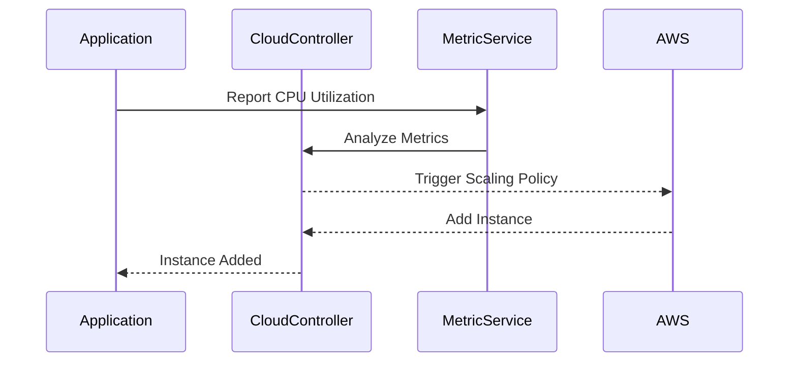

## Overview

Policy-Based Scaling is a cloud design pattern focused on the automation of scaling cloud resources based on predefined policies. This pattern is critical for managing fluctuating workloads efficiently, reducing costs, and maintaining optimal performance without manual intervention. It uses criteria such as CPU utilization, memory usage, request rates, or custom business metrics to determine when to scale in or out.

## Key Concepts

- **Predefined Policies**: Policies are set using thresholds and conditions under which scaling actions should be triggered. This can include scaling up when CPU usage exceeds 70% across instances or scaling down when usage falls below 20%.
  
- **Auto-Scaling Groups**: Resources are organized into groups that are automatically managed, including adding or removing instances according to policy-triggered events.

- **Elasticity**: This pattern aligns with the cloud’s promise of elasticity, ensuring that resources can dynamically adapt to demand changes.

- **Cost Efficiency**: By scaling down resources during low demand, costs are minimized, reducing financial waste on idle resources.

- **Performance Optimization**: Adequate resources are always available during peak loads, ensuring that end-user performance is not compromised.

## Architectural Approaches

- **Threshold-Based Triggers**: This approach uses simple metrics to determine scaling actions. For example, CPU load or memory usage is continuously monitored, and scaling actions are triggered when predefined thresholds are crossed.

- **Predictive Scaling**: Utilizing machine learning models to anticipate spikes in demand based on historical data trends, enabling proactive resource allocation.

- **Scheduled Scaling**: Resources are scaled based on predefined schedules, which is useful for predictable workloads that follow a regular pattern, like business hours or evening peaks for streaming services.

## Example Code

Here's an example using AWS Auto Scaling configurations:

```yaml
autoScalingGroup:
  name: example-asg
  maxSize: 10
  minSize: 1
  desiredCapacity: 2

scalingPolicy:
  name: scale-out-policy
  adjustmentType: ChangeInCapacity
  scalingAdjustment: 1
  cooldown: 300
  trigger:
    metricName: CPUUtilization
    statistic: Average
    comparisonOperator: GreaterThanThreshold
    threshold: 70
    period: 300
```

## Diagrams



## Best Practices

- **Define Clear Policies**: Policies should be intuitive, including inputs from business objectives as well as operational metrics.

- **Testing and Validation**: Regularly test your scaling policies in a controlled environment to ensure they behave as expected before deploying in production.

- **Monitoring and Alerts**: Implement robust monitoring to track the performance of scaling actions and set alerts for unusual behavior.

- **Resource Tags**: Use tagging for resources to improve visibility and management. This is particularly useful for cost allocation.

## Related Patterns

- **Load Balancer**: Distributes incoming application traffic across multiple targets, such as Amazon EC2 instances, to ensure no single instance is overwhelmed.

- **Circuit Breaker**: Prevents a network or system failure from escalating into a series of cascading failures.

## Additional Resources

- [Amazon EC2 Auto Scaling](https://aws.amazon.com/autoscaling/ec2)
- [Azure Autoscale](https://docs.microsoft.com/en-us/azure/azure-monitor/autoscale/autoscale-overview)
- [GCP Autoscaler](https://cloud.google.com/compute/docs/autoscaler)

## Summary

Policy-Based Scaling is a fundamental cloud pattern that empowers businesses to efficiently manage resources, catering to demand fluctuations without manual intervention. By leveraging predefined rules and automated scaling, organizations can achieve scalability, optimize costs, and maintain high performance in cloud environments. This dynamic approach ensures that resource allocation aligns with real-time requirements, fulfilling the promise of cloud elasticity.
