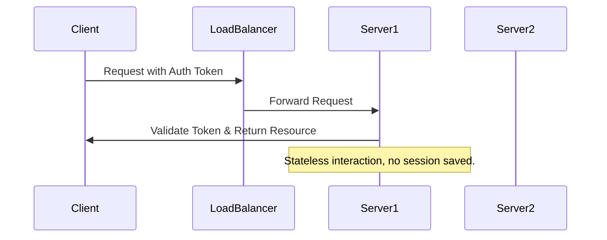

## Overview

Stateless Application Design is a crucial architectural pattern in cloud computing that involves creating applications that do not retain user session states on the server. By not storing session data on the server-side, applications can scale horizontally with ease, as any instance of the application can handle any request. This design pattern is particularly beneficial in distributed systems and cloud environments where scaling and redundancy are essential.

## Detailed Explanation

### Core Concept

In a stateless architecture, every request from a client must contain all the information the server needs to fulfill that request. This is achieved by client-side management of session state or through the use of tokens, such as JSON Web Tokens (JWTs), passed along with each request.

Stateless applications are generally simpler to scale since the underlying computing nodes in a cloud service can be treated as interchangeable. If a node fails or more nodes are needed to handle increased demand, new nodes can be added or existing ones removed without affecting the session states.

### Benefits

- **Scalability:** Statelessness is ideal for load-balanced systems, as requests can be distributed to any server instance in a cluster.
- **Fault Tolerance:** If a server instance fails, requests can be redirected to other instances, without session loss.
- **Simpler Deployment:** Code deployments and version upgrades are easier since there is no persistent state that needs to be managed.
- **Cost-Effectiveness:** Utilizing resources only when needed without carrying over state reduces the overall cost of managing the application lifecycle.

### Best Practices

1. **Session Management:** 
   - Use client-side storage for session data whenever possible.
   - Keep transient data in HTTP headers, cookies, or HTML5 web storage.

2. **State Sharing:** 
   - Use databases or distributed caches (e.g., Redis, Memcached) if temporary state sharing is necessary.
   - Apply patterns like **CQRS (Command Query Responsibility Segregation)** if consistency vs. availability is a concern.

3. **Token Usage:**
   - Implement authentication mechanisms using stateless tokens such as JWT for session management.
   - Add expiration times and signature verification for token security.

4. **Load Balancing:**
   - Ensure load balancers are aware of the stateless nature of applications and provide efficient round-robin or least connection strategies.

### Example Code

Here is a simple example to illustrate how a stateless service can be implemented, using a token for authentication:

```java
@Path("/resource")
public class ResourceService {
    
    @GET
    @Produces(MediaType.APPLICATION_JSON)
    @Path("/{id}")
    public Response getResource(@PathParam("id") String id, @HeaderParam("Authorization") String token) {
        // Validate token
        if (!TokenUtil.isValid(token)) {
            return Response.status(Response.Status.UNAUTHORIZED).build();
        }
        
        // Handle request using ID
        Resource resource = ResourceRepository.getById(id);
        if (resource != null) {
            return Response.ok(resource).build();
        }

        return Response.status(Response.Status.NOT_FOUND).build();
    }
}
```

### Diagrams



## Related Patterns

- **Service Discovery Pattern**: Facilitates automatic detection of services in a stateless environment.
- **Circuit Breaker Pattern**: Provides stability and prevents cascading failures in distributed systems.
- **Retry Pattern**: Ensures requests are resent until successful, useful in scenarios of transient failures.

## Additional Resources

- [Microservices Patterns: With examples in Java](https://www.amazon.com/Microservices-Patterns-examples-Chris-Richardson/dp/1617294543)
- [12 Factor App Methodology](https://12factor.net/)

## Final Summary

Stateless Application Design remains a foundational pattern in cloud-native application development due to its inherent scalability, robustness, and operational simplicity. By decoupling session state from computation instances, developers can architect applications that are highly responsive to varying workloads, reducing costs and enhancing user experience.

Embracing stateless design principles facilitates seamless integration with cloud-based services and simplifies the underlying architecture, which is essential for building next-generation software solutions.
