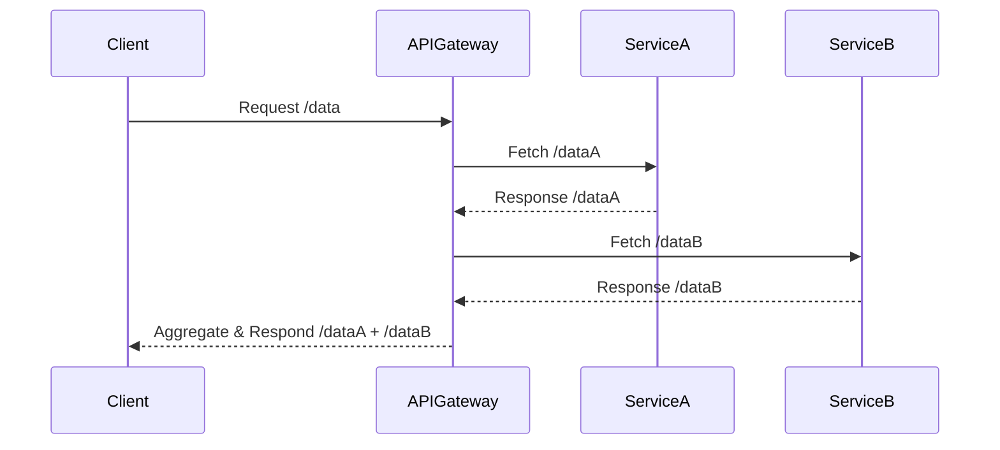

## Overview

The **Microservices Architecture** pattern is a design approach where an application is composed of small, independent services that communicate over well-defined APIs. This pattern is a departure from the traditional monolithic architecture where all components are interconnected and interdependent. In a microservices architecture, each service can be developed, deployed, and scaled independently, which aligns perfectly with modern cloud computing environments that offer on-demand scalability and flexibility.

## Detailed Explanation

### Key Characteristics
- **Modularity**: Each service encapsulates a specific business function or process.
- **Independence**: Services operate independently and communicate via lightweight protocols, often HTTP/REST, AMQP, or gRPC.
- **Scalability**: Each service can be scaled independently, allowing optimized resource utilization.
- **Continuous Delivery**: Facilitates continuous integration and deployment (CI/CD) practices due to isolated services.
- **Resilience**: Fault in one service does not directly impact others, improving the overall robustness.

### Architectural Approaches

1. **Domain-Driven Design (DDD)**:
   - Organizes the services around business capabilities, supporting strong cohesion within a service and loose coupling between services.

2. **API Gateway**:
   - Serves as a single entry point for clients, managing requests, authentication, routing, and potentially response aggregation.

3. **Service Discovery**:
   - Dynamically registers and discovers services. Tools like Consul, etcd, or Eureka facilitate this in cloud environments.

4. **Decentralized Data Management**:
   - Each microservice manages its own database, favoring polyglot persistence for using different data storage technologies as needed.

### Best Practices

- **Design for Failure**: Employ circuit breakers, retries, and fallbacks to enhance resilience.
- **Event-Driven Architecture**: Utilize asynchronous messaging to decouple services and improve responsiveness.
- **Observability**: Implement centralized logging, distributed tracing, and metrics collection to monitor and analyze service health and performance.
- **Security**: Enforce strict API security policies, utilize OAuth2/JWT for authentication, and ensure robust encryption of data in transit and at rest.

## Example Code

Here's a simple example of a microservice using Golang that exposes a RESTful API:

```go
package main

import (
    "fmt"
    "net/http"
    "encoding/json"
)

type Message struct {
    Text string `json:"text"`
}

func messageHandler(w http.ResponseWriter, r *http.Request) {
    msg := Message{Text: "Hello, Microservices World!"}
    w.Header().Set("Content-Type", "application/json")
    json.NewEncoder(w).Encode(msg)
}

func main() {
    http.HandleFunc("/message", messageHandler)
    fmt.Println("Service running on port 8080")
    http.ListenAndServe(":8080", nil)
}
```

## Diagram

Below is a UML Sequence diagram using Mermaid that illustrates a client interacting with multiple microservices through an API Gateway:



## Related Patterns

- **API Gateway Pattern**: Acts as a reverse proxy to support microservices communication.
- **Circuit Breaker Pattern**: Prevents calls to a failing service.
- **Saga Pattern**: Manages distributed transactions across microservices.

## Additional Resources

- [Building Microservices by Sam Newman](https://www.oreilly.com/library/view/building-microservices/9781491950340/)
- [Microservices.io by Chris Richardson](https://microservices.io/)
- [Domain-Driven Design Reference](https://www.dddcommunity.org/learning-ddd/what_is_ddd/)

## Summary

The **Microservices Architecture** pattern offers a strategic approach to building scalable and flexible applications in the cloud. By dividing applications into smaller services, organizations can improve development speed, foster innovation, and ensure the high availability and resilience of their applications. As technology evolves, embracing microservices and employing best practices will remain key to maintaining competitiveness in the cloud-native era.
