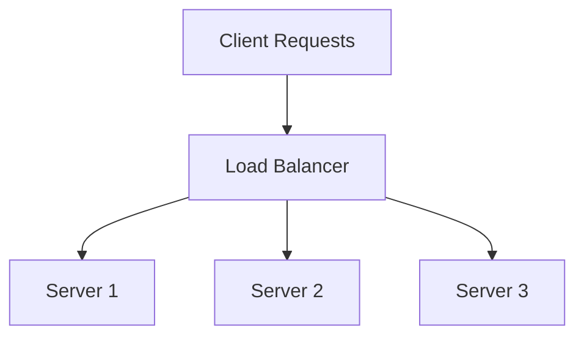

Load balancing is a critical component in cloud computing architectures, designed to optimize resource use, maximize throughput, minimize response time, and avoid overloading any single resource. It plays a vital role in ensuring high availability and reliability by distributing incoming network traffic efficiently across multiple servers or resources.

## Overview of Load Balancing Strategies

### 1. Round Robin
The round-robin method cycles through server list and assigns requests in sequential order. Ideal for equally weighted resources but lacks adaptability to server load.

### 2. Weighted Round Robin
An improvement to Round Robin, where servers with higher capacity receive more requests. It’s useful when server capabilities vary significantly.

### 3. Least Connections
Directs traffic to the server with the fewest active connections. Suitable for environments where server processing capabilities are similar and the load per request varies.

### 4. IP Hash
A hash of the client's IP address is computed to determine which server receives the request, ensuring that the same client is directed to the same server consistently. This approach is useful for session persistence.

### 5. Least Response Time
Assigns requests to the server with the lowest current response time, combining real-time server performance assessments for better decision-making.

### 6. Adaptive Load Balancing
Dynamically adjusts the traffic distribution based on current server load or health checks, suitable for environments with fluctuating server performances.

## Architectural Approaches

### Layer 4 (Transport Layer) vs. Layer 7 (Application Layer)

- **Layer 4 Load Balancing:** Operates at the transport layer, routing packets based purely on data such as IP address and port. It's faster, handling thousands of requests, but lacks deep application insights.
- **Layer 7 Load Balancing:** Works at the application layer, allowing content-based traffic routing, such as URL or HTTP headers, enabling advanced features like SSL termination.

### Global vs. Local Load Balancing

- **Global Load Balancing:** Manages traffic across multiple data centers or clouds, typically using DNS-based strategies for directing users to an optimal location.
- **Local Load Balancing:** Focuses on distributing traffic within a single data center or cloud region.

## Best Practices

- **Implement Health Checks:** Routinely check server statuses to avoid sending traffic to unhealthy servers.
- **Utilize DNS-Based Global Load Balancing:** For geographically distributed applications, to enhance global performance and reliability.
- **Monitor Load Balancer Performance:** Continuously evaluate and adjust configurations based on analytics.
- **Enable Sticky Sessions Sparingly:** Use only when necessary to maintain session affinity, as it can lead to unbalanced loads.

## Example Code

Here is a basic configuration for NGINX to implement a load balancing strategy using Weighted Round Robin:

```nginx
http {
    upstream backend {
        server backend1.example.com weight=3;
        server backend2.example.com weight=2;
        server backend3.example.com weight=1;
    }

    server {
        listen 80;

        location / {
            proxy_pass http://backend;
        }
    }
}
```

## Diagrams

Here's diagram illustrating a basic load balancing architecture:



## Related Patterns

- **Circuit Breaker:** Helps improve system resilience by detecting failures and preventing future requests until issues are resolved.
- **Cache-Aside:** Works well with load balancing to decrease server load by caching frequently accessed data.
- **Auto-Scaling:** Complements load balancing by dynamically adjusting the number of active resources based on load.

## Additional Resources

- [NGINX Load Balancing Guide](https://www.nginx.com/resources/glossary/load-balancing/)
- [AWS Elastic Load Balancing](https://aws.amazon.com/elasticloadbalancing/)
- [Google Cloud Load Balancing](https://cloud.google.com/load-balancing/)

## Summary

Load balancing strategies are integral to cloud architectures, supporting scalability, reliability, and performance. By efficiently distributing incoming requests, leveraging the adaptability of modern algorithms, and integrating seamlessly with other architectural patterns, load balancing ensures an optimized and robust cloud environment capable of handling diverse workload demands.

---
