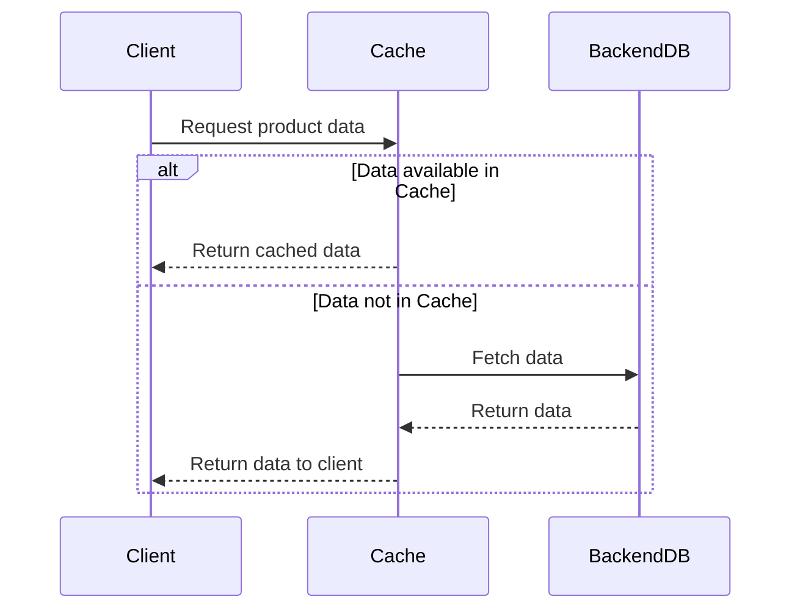

---

linkTitle: "Caching Implementation"
title: "Caching Implementation: Reducing Load on Backend Systems by Caching Frequently Accessed Data"
category: "Scalability and Elasticity in Cloud"
series: "Cloud Computing: Essential Patterns & Practices"
description: "This pattern describes how caching frequently accessed data can reduce the load on backend systems, enhance system performance, and improve user experience in cloud environments."
categories:
- Scalability
- Elasticity
- Performance Optimization
tags:
- caching
- scalability
- elasticity
- cloud-computing
- performance
date: 2024-07-07
type: docs

canonical: "https://softwarepatternslexicon.com/18/20/8"
license: "© 2024 Tokenizer Inc. CC BY-NC-SA 4.0"
---

## Introduction

Caching Implementation is a crucial design pattern in cloud computing that aims to reduce the load on backend systems by storing frequently accessed data temporarily in a cache. This pattern improves the performance of applications by minimizing data retrieval times and reducing resource consumption, ultimately leading to a smoother and more responsive user experience.

## Problem

When dealing with large volumes of requests, accessing the same data from the backend repeatedly can lead to increased latency, excessive load, and higher operational costs. As the number of requests grows, these issues can become severe, impacting application performance and scalability.

## Solution

By implementing a caching mechanism, data that is frequently requested can be stored closer to the client or within a more accessible layer. This reduces the need to repeatedly fetch the same data from the backend, thereby decreasing latency and load on backend systems.

### Key Components

- **Cache Store**: A storage layer where frequently accessed data is kept temporarily. It can be memory-based (e.g., Redis or Memcached) or disk-based, depending on the use case.
- **Cache Invalidation**: A strategy to ensure data consistency by expiring or updating cached data when changes occur in the backend.
- **Cache Population**: Methods to load data into the cache, either proactively (eager loading) or as required (lazy loading).
- **Consistency and Synchronization**: Techniques to maintain data consistency between the cache and the backend.

## Architectural Approaches

### In-Memory Caching

- Typically used for fast data retrieval operations.
- Suitable for high-read, low-write applications.
- Examples include in-memory databases like Redis or Memcached.

### Distributed Caching

- Suitable for large-scale applications spread across multiple regions or nodes.
- Ensures data consistency and scalability.
- Can be implemented using data grid technologies like Apache Ignite or Hazelcast.

### CDN Caching

- Utilizes Content Delivery Networks to cache data closer to the end-user.
- Ideal for static content such as images, stylesheets, or client-side scripts.
- Enhances load times for globally distributed users.

## Best Practices

- **Cache Data Appropriately**: Only cache data that is frequently accessed and doesn't change often.
- **Use Appropriate Expiration Strategies**: Implement time-to-live (TTL) or cache purge policies to ensure data freshness.
- **Monitor Cache Performance**: Continuously monitor cache hit/miss ratios to optimize performance.
- **Security Practices**: Ensure sensitive data is never cached unintentionally.

## Example Code

Below is an example of implementing a simple caching mechanism in Java using the Spring Framework with Redis:

```java
import org.springframework.cache.annotation.Cacheable;
import org.springframework.stereotype.Service;

@Service
public class ProductService {

    @Cacheable(value = "products", key = "#productId")
    public Product getProductById(String productId) {
        // Simulate a complex and resource-intensive operation
        return fetchFromDatabase(productId);
    }

    private Product fetchFromDatabase(String productId) {
        // Database fetching logic
        return new Product(productId, "ProductName");
    }
}
```

## Diagram



## Related Patterns

- **Content Delivery Network (CDN)**: Enhances caching by distributing content geographically.
- **Data Sharding**: Works with caching to improve system scalability by partitioning data.
- **Load Balancing**: Complements caching by distributing requests evenly across servers.

## Additional Resources

- [Redis Official Documentation](https://redis.io/documentation)
- [Spring Framework Caching Documentation](https://docs.spring.io/spring-framework/docs/current/reference/html/integration.html#cache)

## Conclusion

Caching Implementation is a vital pattern for optimizing performance and scalability in cloud-computing environments. By storing and serving frequently accessed data more efficiently, this pattern helps in reducing latency, lowering costs, and improving the overall user experience.


