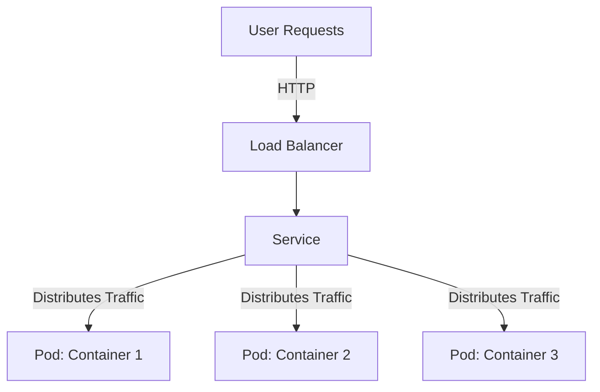

Container orchestration is a crucial design pattern in the realm of cloud computing, enabling the automatic management, scaling, and operation of containerized applications. This approach ensures that applications can efficiently scale across clusters of hosts within a cloud platform. The pattern greatly enhances flexibility and operational efficiency, particularly for cloud-native applications across distributed systems.

## Principles and Architectures

Container orchestration automates a wide array of tasks including container deployment, scaling, load balancing, and ensuring the health of the running applications. Core components involved in this pattern include orchestration engines like Kubernetes, Apache Mesos, and Docker Swarm, each of which allows for seamless container management and deployment efficiency.

### Core Principles

1. **Automation**: Automates container deployment, scaling, updating, and health monitoring.
2. **Scalability**: Efficiently adds or removes containers based on demand or specific business requirements.
3. **Fault Tolerance**: Resilient to system failures, automatically redistributing loads and restarting failed containers.
4. **Resource Optimization**: Manages resources efficiently, balancing loads across physical and virtual resources.

### Architectural Approaches

- **Cluster Management**: Central to orchestration is cluster management, where containers are distributed across multiple host nodes.
- **Service Discovery and Load Balancing**: Ensures all containers in a service can find each other, distribute requests, and remain accessible.
- **Resource Scheduling**: Allocates necessary resources to containers, emphasizing optimization and efficiency.
  
## Best Practices

1. **Immutable Infrastructure**: Adopt practices where containers are immutably deployed, promoting consistency across environments.
2. **Version Control for Configurations**: Maintain configuration as code, which mirrors the version control strategy for application code itself.
3. **Scalability Through Microservices**: Break applications into microservices to leverage the full capability of container orchestration in scaling applications independently.
4. **Centralized Logging and Monitoring**: Implement centralized tools and dashboards for logging and monitoring to ensure visibility across all containerized services.
5. **Security and Compliance**: Enforce strict security policies and ensure compliance requirements are met across all containerized environments.

## Example Code

Here’s a simple YAML example of deploying an application using Kubernetes:

```yaml
apiVersion: apps/v1
kind: Deployment
metadata:
  name: my-application
spec:
  replicas: 3
  selector:
    matchLabels:
      app: my-app
  template:
    metadata:
      labels:
        app: my-app
    spec:
      containers:
      - name: my-container
        image: my-docker-image:v1
        ports:
        - containerPort: 80
```

This YAML file deploys an application with three replicas, ensuring redundancy and availability in case of node failure.

## Diagrams

Below is a simplified architecture using Kubernetes for orchestrating containerized applications:



Each pod running an instance of the application container ensures that services can handle requests with fault tolerance.

## Related Patterns

- **Microservices Architecture**: Complements container orchestration by enabling fine-grained component deployment and management.
- **Serverless Computing**: Offers a complementary approach where microservices could offload specific functions to serverless platforms.
- **Infrastructure as Code (IaC)**: Automates setup for containers, enhancing consistency and reproducibility in deployments.

## Additional Resources

- [Kubernetes Documentation](https://kubernetes.io/docs/home/)
- [Docker Swarm Overview](https://docs.docker.com/engine/swarm/)
- [Apache Mesos](https://mesos.apache.org/)

## Summary

Container orchestration represents a powerful pattern for managing containers at scale, providing benefits such as automation, scalability, and operational efficiency. By integrating tools like Kubernetes or Docker Swarm, organizations can build robust, cloud-native architectures that adeptly handle modern application demands across diverse computing environments. Through strategic implementation of this pattern, enterprises can enjoy optimized resource management, improved fault tolerance, and seamless scalability, paving the way for more agile and responsive IT infrastructures.
