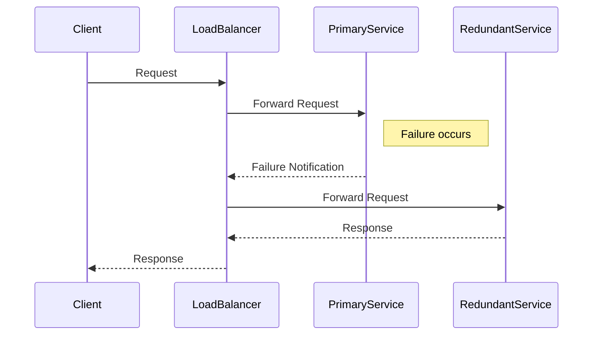

## Introduction

In cloud computing, ensuring resilience and fault tolerance is paramount to maintaining service availability. Redundant Components is a design pattern that addresses these concerns by duplicating critical system components, thus preventing single points of failure and enhancing system reliability.

## Detailed Explanation

### Concept and Significance

The fundamental idea behind Redundant Components is to provide backup resources that can seamlessly take over operations if the primary component fails. By implementing this pattern, the system can sustain hardware failures, network issues, and other unexpected interruptions without significant downtime.

### Architectural Approach

1. **Duplication**: Critical components such as servers, databases, and network infrastructure are duplicated to create a backup system.
2. **Failover Mechanism**: Establish automated failover processes that switch to redundant components when a failure in the primary component is detected.
3. **Load Balancing**: Distribute the workload evenly across primary and redundant components to maximize resource utilization and efficiency.
4. **Heartbeat Monitoring**: Implement real-time monitoring that checks component health status to trigger failover processes promptly.

### Example Code

Below is a basic example demonstrating redundancy in a microservices architecture using a load balancer:

```java
// Sample implementation of a load balancer in Java to route traffic to redundant components
public class LoadBalancer {

    private List<ServiceInstance> serviceInstances = new ArrayList<>();

    // Method to register service instances (primary and redundant)
    public void registerInstance(ServiceInstance instance) {
        serviceInstances.add(instance);
    }

    // Method to get an instance for processing requests
    public ServiceInstance getInstance() {
        // Simple round-robin algorithm for instance selection
        return serviceInstances.remove(0);
    }
}

// Example service instance class
public class ServiceInstance {
    private String instanceId;
    private String status;

    // Constructor and methods to interact with the instances
    public ServiceInstance(String instanceId, String status) {
        this.instanceId = instanceId;
        this.status = status;
    }

    public boolean isAvailable() {
        return "available".equalsIgnoreCase(status);
    }
}
```

### Diagram

Here is a sequence diagram illustrating the failover process:



## Best Practices

- **Continuous Monitoring**: Implement comprehensive monitoring to detect and react to failures swiftly.
- **Regular Testing**: Conduct failover tests to ensure that redundant components can handle production workloads.
- **Sufficient Capacity**: Ensure that redundant components have the capacity to handle the full load independently.
- **Geographic Redundancy**: Deploy redundant components in geographically diverse locations to mitigate regional failures.

## Related Patterns

- **Circuit Breaker**: Prevents a system from repeatedly attempting operations likely to fail, safeguarding against cascading failures.
- **Bulkhead**: Isolates different system components to prevent failures in one part from affecting the entire system.
- **Auto-Scaling**: Automatically adjusts the number of active instances to match demand, enhancing availability and performance.

## Additional Resources

- [AWS Well-Architected Framework](https://aws.amazon.com/architecture/well-architected/)
- [Google Cloud Resiliency Best Practices](https://cloud.google.com/resiliency)
- [Azure Resilient Architecture Guidance](https://docs.microsoft.com/en-us/azure/architecture/framework/resiliency/)

## Summary

The Redundant Components pattern is integral in creating fault-tolerant cloud architectures. By duplicating crucial components and implementing failover mechanisms, enterprises can achieve high availability and superior user experiences. The pattern's application is crucial across industries where uptime and reliability directly influence business outcomes.
