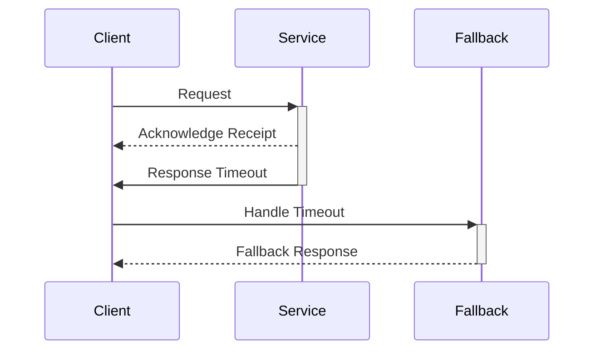

In the realm of cloud computing, resiliency and fault tolerance are paramount for building robust and efficient applications. The "Timeouts and Limits" design pattern helps ensure that your system can handle failures gracefully by setting constraints on operation durations and resource usage, thus avoiding cascading failures.

## Design Pattern Overview

This pattern involves defining explicit timeouts and limits on various operations within a cloud application. By doing so, you mitigate the risks associated with network delays, resource exhaustion, and other unexpected failures. Using this approach can lead to improved system reliability and user experience by ensuring that failures are dealt with promptly and do not propagate through the system.

## Architectural Approaches

### 1. **Setting Operation Timeouts**

Implementing timeouts involves specifying the maximum duration an operation or service call should take. If the operation exceeds this time, it is either retried or handled by a fallback mechanism. This approach prevents the system from waiting indefinitely for an unresponsive component.

**Example in Java:**

```java
try {
    CompletableFuture<String> future = CompletableFuture.supplyAsync(() -> {
        // Simulate long-running task
        Thread.sleep(3000);
        return "Result";
    });

    // Define a timeout of 2 seconds
    String result = future.get(2, TimeUnit.SECONDS);
} catch (TimeoutException e) {
    // Handle timeout
    System.out.println("Operation timed out");
}
```

### 2. **Rate Limiting**

Rate limiting is a strategy to control the rate at which users can make requests to an API. This protects the system from being overwhelmed and helps maintain quality of service for all users.

**Example in JavaScript (Node.js):**

```javascript
const rateLimit = require("express-rate-limit");

const apiLimiter = rateLimit({
    windowMs: 15 * 60 * 1000, // 15 minutes
    max: 100 // Limit each IP to 100 requests per windowMs
});

// Apply to all requests
app.use(apiLimiter);
```

## Diagrams

### Sequence Diagram for Timeout



## Best Practices

- **Proper Timeout Configuration**: Set timeouts strategically based on expected response times and the criticality of operations.
- **Use Circuit Breakers**: Combine timeouts with circuit breaker patterns to avoid repeated failed attempts overloading your system.
- **Graceful Degradation**: Implement fallback procedures to maintain a minimum level of service when timeouts occur.
- **Monitor and Analyze**: Continuously monitor metrics related to timeouts and limits to fine-tune configurations and anticipate potential issues.

## Related Patterns

- **Circuit Breaker Pattern**: Similar to timeouts but also stops all requests to a service that is likely to fail.
- **Retry Pattern**: Complements timeouts by retrying failed operations after a delay.
- **Bulkhead Pattern**: Isolates elements of an application to prevent a failure in one part from affecting others.

## Additional Resources

- [Retry and Circuit Breaker Pattern on AWS](https://aws.amazon.com/architecture/resiliency)
- [GCP Resiliency Patterns](https://cloud.google.com/architecture)

## Summary

The Timeouts and Limits pattern is an essential component in designing resilient cloud applications. By effectively managing time constraints and resource usage, you can significantly enhance the fault tolerance of your systems. When implemented alongside related patterns such as circuit breakers and retries, this pattern not only ensures smooth operation under load but also offers a better user experience by minimizing downtime and service disruptions.
