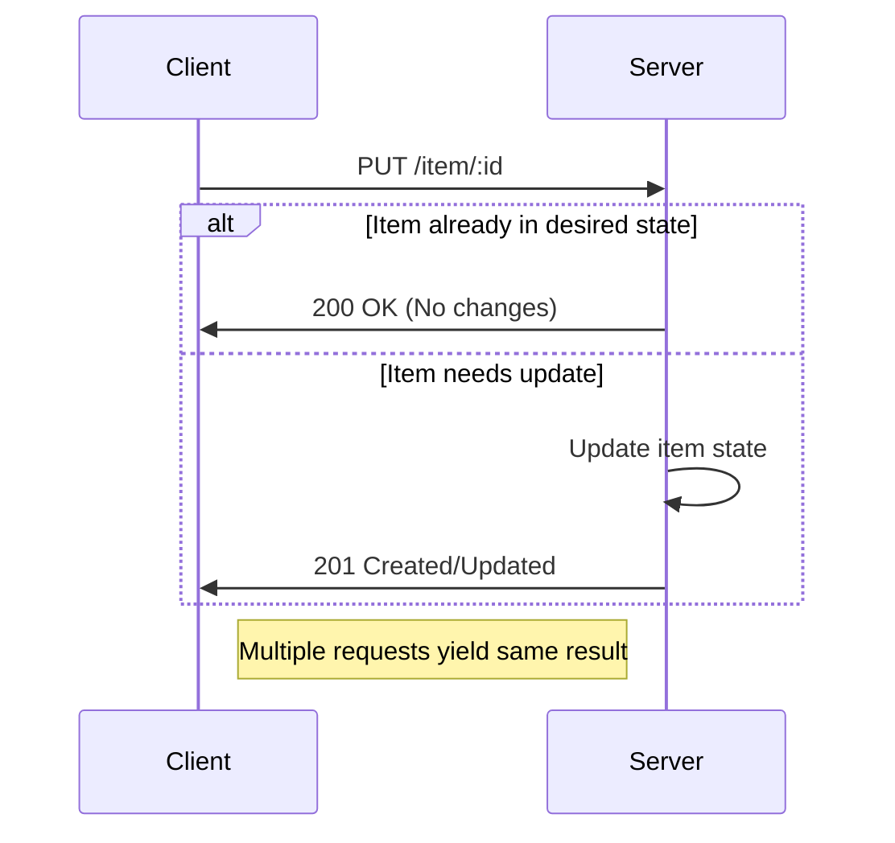

## Overview

In cloud-based systems, network or server failures can often lead to repeated execution of operations, which can, in turn, cause inconsistent data states. The **Idempotent Operations** design pattern is a crucial practice in distributed systems to ensure that a given operation can be repeated without changing the result beyond the initial application. This pattern plays a critical role in designed systems to handle failures gracefully.

## Key Concepts of Idempotent Operations

- **Definition**: An operation is idempotent if applying it multiple times has the same effect as applying it once.
- **Example Operations**: 
  - PUT requests in REST APIs are typically idempotent as they update or create a resource to a particular state.
  - Deleting a resource (DELETE operation) typically leaves the system in the same state irrespective of how many times it's invoked.

## Architectural Approach

Developing an idempotent operation requires an architect to ensure that its repeated execution does not alter the state of the system after the initial application.

### Characteristics:

- **State Management**: Operations should independently manage resource states so that subsequent calls do not cause additional side effects.
- **Request Verification**: Employ mechanisms to check if a request has already been executed.
- **Statelessness**: Helps in cloud environments by not relying on remembered information, making operations inherently retriable.

### Implementation Strategies:

- **Use Unique Tokens**: For operations that change multiple resources, using unique client-generated tokens or request identifiers can help track if the operation has already been executed.
  
- **Database Design**: Design your database schema to support idempotency, such as unique constraints on specific fields that remain unchanged after the first operation.

- **Service Layers**: Implement service layers that check or compute the desired end state and apply the necessary transformations.

## Example Code

Here's an example of implementing an idempotent operation in a RESTful API using JavaScript with Express.js:

```javascript
const express = require('express');
const app = express();
app.use(express.json());

let items = {};

app.put('/item/:id', (req, res) => {
    const id = req.params.id;
    const value = req.body.value;

    if (items[id] && items[id] === value) {
        res.status(200).send({message: 'No changes needed.'});
    } else {
        items[id] = value;
        res.status(201).send({message: 'Item updated.', id, value});
    }
});

app.listen(3000, () => {
    console.log('Server running on port 3000');
});
```

## Diagrams

### Sequence Diagram for Idempotent Operations



## Related Patterns

- **Retry Pattern**: Often used with idempotent operations to safely retry failed requests.
- **Circuit Breaker**: To stop excessive retries on failed services, maintaining system stability.

## Additional Resources

- [REST API Design and Core Operations](https://restfulapi.net/)
- [Idempotency in Web Services: Best Practices](https://www.some-web-service-guide.com)
- [Martin Fowler on Idempotency](https://martinfowler.com/bliki/Idempotency.html)

## Summary

Idempotent operations are an essential pattern for achieving reliable cloud services. By ensuring that operations can safely be repeated, systems are better equipped to handle network issues, retries, and errors without unwanted side effects. As such, it forms a foundational component of building resilient, fault-tolerant distributed systems.
