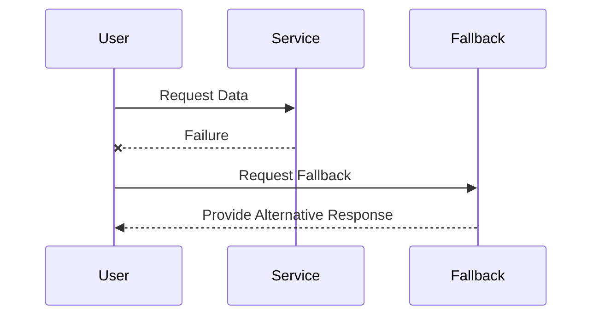

## Introduction 

In cloud computing, maintaining the reliability and availability of services is paramount, especially in distributed systems where failures are inevitable. Fallback mechanisms are a crucial design pattern employed to ensure resilience and fault tolerance by providing alternative responses when primary services fail. This pattern is pivotal in guaranteeing that user experiences remain uninterrupted despite service disruptions or outages.

## Problem Statement

In cloud environments, services can fail due to various reasons—network issues, server failures, or exhausted resources. Without a fallback mechanism, these failures can lead to degraded performance or complete service outages, adversely affecting user experience and service reliability.

## Solution Overview

Fallback mechanisms involve defining alternate paths or responses when primary service operations fail. These mechanisms can range from returning cached responses, default values, or connecting to backup services. By doing so, the system's resilience is enhanced, ensuring that service disruption is minimized or even imperceptible to end-users.

## Architectural Approaches

1. **Static Fallbacks**: Provide pre-defined static responses when a service fails. This approach is suitable for non-critical data where approximate results or static data suffice.

2. **Cache Fallbacks**: Use previously cached data as a response when live data retrieval fails. This is useful for data that doesn't change frequently.

3. **Backup Service Fallbacks**: Redirect requests to backup or alternative services if the primary service is unavailable. This requires having mirrored or functionally equivalent services.

4. **Graceful Degradation**: Reduce service functionality to maintain core operations. This may involve disabling non-essential features and keeping the system partially running.

5. **Circuit Breaker Pattern**: Integrate with services using the Circuit Breaker pattern, effectively managing failures and triggering fallback logic when a service is deemed unhealthy.

## Best Practices

- **Identify Critical Paths**: Determine which system operations are critical and require a robust fallback strategy.
  
- **Use Caching Wisely**: Ensure caches are refreshed adequately to prevent serving stale data.

- **Monitor and Log**: Continuously monitor fallback activations and log incidents for future analysis and improvement.

- **Testing and Validation**: Regularly test fallback mechanisms to confirm their effectiveness and optimize response strategies.

## Example Code

Here's a basic example using a Circuit Breaker in a hypothetical service using Java:

```java
import io.github.resilience4j.circuitbreaker.CircuitBreaker;
import io.github.resilience4j.circuitbreaker.CircuitBreakerConfig;
import io.github.resilience4j.circuitbreaker.CircuitBreakerRegistry;
import java.time.Duration;
import java.util.function.Supplier;

public class FallbackExample {
    public static void main(String[] args) {
        CircuitBreakerConfig config = CircuitBreakerConfig.custom()
                .failureRateThreshold(50)
                .waitDurationInOpenState(Duration.ofMillis(1000))
                .build();

        CircuitBreakerRegistry registry = CircuitBreakerRegistry.of(config);
        CircuitBreaker circuitBreaker = registry.circuitBreaker("serviceBreaker");

        Supplier<String> primaryService = CircuitBreaker.decorateSupplier(circuitBreaker, FallbackExample::primaryServiceCall);
        Supplier<String> fallbackService = () -> "Fallback response";

        String result = circuitBreaker.executeSupplier(primaryService.orElse(fallbackService));
        System.out.println(result);
    }

    private static String primaryServiceCall() {
        throw new RuntimeException("Service failed"); // Simulating failure
    }
}
```

## Diagrams



## Related Patterns

- **Circuit Breaker Pattern**: Prevents system overload by disabling calls to a failing service and transitioning to a fallback.
- **Retry Pattern**: Attempts operation retries before resorting to a fallback.
- **Bulkhead Pattern**: Isolates components to prevent cascading failures, indirectly supporting fallback mechanisms.

## Additional Resources

- [Resilience4j - Fallback Documentation](https://resilience4j.readme.io/docs/fallback)
- [AWS Well-Architected Framework - Reliability Pillar](https://aws.amazon.com/architecture/well-architected/)

## Summary

Fallback mechanisms play a vital role in enhancing cloud service reliability and resilience by providing contingency plans when primary services are disrupted. By employing strategies such as static responses, caching, and alternative routing, systems can endure failures gracefully, offering uninterrupted service experiences. These mechanisms, when properly implemented and monitored, are invaluable assets in a robust cloud architecture.
