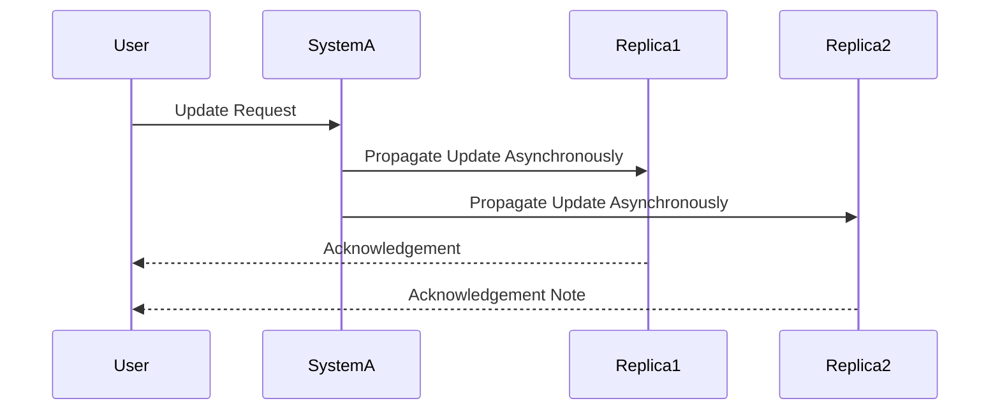

Eventual Consistency is a design pattern employed in distributed systems to manage the trade-off between consistency and availability. This pattern becomes crucial in cloud environments where systems must remain available and responsive under various conditions, including failures. By embracing eventual consistency, systems allow temporary data inconsistencies but guarantee that all changes will propagate to all nodes, eventually bringing the system to a consistent state.

## Detailed Explanation

### The Concept

In distributed systems, maintaining strong consistency can lead to significant downtime or latency because all operations require coordination among multiple nodes. Eventual Consistency provides a more flexible approach by allowing systems to remain available even when there are updates. It guarantees that all copies of the data will become consistent over time without enforcing immediate full consistency after each transaction.

### The CAP Theorem

Eventual Consistency is a key outcome of the CAP theorem, which states that a distributed system can simultaneously ensure only two of the following three guarantees:

- Consistency: All nodes see the same data at the same time.
- Availability: Every request (not necessarily the most recent data) gets a response without guarantee that it contains the most recent write.
- Partition Tolerance: The system continues to operate despite any number of communication breakdowns between nodes.

#### Trade-off

Eventual Consistency trades off immediate consistency for availability and partition tolerance, which is essential in cloud environments where network partitions are common or when reducing latency is a priority.

## Architectural Approaches

1. **Replication Strategies**: Data is often replicated across multiple nodes to ensure availability. However, updates can cause temporary divergence, during which the nodes may not hold identical data.

2. **Conflict Resolution**: Mechanisms to manage conflicts during data merging are essential. Techniques include last-write-wins, version vectors, and custom conflict-resolution logic.

3. **Consistency Models**: While eventual consistency does not require immediate data updates across nodes, models like causal consistency and read-your-writes consistency can be layered on top for enhanced user experiences.

4. **Asynchronous Propagation**: Updates are propagated to the replicas in an asynchronous manner. This helps maintain system availability without waiting for all replicas to acknowledge the update.

### Best Practices

- **Understand Use Case Requirements**: Use eventual consistency where your application can tolerate inconsistencies for short periods.

- **Define Acceptable Inconsistency Window**: Establish how long your system can tolerate inconsistencies, which can guide acceptable delays in propagating changes.

- **Employ Monitoring and Alerting**: Set up mechanisms to detect anomalies and identify divergence behavior.

- **Ensure Effective Conflict Resolution**: Develop robust strategies for resolving conflicts to prevent data corruption.

## Example Code

In practice, an implementation might look like this:

```scala
case class UpdateEvent(dataId: String, dataValue: String, version: Long)

class EventuallyConsistentService {
  val replicas: List[ReplicaNode] = createReplicaNodes()

  def updateData(event: UpdateEvent): Unit = {
    replicas.foreach { replica =>
      replica.propogateUpdate(event)
    }
  }
}

class ReplicaNode {
  var dataStore: Map[String, (String, Long)] = Map()

  def propogateUpdate(event: UpdateEvent): Unit = {
    // A simple version-based conflict resolution
    dataStore.get(event.dataId) match {
      case Some((_, storedVersion)) if storedVersion < event.version =>
        dataStore += (event.dataId -> (event.dataValue, event.version))
      case None =>
        dataStore += (event.dataId -> (event.dataValue, event.version))
      case _ => // ignore the event if it's redundant
    }
  }
}
```

## Diagrams

### Sequence Diagram



## Related Patterns

- **CQRS (Command Query Responsibility Segregation)**: Segregates reading and updating information, providing flexibility which can help maintain eventual consistency.
- **Saga Pattern**: Manages data consistency in distributed transactions by splitting a transaction into a series of steps to ensure eventual consistency.
- **Leader Election**: Used to coordinate updates in distributed systems, potentially reducing conflict scenarios in eventual consistency.

## Additional Resources

- [Understanding the CAP Theorem](https://en.wikipedia.org/wiki/CAP_theorem)
- [AWS Documentation on Eventual Consistency](https://aws.amazon.com/nosql/)
- [Strong vs. Eventual Consistency](https://www.mongodb.com/eventual-consistency)

## Summary

Eventual Consistency is an important design pattern in distributed computing dedicated to balancing availability and resilience in cloud environments. While immediate consistency is sacrificed, the pattern ensures that all nodes will eventually converge to the same state, thereby prioritizing system availability and responsiveness in the presence of network partitions or failures. Implementing eventual consistency requires carefully architecting conflict resolution strategies and understanding user tolerance for data discrepancies.
