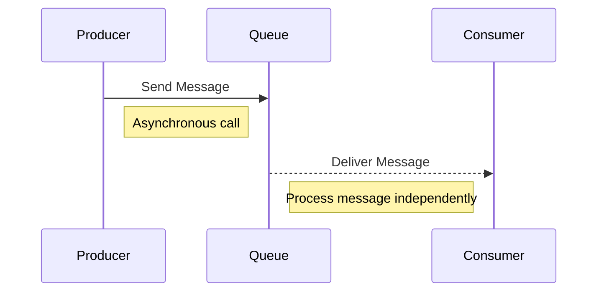

## Introduction to Message Queuing for Resilience

In cloud computing architectures, ensuring system resilience and fault tolerance is critical to maintaining continuous service availability and reliability. The **Message Queuing for Resilience** pattern leverages message queues to decouple components and buffer messages, providing a robust mechanism to handle service disruptions or failures.

## Detailed Explanation

### The Role of Message Queues

Message queues act as intermediaries that temporarily store messages sent from producers (e.g., client services) to consumers (e.g., backend services). This decoupling allows each service to function independently and asynchronously, ensuring that a temporary failure in one service does not halt the entire system.

### Architectural Approach

1. **Decoupling Services**: By introducing a message queue, producers and consumers are decoupled, allowing them to operate independently. This decoupling minimizes the impact of a service outage.

2. **Asynchronous Communication**: Message queues facilitate asynchronous communication, enabling producers to send messages without waiting for consumers to process them immediately.

3. **Buffering and Load Leveling**: Queues act as buffers that manage the volume of incoming requests, preventing consumer services from becoming overwhelmed during peak times.

4. **Error Handling and Retries**: When a consumer fails to process a message, the message can be left in the queue for retry, allowing for automatic recovery and minimizing message loss.

### Example Code

Here is an example using RabbitMQ, a popular message queuing system, implemented in Java:

```java
import com.rabbitmq.client.ConnectionFactory;
import com.rabbitmq.client.Connection;
import com.rabbitmq.client.Channel;

public class Producer {
    private final static String QUEUE_NAME = "resilientQueue";

    public static void main(String[] argv) throws Exception {
        ConnectionFactory factory = new ConnectionFactory();
        factory.setHost("localhost");
        try (Connection connection = factory.newConnection();
             Channel channel = connection.createChannel()) {
            channel.queueDeclare(QUEUE_NAME, true, false, false, null);
            String message = "Resilient message!";
            channel.basicPublish("", QUEUE_NAME, null, message.getBytes("UTF-8"));
            System.out.println(" [x] Sent '" + message + "'");
        }
    }
}
```

### Diagram



## Best Practices

- **Reliable Delivery**: Ensure message persistence to avoid message loss during system failures.
- **Idempotent Consumers**: Design consumers to handle duplicate messages gracefully.
- **Monitoring and Alerting**: Set up monitoring for queue length and consumer processing rates to identify bottlenecks.
- **Dead-Letter Queues**: Use dead-letter queues to capture unprocessable messages for further analysis.

## Related Patterns

- **Circuit Breaker**: Protects services by halting request processing when failures accumulate.
- **Retry**: Implements automatic retries upon transient failures.
- **Bulkhead**: Isolates services to prevent cascading failures.

## Additional Resources

- [RabbitMQ Documentation](https://www.rabbitmq.com/documentation.html)
- [AWS SQS](https://aws.amazon.com/sqs/)
- [Apache Kafka](https://kafka.apache.org/)

## Summary

The **Message Queuing for Resilience** pattern is an essential design strategy in cloud architectures, promoting the decoupling of services and ensuring system resilience. By leveraging message queues, architects can address service disruptions efficiently, maintaining a seamless user experience and robust system reliability.
