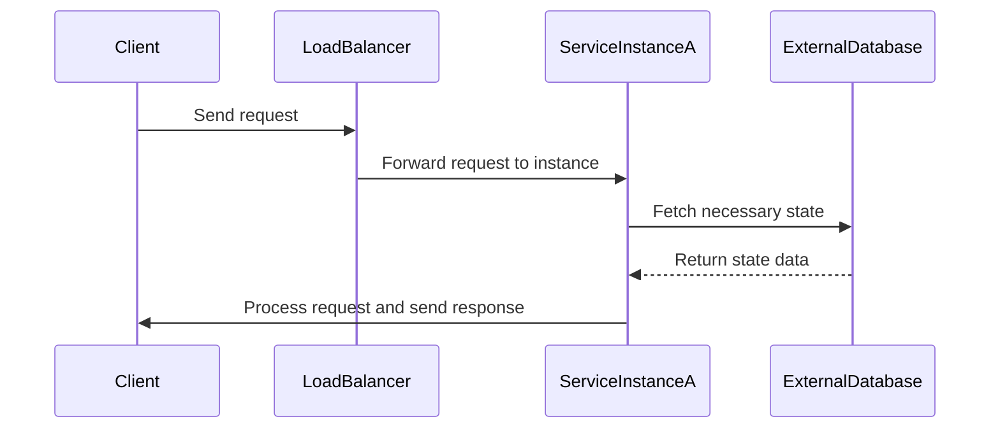

Stateless Service Design is a critical pattern in cloud computing aimed at achieving high availability and scalability by minimizing dependency on local state. This design pattern is integral to creating resilient systems in distributed environments where services failover and scale horizontally, often in response to demand changes.

## Detailed Explanation

In cloud computing, scalability, and failover strategies are paramount to system resilience and performance. Stateless services achieve this by ensuring that each service instance does not retain session-specific information or state between service calls. This allows any service instance to handle any request, enabling load balancing, elasticity, and improved fault-tolerance as instances can be restarted or duplicated without affecting ongoing processes.

### Key Characteristics
1. **Idempotency**: Stateless services are often designed to be idempotent, where repeated executions produce the same result, ensuring consistency even if requests are duplicated due to network retries or timeouts.
2. **External State Management**: Any required state is stored externally, typically in databases, caches, or context-storing services, facilitating service resilience.
3. **Horizontal Scalability**: Services can be scaled by simply adding more instances, with no unique state to migrate between instances.

## Architectural Approaches

### Example Code

Below is a simple RESTful API in Node.js illustrating a stateless service design:

```javascript
const express = require('express');
const app = express();

app.get('/compute', (req, res) => {
    // The service doesn't store any state; it computes and responds directly
    const result = someStatelessComputation(req.query.input);
    res.status(200).send({ result });
});

const someStatelessComputation = (input) => {
    // computation logic
    return `Computed result for ${input}`;
};

app.listen(3000, () => {
    console.log('Stateless service running on port 3000');
});
```

### Deploying at Scale

In cloud environments like AWS, Google Cloud Platform (GCP), or Azure, stateless services can be deployed using container orchestration platforms like Kubernetes or AWS ECS (Elastic Container Service), facilitating effortless scaling and management.

## Diagrams

### Example: Stateless Service Sequence Diagram



## Related Patterns

- **Circuit Breaker Pattern**: To manage latency and prevent cascading failures in stateless service networks.
- **Cache-Aside Pattern**: To enhance performance by externalizing and accessing state from a cache instead of direct database queries.
- **Bulkhead Pattern**: To isolate components and prevent failures in one area from affecting others.

## Best Practices

1. **Design APIs for Statelessness**: Ensure requests are self-contained without dependency on past interactions.
2. **Externalize State**: Use managed services like Amazon RDS, Google Cloud Datastore, or Redis.
3. **Implement Idempotence**: Handle duplicate requests safely, ensuring consistent outcomes without unintended side effects.

## Additional Resources

- "Designing Data-Intensive Applications" by Martin Kleppmann
- AWS Well-Architected Framework
- Google Cloud's Application Design and Development practices

## Summary

Stateless Service Design empowers cloud-native applications to achieve exceptional scalability and resilience. By decoupling service logic from the state, it simplifies the architecture, enabling efficient load balancing and recovery in dynamic cloud environments. Applying this pattern is essential for modern microservices and serverless architectures focused on reliability and performance.
