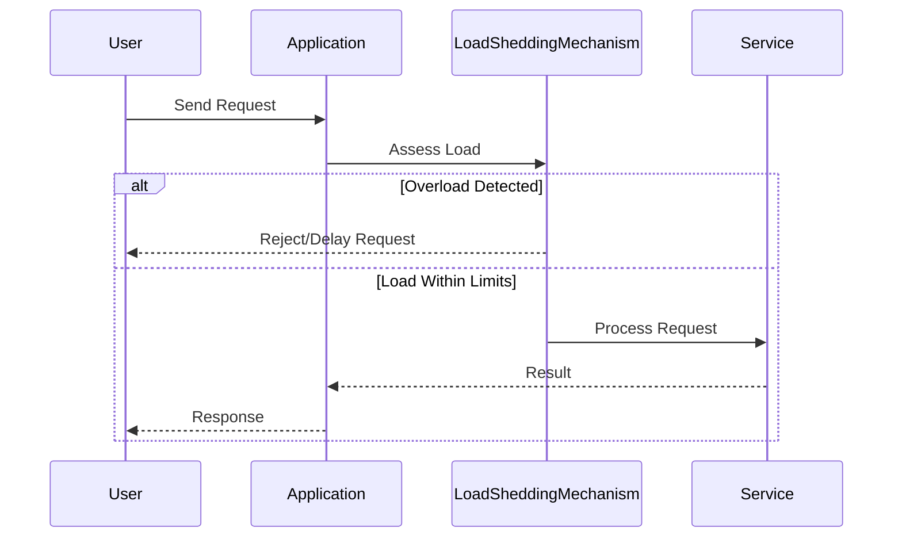

## Introduction

In the dynamic world of cloud computing, maintaining system stability under unpredictable load is critical. **Load Shedding** is a design pattern that involves intentionally discarding certain requests when the system is overwhelmed, thereby preventing failure and ensuring that the most critical operations continue to execute.

## Detailed Explanation

The objective of load shedding is to protect the system from being overloaded, which can compromise both performance and availability. This pattern is particularly useful in environments where unexpected spikes in workload occur, causing resource constraints. Load shedding can be viewed as a controlled degradation strategy that gracefully declines requests likely to impact system health negatively.

### How It Works

1. **Threshold Setting**: Establish thresholds for acceptable load levels. Parameters like CPU usage, memory consumption, or request rate might define these limits.
   
2. **Monitoring**: Continuously monitor these parameters using telemetry data to ensure they are within the predefined thresholds.

3. **Load Detection**: Implement mechanisms to detect when the system has reached or is nearing the threshold of maximum capacity.

4. **Shed Load**: Identify the non-critical requests and temporarily block, delay, or discard them. This could include pausing batch processes, rate-limiting user-facing microservices, or shedding connections from less prioritized clients.

5. **Graceful Recovery**: Once below threshold, gradually reintroduce the shed load ensuring the system can handle the reintroduced workload without degradation.

## Architectural Approaches

- **Priority Queueing**: Implementing queues that prioritize requests based on their importance to the system’s end goals.
- **Rate Limiting**: Control the rate at which requests are accepted, typically through token buckets or leaky buckets algorithms.
- **Circuit Breakers**: Temporarily blocking service until it recovers from the load spike.
- **Backpressure Management**: Implementing backpressure strategies that signal clients to slow down sending requests.

## Best Practices

- Understand your system's load patterns and historical usage data to set realistic shedding thresholds.
- Use predictive analytics and machine learning models to anticipate load spikes and adjust thresholds dynamically.
- Implement detailed logging and monitoring to continuously assess the effectiveness of load shedding strategies.
- Consider user impact when designing shedding strategies to minimize inconvenience.

## Example Code

For example, a basic implementation in Java using a priority queue and executor service to demonstrate simple load shedding:

```java
import java.util.concurrent.*;

public class LoadSheddingExample {
    private final ExecutorService executor;
    private final BlockingQueue<Runnable> queue;

    public LoadSheddingExample(int maxQueueSize, int poolSize) {
        queue = new PriorityBlockingQueue<>(maxQueueSize);
        executor = new ThreadPoolExecutor(poolSize, poolSize, 0L, TimeUnit.MILLISECONDS, queue);
    }

    public void submitTask(Runnable task) {
        if (queue.remainingCapacity() == 0) {
            System.out.println("Shedding load: dropping task");
            return;
        }
        executor.execute(task);
    }

    public void shutdown() {
        executor.shutdown();
    }

    public static void main(String[] args) {
        LoadSheddingExample loadShedder = new LoadSheddingExample(10, 5);
        for (int i = 0; i < 100; i++) {
            loadShedder.submitTask(() -> System.out.println("Task Executed"));
        }
        loadShedder.shutdown();
    }
}
```

## Diagrams



## Related Patterns

- **Throttling**: Similar to load shedding but focuses on controlling the request rate rather than shedding excess load.
- **Bulkhead**: Isolates resources to prevent failure propagation.
- **Retry**: Retries operations upon failure, typically used with circuit breaker patterns.

## Additional Resources

- [Resilience Engineering in Cloud](https://example.com/resilience-engineering)
- [Circuit Breaker Pattern Explained](https://example.com/circuit-breaker-pattern)
- [Monitoring and Logging Best Practices](https://example.com/monitoring-logging)

## Summary

Load shedding is an essential pattern for maintaining system stability in cloud environments. By prioritizing critical requests and dropping those deemed non-essential during peak times, systems can ensure continuous operation and maximize uptime. Implementers must strategically design and test load shedding mechanisms to align with business priorities and anticipate future load scenarios.
