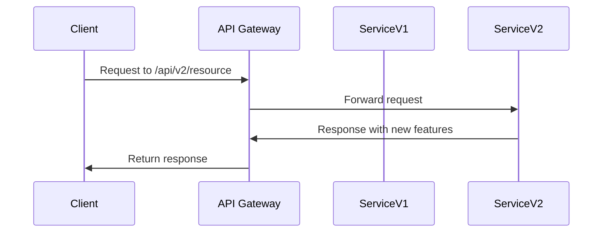

## Overview

The **Versioning and Compatibility** pattern is essential for cloud-based applications where frequent deployments are common. It addresses the challenge of introducing new software functionalities without disrupting existing operations. 

## Design Pattern Explanation

### Problem Statement

In cloud environments, services are continuously updated with new features and improvements. However, naive deployment strategies can break dependencies or lead to inconsistencies, resulting in service outages or degraded user experiences. Ensuring backward compatibility during deployments becomes crucial to resilient cloud operations.

### Solution

Versioning and Compatibility offer a structured approach to manage changes in cloud applications by following practices that prevent disruptions:

1. **Semantic Versioning**: Adopt a versioning standard where changes are classified into major, minor, and patch categories. This helps in communicating the impact of changes to stakeholders and automated systems.

2. **Backward Compatibility**: Design APIs and interfaces such that new versions do not break existing functionalities. Common techniques include:

   - **Deprecation Plan**: Mark outdated features as deprecated before removal with ample time for users to migrate.
   - **Feature Toggles**: Enable new features conditionally, based on user settings or configurations.
   - **Dual-Running**: Operate old and new versions simultaneously to allow consumers to adapt.

3. **Contract Testing**: Implement contract testing frameworks to ensure that the interactions between different services adhere to defined interfaces, especially when introducing changes.

4. **API Gateways and Proxies**: Utilize API gateways to route traffic based on versions, thereby managing HTTP request flows and reducing the direct impact of changes.

## Architectural Approaches

- **Microservices Architecture**: Ensure each microservice can be independently versioned. Use service discovery and service mesh technologies for dynamic service management.
  
- **Immutable Architecture**: Emphasize immutability where components are not modified post-deployment, but replaced with new iterations.

- **Message-Driven Communication**: Leverage message queues and event streams that include version identifiers, allowing consumers to process the correct event schema.

## Best Practices

- **Automate Deployment Pipelines**: Implement CI/CD pipelines with automated tests specifically designed to verify version compatibility.

- **Clear API Documentation**: Maintain robust documentation that clarifies version changes and compatibility rules.

- **Rollback Mechanisms**: Set up mechanisms to quickly rollback deployments that inadvertently disrupt existing functionality.

## Example Code

### Sample API Versioning with Node.js

```javascript
const express = require('express');
const app = express();

// Version 1 Endpoint
app.get('/api/v1/resource', (req, res) => {
  res.send('This is Version 1 of the API.');
});

// Version 2 Endpoint
app.get('/api/v2/resource', (req, res) => {
  res.send('This is Version 2 with new features.');
});

app.listen(3000, () => {
  console.log('API listening on port 3000');
});
```

## Diagram



## Related Patterns and Practices

- **Canary Releases**: Gradually roll out versions to a subset of users to gauge impact before full deployment.
- **Side-by-Side Deployment**: Host multiple versions of applications simultaneously to facilitate smooth migrations.

## Additional Resources

- [Martin Fowler's Guide to Versioning](https://martinfowler.com/articles/versioning.html)
- [API Gateway Patterns](https://www.nginx.com/blog/building-microservices-using-an-api-gateway/)
- [Semantic Versioning Specification](https://semver.org/)

## Summary

In a world of continuous integration and delivery, maintaining a robust versioning strategy ensures that software services remain resilient and user experiences uninterrupted. By adopting the Versioning and Compatibility pattern, cloud systems can effectively manage changes with minimal friction, supporting agile development and deployment cycles.
