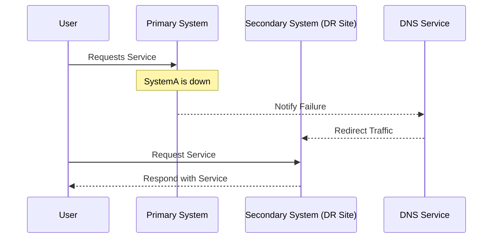

## Introduction

In today's business landscape, ensuring uninterrupted service and data integrity is paramount. This document focuses on the design pattern of **Disaster Recovery Planning (DRP)** specifically within cloud environments. Here, the objective is to create structured strategies that prepare organizations to respond effectively to significant disruptions, such as natural disasters, cyber-attacks, or infrastructure failures. 

## Design Patterns and Architectural Approaches

### 1. **Redundancy and Replication**

Cloud-based disaster recovery often employs redundancy and data replication across geographically diverse locations to ensure continuous data availability and integrity. 

- **Active-Active Configuration**: Utilizes multiple data centers that actively handle traffic and workloads. This configuration ensures minimal downtime and rapid recovery but can be costly.
  
- **Active-Passive Configuration**: Maintains one active data center, while another remains on standby. This setup is resource-efficient but may take longer to recover from a failure.

### 2. **Automated Failover Mechanisms**

Automated failover involves cloud-native tools and services that redirect workloads to backup systems without manual intervention. Tools like AWS Route 53 and Azure Traffic Manager can provide intelligent routing for this purpose.

### 3. **Snapshot and Backup Solutions**

Regular snapshots and backups are critical in maintaining data integrity and enabling point-in-time recovery. Solutions like AWS Backup and Google Cloud's Persistent Disk snapshots allow organizations to automate these processes.

### 4. **Disaster Recovery as a Service (DRaaS)**

Many cloud providers offer DRaaS, allowing organizations to leverage predefined services for rapid deployment of disaster recovery operations. This service eliminates the need for onsite hardware and provides cost-effective, scalable recovery solutions.

## Best Practices

- **Risk Assessment**: Conduct comprehensive risk evaluations to identify potential threats and their impact on business operations.
  
- **Recovery Time Objective (RTO) and Recovery Point Objective (RPO)**: Define and strive to meet specific RTOs and RPOs to minimize data loss and downtime.
  
- **Regular Testing**: Regular testing and drills ensure that all components of the disaster recovery plan function correctly during an actual disaster event.
  
- **Update and Maintenance**: Continuously update the disaster recovery plan to accommodate new technologies and address uncovered vulnerabilities.

## Example Code

Here's a simple AWS Lambda function example to automate a daily snapshot of EC2 instances, ensuring that a backup is always available:

```python
import boto3
from datetime import datetime
from botocore.exceptions import ClientError

ec2_client = boto3.client('ec2')

def lambda_handler(event, context):
    try:
        instances = ec2_client.describe_instances()
        for reservation in instances['Reservations']:
            for instance in reservation['Instances']:
                create_snapshot(instance['InstanceId'])
    except ClientError as e:
        print(f"Failed to take snapshot: {str(e)}")

def create_snapshot(instance_id):
    snapshot = ec2_client.create_snapshot(
        Description=f"Daily Backup {datetime.now().strftime('%Y-%m-%d %H:%M:%S')}",
        InstanceId=instance_id
    )
    print(f"Created snapshot: {snapshot['SnapshotId']} for instance: {instance_id}")
```

## Diagrams

Here is a high-level sequence diagram using Mermaid to illustrate the disaster recovery plan activation:



## Related Patterns and Descriptions

- **High Availability Clusters**: Ensures minimal service disruption by distributing workloads across multiple nodes and data centers.
- **Geo-Redundancy**: Distributes backup and replication across different geographic regions.
- **Auto-Scaling**: Automatically adjusts compute resources in response to load changes, ensuring that recovery infrastructure scales as required.

## Additional Resources

- [AWS Disaster Recovery](https://aws.amazon.com/disaster-recovery/)
- [Google Cloud Operations Suite](https://cloud.google.com/products/operations)
- [Azure Site Recovery](https://azure.microsoft.com/en-us/services/site-recovery/)

## Summary

A well-structured Disaster Recovery Plan is indispensable for maintaining business operations and data security in cloud environments. By implementing strategies such as redundancy, automated failovers, and regular testing, organizations can mitigate the risks associated with major outages and ensure a resilient and robust IT infrastructure.
