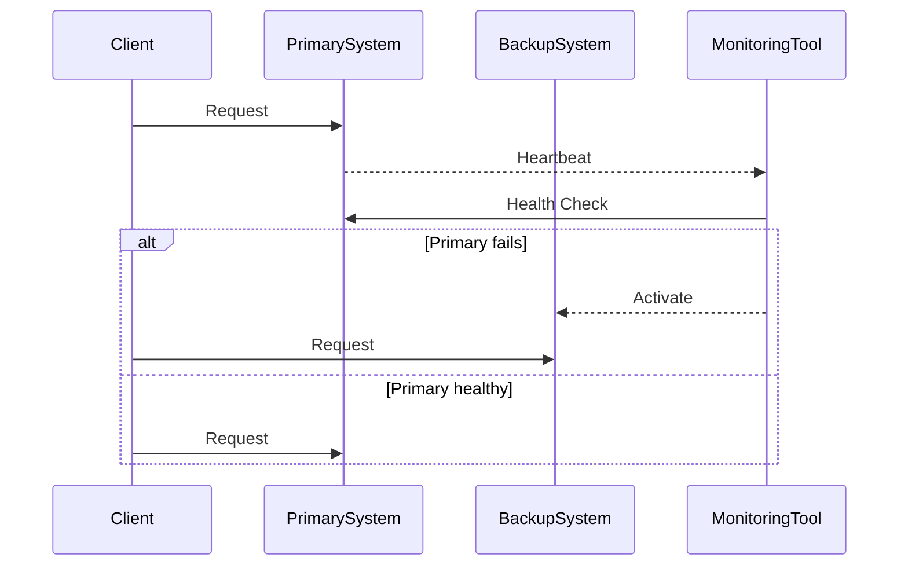

## Introduction

In cloud computing, ensuring continuous availability of services is crucial. **Failover Mechanisms** are designed to automatically switch to a redundant or standby system upon the failure of the currently active system. This pattern is critical in maintaining service availability and reliability, particularly in environments where downtime translates to significant operational and financial impacts.

## Design Pattern Overview

Failover Mechanisms help to achieve high availability by providing the architecture needed to detect failures and redirect requests to functioning components. This approach eliminates single points of failure and minimizes downtime.

### Key Components

1. **Primary System**: The active component that handles processing under normal conditions.
2. **Backup System**: A standby component that takes over the duties of the primary system when it fails.
3. **Monitoring and Detection**: Tools or scripts that continuously check the health of the primary system.
4. **Failover Logic**: The rules and actions that drive the transition from the primary to the backup system.

## Architectural Approaches

- **Cold Failover**: The backup system is in a dormant state and is only activated upon system failure. This approach may result in some delay but is cost-effective.
  
- **Warm Failover**: The backup system remains operational and receives updates frequently but does not handle traffic until a failover is initiated, leading to quicker switchover times than cold failover.
  
- **Hot Failover**: Both primary and backup systems run concurrently and are synchronized in near real-time. This enables an almost immediate switchover without noticeable service disruption, albeit at a higher cost.

## Best Practices

- **Redundancy**: Implement multiple layers of redundancy (data, network paths) to ensure no single point of failure.
  
- **Testing**: Regularly test failover processes and infrastructure resilience under various failure scenarios.
  
- **Monitoring**: Use robust monitoring tools to detect failures swiftly, minimizing the failover time.
  
- **Documentation**: Keep comprehensive documentation of your failover processes and infrastructure configurations.
  
- **SLA Considerations**: Align failover mechanisms with Service Level Agreements to meet required uptime metrics.

## Example Code 

Here's a simplistic example of a Python script that mimics failover decision-making logic:

```python
import time

class System:
    def __init__(self, name):
        self.name = name
        self.is_active = True

    def check_health(self):
        # Simulate health check logic
        return self.is_active

def failover(primary, backup):
    if not primary.check_health():
        print(f"Failure detected in {primary.name}. Switching to {backup.name}.")
        return backup
    return primary

primary_system = System("PrimarySystem")
backup_system = System("BackupSystem")

active_system = primary_system

for _ in range(5):
    active_system = failover(active_system, backup_system)
    print(f"Current active system: {active_system.name}")
    time.sleep(1)

    # Simulate primary failure
    if _ == 2:
        primary_system.is_active = False
```

## Diagrams

Here is UML Sequence diagram demonstrating the failover process:



## Related Patterns

- **Circuit Breaker Pattern**: Prevents system from repeatedly trying an operation that's likely to fail, protecting itself from further harm.
- **Bulkhead Pattern**: Isolates parts of an application to prevent a failure from escalating.
- **Load Balancer Pattern**: Distributes incoming requests across multiple instances, aiding in resilience.

## Additional Resources

- [High Availability and Disaster Recovery Concepts](https://link-to-resource)
- [AWS Well-Architected Framework: Reliability Pillar](https://aws.amazon.com/architecture/well-architected/)

## Summary

Failover Mechanisms play a vital role in delivering resilient and fault-tolerant cloud services. By automatically switching operations to standby components upon system failures, they ensure the continuity and reliability of services. Utilizing a well-defined failover strategy as part of your cloud architecture helps in minimizing downtime and meeting critical service availability SLAs.
