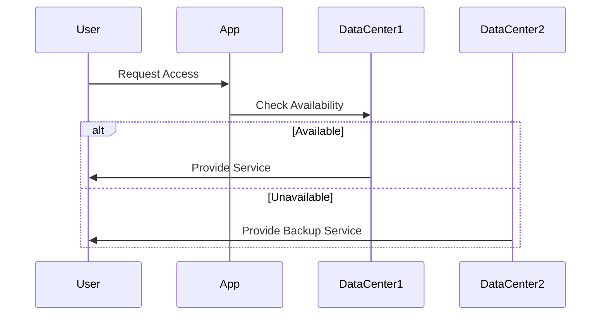

### Introduction

Geo-Redundancy is a critical design pattern in cloud computing that involves distributing computational resources and data across multiple geographic locations. This approach ensures that applications and services remain available and resilient even in the event of a regional failure, natural disaster, or other localized issues that could impact the availability of services hosted in a single location.

### Architectural Approach

Geo-Redundancy leverages multiple data centers located in diverse geographical regions. An architectural layout using Geo-Redundancy typically involves:

- **Redundant Data Centers**: Set up identical or strategically diverse infrastructures in multiple geographic regions.
- **Data Synchronization**: Use data replication techniques to synchronize data across different regions ensuring consistency.
- **Load Balancing**: Deploy load balancers that can distribute requests across multiple regions based on latency, resource availability, or other policies.
- **Failover Mechanisms**: Implement automatic failover strategies to redirect traffic to an alternative region if one region becomes unavailable.

### Best Practices

1. **Data Consistency**: Deploy mechanisms to handle eventual consistency across regions if low latency and high availability are crucial.
2. **Latency Management**: Optimize data transfer and minimize latency through optimization strategies like Content Delivery Networks (CDNs).
3. **Automated Scalability**: Utilize cloud providers’ auto-scaling features to dynamically manage resources across regions based on demand.
4. **Regular Testing**: Conduct failover testing and simulations to ensure seamless recovery and redundancy effectiveness.
5. **Compliance and Governance**: Ensure that the data distribution complies with regional laws and industry standards concerning data sovereignty and privacy.

### Example Code

Here's a simple example using Terraform to provision resources in multiple AWS regions:

```hcl
provider "aws" {
  region = var.primary_region
}

resource "aws_instance" "primary" {
  ami           = "ami-12345678"
  instance_type = "t2.medium"

  tags = {
    Name = "PrimaryInstance"
  }
}

provider "aws" {
  alias  = "secondary"
  region = var.secondary_region
}

resource "aws_instance" "secondary" {
  provider      = aws.secondary
  ami           = "ami-12345678"
  instance_type = "t2.medium"

  tags = {
    Name = "SecondaryInstance"
  }
}
```

### Diagrams

#### UML Sequence Diagram



### Related Patterns

- **Cloud Load Balancing**: Distributes incoming application traffic across multiple targets to enhance application availability.
- **Failover Pattern**: Automatically reroutes network traffic to a secondary system or region to maintain service continuity.
- **Backup and Restore**: Provides mechanisms to recover systems and data after failure.

### Additional Resources

- [AWS Multi-Region Architecture](https://aws.amazon.com/architecture/multi-region/)
- [Azure Geo-Redundancy](https://azure.microsoft.com/en-us/updates/zone-redundant-storage/)
- [Google Cloud Disaster Recovery](https://cloud.google.com/solutions/dr-scenarios)

### Summary

Geo-Redundancy is vital for building resilient and fault-tolerant cloud applications. By distributing resources across multiple regions, organizations can ensure high availability, disaster recovery, and maintain service continuity against various disruptions. This design pattern is integral to any organizational strategy focused on reliability and customer centricity in cloud-based architectures.
