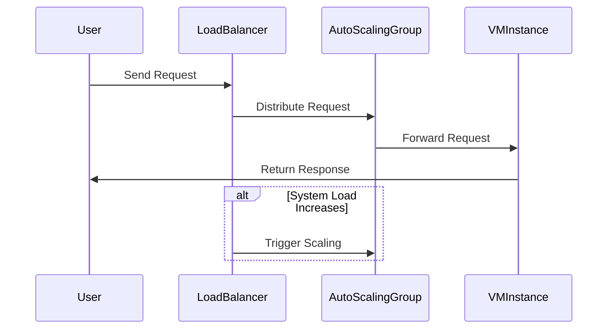

## Overview

In cloud environments, the **Scaling for Resilience** design pattern is integral to maintaining service availability and performance during unexpected failures or sudden spikes in demand. By dynamically adjusting resources, systems can continue to operate smoothly, absorbing additional load and minimizing downtime.

## Detailed Explanation

### Concept

The Scaling for Resilience pattern leverages both horizontal and vertical scaling to accommodate increased loads and potential system failures. This pattern includes automating the scaling process to ensure that the system remains responsive and available.

- **Horizontal Scaling** involves adding more instances or nodes to the system, which is particularly effective in distributed systems architecture.
- **Vertical Scaling** involves increasing the resources (CPU, memory) of existing instances or nodes. 

### Benefits

- **Improved Availability**: Automatically adjusting resources helps prevent service degradation.
- **Cost Efficiency**: Resources are allocated based on demand, optimizing costs.
- **Flexible Adaptation**: Quickly reacting to changes in workload ensures a seamless user experience.

### Implementation Strategies

1. **Auto Scaling Groups**: Utilize cloud service features (e.g., AWS Auto Scaling, GCP Autoscaler, Azure Scale Sets) to automatically adjust the number of running instances based on predefined policies or metrics.
   
2. **Load Balancing**: Distribute incoming requests across instances to prevent any single instance from being overwhelmed.

3. **Health Checks**: Implement ongoing monitoring to detect failures or performance issues, triggering scaling operations.

4. **Queue Management**: Use message queues to decouple service components, allowing parts of a system to scale independently.

### Example Code

Here's a basic example using AWS's Boto3 library to manage an auto-scaling group:

```python
import boto3

client = boto3.client('autoscaling')

response = client.update_auto_scaling_group(
    AutoScalingGroupName='my-auto-scaling-group',
    DesiredCapacity=5,
    MaxSize=10,
    MinSize=1
)

print("Auto-scaling group updated with response:", response)
```

### Diagrams

Below is diagram illustrating a user request flow in a cloud environment utilizing the Scaling for Resilience pattern:



## Related Patterns

- **Circuit Breaker**: Prevents cascading failures by monitoring success and failure rates of requests.
- **Throttling**: Limits request rates to avoid overwhelming system resources.
- **Failover**: Automatically switches to a standby system in case of failure.

## Additional Resources

- [AWS Auto Scaling](https://aws.amazon.com/autoscaling/)
- [GCP Autoscaler](https://cloud.google.com/compute/docs/autoscaler)
- [Azure Autoscale](https://docs.microsoft.com/en-us/azure/azure-monitor/autoscale/autoscale-get-started)

## Summary

The Scaling for Resilience pattern is a foundational principle in cloud computing, aimed at enhancing the reliability and robustness of cloud services. By employing strategic scaling methods, organizations can ensure high availability and seamless performance, even in the face of sudden demand spikes or component failures.
