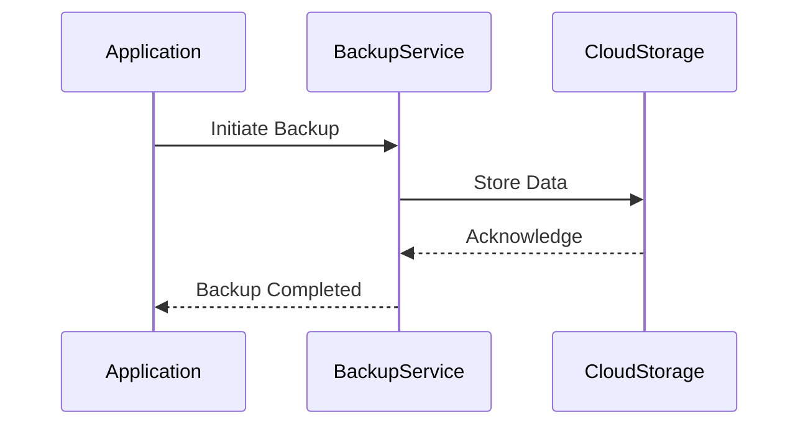

## Overview

In cloud computing, ensuring data resilience and preventing data loss are critical for maintaining operational continuity and trust. The *Data Backups and Snapshots* pattern focuses on regularly duplicating and storing data safely to allow recovery in case of data corruption, accidental deletion, or disasters. This pattern emphasizes both on-premise and cloud-based strategies for creating backups and snapshots.

## Problem

Data in cloud environments can be at risk due to cyber attacks, hardware failures, or software errors. Without effective backup solutions, systems can suffer critical data loss, leading to operational disruptions, financial losses, and damage to reputation.

## Solution

To minimize data loss risks, implement a backup and snapshot strategy that includes:

1. **Regular Data Backups**: Automate regular backups of data to different storage locations and media types. These backups could be full, incremental, or differential, depending on the business needs and data size.
2. **Data Snapshots**: Utilize cloud provider capabilities to create point-in-time snapshots of data. Snapshots often offer a more performance-efficient way to revert to a previous state without requiring a full restore operation.
3. **Redundant Storage**: Leverage geographically distributed storage solutions to ensure that backups are safe from regional disasters.
4. **Versioning and Retention Policies**: Implement versioning for backup data to recover from unintended changes and employ retention policies to manage storage costs.

## Architectural Approaches

### Cloud-Based Backups

Most cloud providers offer robust backup services that integrate seamlessly with their storage solutions. For instance, AWS offers AWS Backup for automating and managing backups across AWS services.

### On-Premise to Cloud Backups

For hybrid environments, consider backing up on-premise data to cloud storage systems to benefit from cost effectiveness and scalability of cloud solutions.

### Cross-Cloud Backups

For businesses using multiple cloud providers, cross-cloud backups help prevent dependency on a single vendor and enhance data resilience.

## Example Code

Using AWS SDK, you can automate snapshots for an Amazon RDS instance:

```java
import software.amazon.awssdk.services.rds.RdsClient;
import software.amazon.awssdk.services.rds.model.CreateDbSnapshotRequest;
import software.amazon.awssdk.services.rds.model.CreateDbSnapshotResponse;

public class RdsSnapshot {

    public static void createSnapshot(String instanceIdentifier, String snapshotIdentifier) {
        try (RdsClient rdsClient = RdsClient.builder().build()) {
            CreateDbSnapshotRequest request = CreateDbSnapshotRequest.builder()
                .dbInstanceIdentifier(instanceIdentifier)
                .dbSnapshotIdentifier(snapshotIdentifier)
                .build();
            
            CreateDbSnapshotResponse response = rdsClient.createDBSnapshot(request);
            System.out.println("Snapshot created: " + response.dbSnapshot().dbSnapshotIdentifier());
        }
    }
}
```

## Diagrams

Below is UML Sequence diagram illustrating the data backup process:



## Related Patterns

- **Disaster Recovery**: Focuses on recovering IT infrastructure and operations after a catastrophe.
- **Multi-Region Deployment**: Improves application availability by distributing across regions.

## Additional Resources

- [AWS Backup Documentation](https://aws.amazon.com/documentation/aws-backup/)
- [Azure Backup Overview](https://learn.microsoft.com/en-us/azure/backup/backup-overview)
- [Google Cloud Backup Services](https://cloud.google.com/backup-restore)

## Summary

The *Data Backups and Snapshots* pattern is essential for ensuring business continuity in cloud environments. By implementing a reliable backup and snapshot system, organizations can safeguard their data against potential losses while meeting compliance and operational requirements. Whether leveraging native cloud services or building custom solutions, maintaining data resilience through effective backup strategies is an indispensable practice in modern IT landscapes.
