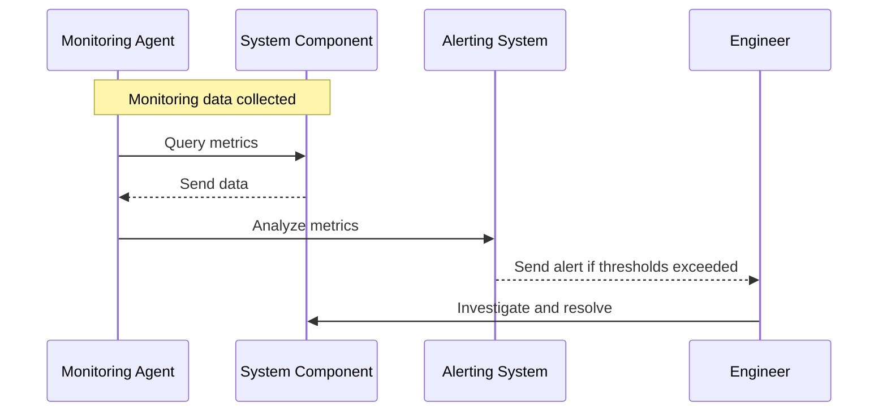

Monitoring and alerting systems are vital components of cloud computing architecture. These systems enable you to detect issues promptly and respond effectively, ensuring high availability and fault tolerance in cloud environments. In this article, we'll delve into the architectural patterns, best practices, and examples related to creating effective monitoring and alerting systems.

## Detailed Explanation

### Design Patterns for Monitoring and Alerting

1. **Centralized Logging**: Collects and aggregates logs from various components across the system into a central location. This pattern simplifies log analysis and troubleshooting.

2. **Health Check Pattern**: Regularly executes checks to ensure components perform as expected. If an abnormality is detected, alerts are generated for immediate investigation.

3. **Metric Aggregation**: Captures and consolidates metrics across the system to analyze performance trends and anomalies over time.

4. **Auto-Scaling and Resource Adjustment**: Uses thresholds and triggers in conjunction with monitoring data to automatically scale resources up or down based on load demands.

5. **Alert Routing and Management**: Ensures the right team members receive alerts with relevant context and severity levels, reducing response times and improving resolution accuracy.

### Architectural Approaches

- **Distributed Tracing**: Utilize distributed tracing tools to follow the path of requests through various microservices, identifying where bottlenecks or failures occur.

- **Service Level Objectives (SLOs)**: Define explicit performance and availability goals for services to guide monitoring priorities and alerting configurations.

- **Anomaly Detection**: Implement machine learning models for detecting anomalous patterns in data, proactively identifying potential issues before they become critical failures.

### Best Practices

- **Set Clear Alerts**: Avoid alert fatigue by carefully setting thresholds and circumstances that truly require action. Use dashboards to visualize trends, reserving alerts for critical incidents.

- **Implement Redundancy**: Ensure monitoring components themselves are redundant and resilient to avoid single points of failure in the monitoring system.

- **Integrate with CI/CD Pipelines**: Incorporate monitoring and alerting as part of the continuous integration and deployment process to automatically adjust and test configurations as part of the release cycle.

### Example Code

Here are some basic examples of how to integrate monitoring and alerting using Prometheus and Grafana:

```yaml
scrape_configs:
  - job_name: 'my_service'
    static_configs:
      - targets: ['localhost:9090']

{
  "id": 1,
  "alert": {
    "name": "High CPU Usage Alert",
    "condition": {
      "type": "greaterThan",
      "value": 80
    }
  }
}
```

### Diagrams



## Related Patterns

- **Circuit Breaker Pattern**: Protects services from cascading failures by reacting to failure conditions and limiting harm.

- **Load Balancing Pattern**: Distributes incoming client requests evenly across a group of backend servers to ensure no single server becomes a bottleneck.

- **Failover and Clustering Patterns**: Provides redundancy to automatically transfer workloads from a failed component to a standby component.

## Additional Resources

- [Prometheus Monitoring Guide](https://prometheus.io/docs/introduction/overview/)
- [Grafana Alerting](https://grafana.com/docs/grafana/latest/alerting/)

## Final Summary

Monitoring and alerting systems are essential for maintaining resilient and fault-tolerant cloud environments. By implementing right-fit design patterns, utilizing intelligent alerting, and following best practices, organizations can ensure their systems operate smoothly and efficiently, even in the face of unexpected challenges.
