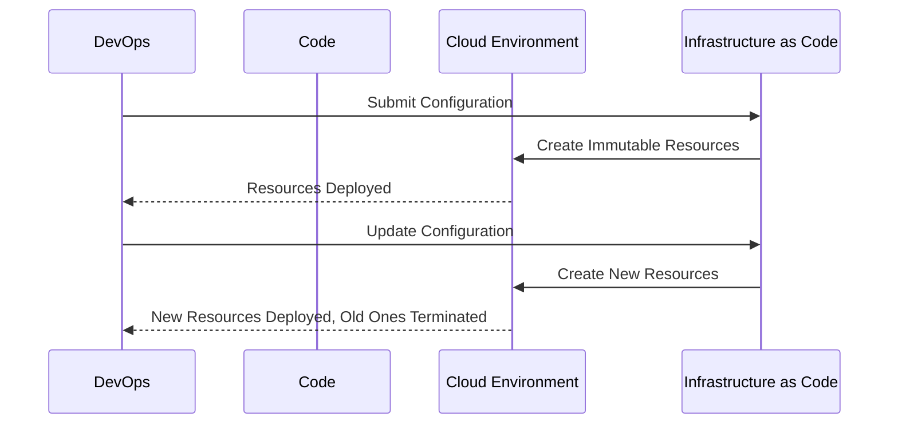

## Introduction

The Pattern of Immutability is a design pattern that emphasizes using immutable components or infrastructure in cloud computing. By adopting this pattern, systems experience reduced errors, less complexity, and enhanced resiliency. In distributed and cloud-based systems, immutability offers a significant advantage due to its ability to enable versioned deployments, rollback capabilities, and consistent environments.

## Detailed Explanation

### Immutability Concept

In software, immutability refers to the idea that once a component or object is created, it cannot be modified. This concept has been particularly beneficial in functional programming languages and has gained traction in system design patterns, especially in cloud architecture.

### Key Advantages

1. **Consistency:** Immutable components ensure that the state of an infrastructure component remains consistent across different environments. This consistency eliminates discrepancies between development, testing, staging, and production environments.
   
2. **Predictability:** Since components do not change once deployed, they behave predictably, simplifying debugging and reducing potential errors due to unexpected states.
   
3. **Resilience:** Immutable systems can withstand faults better as they allow easy recovery by reverting to a previous state or by redeploying known good versions.
   
4. **Scalability:** Immutable infrastructures improve scalability by allowing new instances to be brought up based on a predefined state without intricate configuration steps.

### Architectural Approaches

- **Immutable Infrastructure:** Use tools such as Terraform or Pulumi to define your infrastructure as code. These tools create and manage cloud resources using configuration files, allowing all changes to be version-controlled.
- **Containerization:** Use containers (e.g., Docker) to package applications and their dependencies into immutable units of deployment. Docker images are a prime example of immutable components.
- **Serverless Architecture:** Leverage serverless or FaaS (Function as a Service) platforms where the underlying infrastructure is managed by the provider, inherently encouraging immutability.

## Example Code

Here's a sample Terraform configuration snippet illustrating immutable infrastructure:

```hcl
provider "aws" {
  region = "us-east-1"
}

resource "aws_instance" "web" {
  ami           = "ami-12345678"
  instance_type = "t2.micro"

  lifecycle {
    create_before_destroy = true
  }

  tags = {
    Name = "ImmutableServer"
  }
}
```

In this configuration, changes result in the creation of new instances instead of modifying existing ones.

## Diagrams



## Related Patterns

- **Infrastructure as Code (IaC):** Automating infrastructure management with version control and automation tools.
- **Blue-Green Deployment:** Using two separate environments for deployment to facilitate seamless updates and rollbacks.
- **Phoenix Server Pattern:** Regularly replacing servers with new instances to apply updates and fix issues.

## Additional Resources

- [Terraform Documentation](https://www.terraform.io/docs/index.html)
- [Docker Overview](https://docs.docker.com/get-started/overview/)
- [AWS Lambda - Serverless Compute](https://aws.amazon.com/lambda/)

## Summary

The Pattern of Immutability is crucial for building resilient, fault-tolerant cloud systems. By treating infrastructure and deployment components as immutable, teams can reduce errors, simplify change management, and enhance overall system consistency. Utilizing containerization, serverless architectures, and infrastructure as code are key strategies in implementing this pattern.
