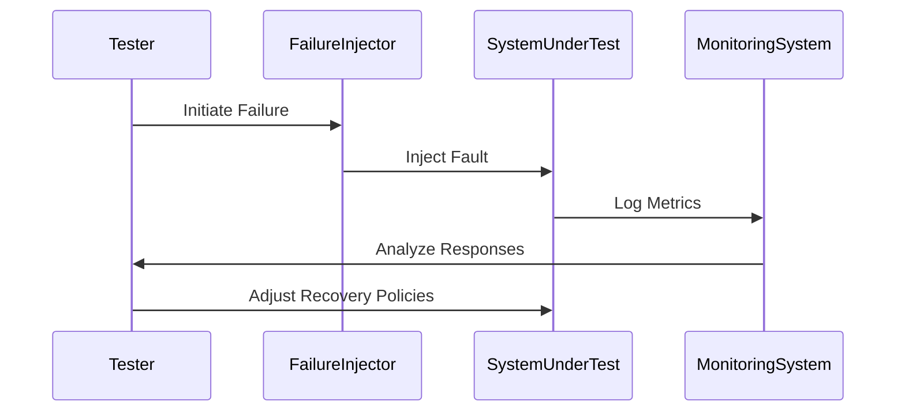

In the rapidly evolving realm of cloud computing, ensuring systems are resilient and fault-tolerant is fundamental to maintaining service reliability. Testing failures in non-production environments is a crucial pattern that involves deliberately injecting faults into systems outside of production to validate and improve their recovery processes.

## Understanding the Pattern

### Aim

The primary goal of this pattern is to simulate various failure scenarios that a cloud infrastructure might encounter. By doing this in non-production environments, organizations can evaluate how their systems respond to failures and refine recovery strategies without jeopardizing live customer experiences.

### Scenarios and Considerations

- **Network Failures:** Simulate network partitioning or latency spikes to test data consistency and system communication.
- **Service Crashes:** Induce service or instance crashes to observe recovery time objectives (RTO) and service redundancy.
- **Resource Depletion:** Artificially limit CPU, memory, or storage to evaluate system behavior under constrained resources.
- **Dependency Failures:** Cause upstream or downstream service failures to assess impact on application functionality.

## Best Practices

1. **Plan and Document**: Define the scope of testing, potential risks, and expected system behaviors.
2. **Automated Testing**: Leverage automated tools for continuous and repeatable failure injections.
3. **Metrics and Monitoring**: Ensure comprehensive monitoring and alerting are in place to gather data on system responses.
4. **Incremental Failure Injection**: Start with low-impact tests and escalate to more severe failure conditions gradually.
5. **Review and Iterate**: Analyze the outcomes to refine resilience strategies continually.

## Example Code

Below is a conceptual demonstration using a hypothetical failure injection tool in a Kubernetes environment:

```yaml
apiVersion: v1
kind: Pod
metadata:
  name: failure-injector
spec:
  containers:
  - name: network-latency-injector
    image: failure-injector-image:latest
    args: ["--network-latency=100ms", "--target-service=my-service"]
  restartPolicy: Never
```

In this example, a pod is created to inject network latency into a service for testing purposes.

## Diagrams

The sequence diagram below illustrates the process of failure injection and system response analysis:



## Related Patterns

- **Circuit Breaker**: Helps in managing failures gracefully by preventing a chain reaction of failures.
- **Retry Pattern**: Implements retry logic to handle transient failures.
- **Bulkhead Pattern**: Isolates components to prevent cascading failures.

## Additional Resources

- [Chaos Engineering Principles](https://principlesofchaos.org)
- [Kubernetes Failure Stories](https://kubernetesfailurestories.com)
- [AWS Fault Injection Simulator](https://aws.amazon.com/fis/)

## Summary

Testing failures in non-production environments enables organizations to proactively prepare for and mitigate system disruptions in production. By identifying vulnerabilities and improving recovery mechanisms, companies can ensure higher availability and reliability of their cloud services. This strategy, combined with concrete metrics and continuous iteration, fosters robust fault-tolerant architectures essential for modern cloud deployments.
