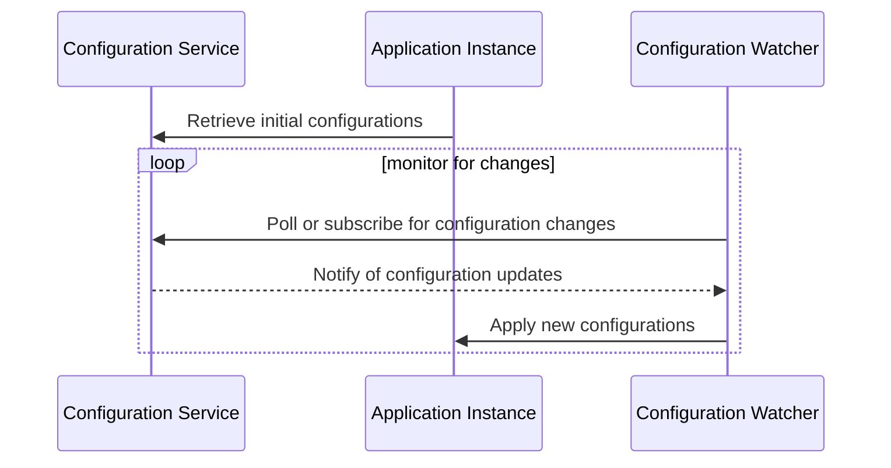

## Introduction

In cloud computing, the ability to dynamically adjust configuration settings in response to system failures and other operational conditions is crucial for maintaining service availability and performance. The Dynamic Configuration pattern enables applications to change their behavior without a need for redeployment, enhancing their resilience and adaptability.

## Pattern Explanation

Dynamic Configuration involves the use of externalized configuration management where system settings can be modified at runtime. This configuration is often managed through a centralized service that allows for consistent and instantaneous updates across distributed system components.

### Key Components:
1. **Configuration Service**: A centralized service where configurations are stored and managed. It should support high availability and scalability.
2. **Watchers/Listeners**: Components within the system that listen for configuration changes and apply them dynamically.
3. **Consistency Mechanism**: Ensures that all components receive the same configuration updates in a consistent manner.

## Architectural Approach

A typical implementation of Dynamic Configuration in a cloud environment can be illustrated through a microservices architecture that uses a configuration service such as AWS Systems Manager Parameter Store, Google Cloud Runtime Configuration, or open-source solutions like Consul or etcd.



## Best Practices

- **Centralization and Decoupling**: Always centralize configuration management to ensure ease of updates and consistency. Decouple the configuration logic from application logic.
- **Versioning and Rollbacks**: Implement version control for configurations to enable the rollback of changes if they degrade system performance or stability.
- **Security**: Ensure sensitive configuration parameters are encrypted and access is controlled through stringent authentication and authorization measures.
- **Granular Settings**: Design the configuration to cover different granular levels (application-wide, service, or feature-specific).
- **Alerting and Auditing**: Integrate alerting mechanisms for configurations to notify administrators about critical changes, and maintain audit logs for tracking adjustments over time.

## Example Code

Here's a simple example using Spring Cloud Config for managing dynamic configuration in a microservices setup:

```java
@RestController
public class DynamicConfigController {

    @Value("${service.api.url}")
    private String apiUrl;

    @GetMapping("/config")
    public String getConfig() {
        return "Current API URL: " + apiUrl;
    }
}
```

Application properties stored in a Git repository might initially look like:

```properties
service.api.url=https://api.initial.url
```

Changes to this file in the Git repository can trigger an update across all instances using Spring Cloud Config Client.

## Related Patterns

- **Configuration Management**: While closely related, Configuration Management focuses more on the methodologies and tools used to manage configurations as opposed to dynamic responses.
- **Circuit Breaker**: Often used in conjunction with dynamic configuration, allows a system to gracefully degrade functionality in response to partial system failures.

## Additional Resources

- [Spring Cloud Config](https://spring.io/projects/spring-cloud-config)
- [AWS Systems Manager Parameter Store](https://aws.amazon.com/systems-manager/features/#Parameter_Store)
- [Consul by HashiCorp](https://www.consul.io/)
- [etcd by CoreOS](https://etcd.io/)
- [Google Cloud Runtime Configuration](https://cloud.google.com/deployment-manager/docs/configuration/supported-types/runtimeconfig-v1beta1)

## Summary

Dynamic Configuration is an essential pattern in cloud computing for ensuring resiliency and fault tolerance. By enabling systems to adjust configuration settings in real time in response to changes and failures, it maintains continuity of service and operational efficiency. Implementing dynamic configuration requires consideration of centralization, security, and careful management of configuration changes, but the benefits of increased adaptability and reduced downtime are well worth the effort.
