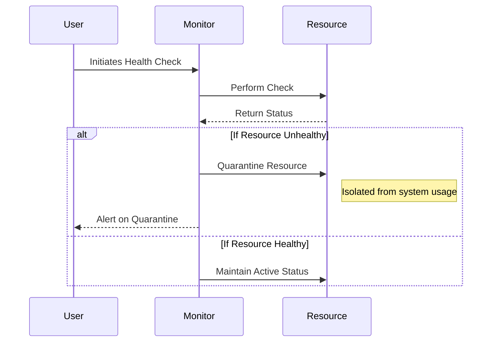

## Introduction

In cloud environments, the ability to isolate and manage faulty components is critical to maintaining overall system resilience and integrity. The **Resource Quarantining** design pattern is a strategy used to prevent the propagation of faults from one component to others within the system. It involves identifying unhealthy resources, isolating them, and managing the mitigation process to maintain application continuity and protect healthy resources.

## Pattern Explanation

Resource Quarantining is especially vital in large-scale distributed systems where numerous components, like virtual machines, containers, databases, and networks, operate in concert. The pattern entails continuous monitoring to identify anomalies or signs of failure. Once a resource is marked unhealthy, it is quarantined, which means preventing it from affecting other components, until the issue is resolved, either through automated recovery or manual intervention.

### Key Features of Resource Quarantining:
- **Automated Monitoring:** Utilizes metrics and logs to continuously assess the health of resources.
- **Isolation Mechanism:** Implements network policies, resource tagging, or infrastructure management rules to contain the faulty component.
- **Health Checks and Alerting:** Regularly checks resource statuses and alerts administrators for manual reviews or automated scripts execution.
- **Self-Healing:** Enables automatic recovery actions, such as redeploying or replacing the faulty resource.

## Best Practices

1. **Implement Robust Health Checks:** Ensure periodic and adaptive health checks to identify both latent and manifest faults promptly.
2. **Automate Quarantine and Release Processes:** Use infrastructure as code (IaC) tools to automate the quarantining process, reducing human error and response time.
3. **Log and Analyze Quarantine Events:** Maintain a detailed log of quarantine events to analyze patterns, which could help in forecasting and preventing future occurrences.
4. **Minimal Access Policies:** Use the principle of least privilege to limit access to quarantined resources, tightening security and containment measures.
5. **Test Quarantine Scenarios:** Regularly simulate quarantine scenarios to test system responses and improve the response plan.

## Example Code

```typescript
const monitorResource = (resource) => {
    if (!resource.isHealthy()) {
        quarantineResource(resource);
    }
};

const quarantineResource = (resource) => {
    console.log(`Quarantining resource: ${resource.id}`);
    // Implement isolation logic, e.g., remove from load balancer, revoke access
    resource.isolate();
};

const releaseResource = (resource) => {
    if (resource.isHealthy()) {
        console.log(`Releasing resource: ${resource.id}`);
        // Reinstate integration, e.g., add back to load balancer
        resource.integrate();
    }
};

// Example usage
setInterval(() => {
    resources.forEach(monitorResource);
}, HEALTH_CHECK_INTERVAL);
```

## Diagrams

### Sequence Diagram



## Related Patterns

- **Circuit Breaker:** Prevents a network or service call from continuously trying to execute when a failure is detected.
- **Bulkhead:** Isolates components so that if one fails, the failure does not cascade to other components.
- **Retry Pattern:** Attempts to resolve transient faults by retrying a failed operation after a transient failure.

## Additional Resources

- [Google Cloud's Best Practices for Resilient Architectures](https://cloud.google.com/architecture)
- [AWS Well-Architected Framework](https://aws.amazon.com/architecture/well-architected/)

## Summary

Resource Quarantining is paramount for ensuring the resilience and reliability of cloud-based systems. By effectively isolating and managing unhealthy resources, organizations can prevent system-wide failures and maintain a stable service. Implementing automated tools and practices to enforce quarantine policies will enhance fault tolerance and improve the overall robustness of the system.
