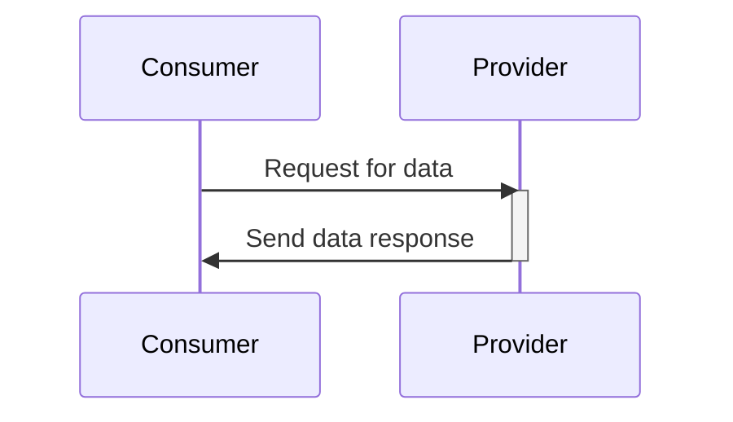

## Introduction to Contract Testing

Contract Testing is a critical design pattern used in cloud computing environments to ensure that services and applications adhere to agreed interfaces, facilitating reliable inter-service communication and minimizing integration issues. As cloud architectures increasingly utilize microservices and distributed systems, maintaining consistency and reliability across service boundaries becomes crucial. Contract Testing focuses on validating the interactions between dependent services by checking if they meet the contractual obligations defined by their interfaces.

## Design Pattern Overview

### Principles of Contract Testing

1. **Isolated Environment Testing**: Focus on testing the contract between two or more components in isolation, without requiring the entire application to be deployed.
2. **Consumer-Driven Contracts**: Ensure that contracts are driven by the consumer's needs, fostering a consumer-first approach in service development.
3. **Version Compatibility**: Facilitate backward compatibility by confirming that newer versions of services adhere to the expected contract for existing consumers.
4. **Automated Verification**: Integrate contract tests into automated CI/CD pipelines, ensuring consistent validation during development and deployment stages.

### Implementation Approaches

- **Pact Framework**: Use tools like Pact to write and verify consumer-driven contracts, where the consumer defines expectations, and the provider validates those expectations against actual service behavior.
- **Swagger/OpenAPI**: Utilize Swagger or OpenAPI specifications to define reusable and machine-readable service contracts, enabling automated contract validation.

## Best Practices

- **Contract As A Code**: Treat contract definitions as part of the codebase, promoting versioning and collaboration among development teams.
- **Granularity in Contracts**: Define contracts at a granular level to ensure precise and comprehensive testing of service interactions.
- **Collaborative Contract Development**: Involve both consumer and provider teams in the contract definition process to ensure practical and viable interfaces.
- **Frequent Contract Testing**: Continuously execute contract tests during development, integration, and deployment stages to catch errors early.

## Example Code

Here’s a simple example using Pact for a contract test between a consumer and provider service in Java:

```java
package com.example.contracts;

import au.com.dius.pact.consumer.PactBuilder;
import au.com.dius.pact.consumer.dsl.PactDslJsonBody;
import au.com.dius.pact.consumer.junit5.PactConsumerTestExt;
import au.com.dius.pact.consumer.junit5.PactTestFor;
import au.com.dius.pact.core.model.RequestResponsePact;
import au.com.dius.pact.core.model.annotations.Pact;
import org.junit.jupiter.api.Test;
import org.junit.jupiter.api.extension.ExtendWith;

import static org.junit.jupiter.api.Assertions.assertEquals;

@ExtendWith(PactConsumerTestExt.class)
@PactTestFor(providerName = "ProviderService")
public class ConsumerContractTest {

    @Pact(consumer = "ConsumerService")
    public RequestResponsePact createPact(PactBuilder builder) {
        return builder
            .given("a request for data")
            .uponReceiving("a request for data")
            .path("/data")
            .method("GET")
            .willRespondWith()
            .status(200)
            .body(new PactDslJsonBody().stringValue("name", "test").integerType("age", 30))
            .toPact();
    }

    @Test
    void testPact(MockServer mockServer) {
        String response = // Code to make GET request to mockServer.getUrl() + "/data"

        assertEquals(expectedResponse, response);
    }
}
```

## Diagrams



## Related Patterns

- **API Gateway**: Manages API endpoints and routes requests to appropriate microservices, simplifying the contract management process in cloud architectures.
- **Service Mesh**: Provides a dedicated infrastructure layer for handling service-to-service communications, potentially enabling automated contract testing.

## Additional Resources

- **Pact Framework Documentation**: [pact.io](https://pact.io/)
- **OpenAPI Specification**: [swagger.io/specification](https://swagger.io/specification/)

## Summary

Contract Testing is a powerful design pattern for ensuring service reliability and resilience in cloud environments. By establishing clear and testable agreements between services, teams can quickly identify and resolve integration issues, facilitating smoother deployments and more robust service ecosystems. By leveraging tools such as the Pact Framework and OpenAPI specifications, organizations can automate contract verification, increase collaboration between consumer and provider teams, and enhance system robustness.

Joining the ranks of patterns like API Gateway and Service Mesh, Contract Testing forms an essential part of robust cloud architecture ensuring seamless, reliable, and consistent service interactions.
